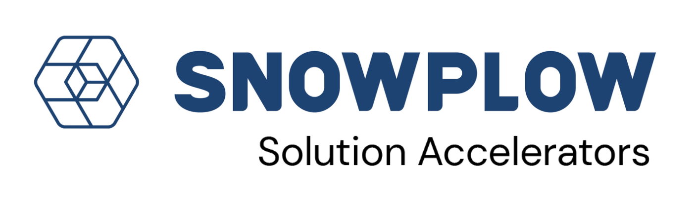

# Example Next.js ecommerce store

[![License][license-image]][license]

This application is a demo ecommerce store, written in Next.js.

It's intended to be used as part of the [Snowplow **example** accelerator](link goes here). Check out the accelerator for information on running the project, and to learn more about Snowplow's features and capabilities.

<!-- A short paragraph describing what the app does -->
The application consists of a product listing page, individual product pages, and cart functionality.

<!-- State what Snowplow features are used, if applicable -->
It incorporates Snowplow tracking using these features:
* [Snowplow browser tracker](https://docs.snowplow.io/docs/sources/trackers/web-trackers/)
* [Ecommerce tracking plugin](https://docs.snowplow.io/docs/sources/trackers/web-trackers/tracking-events/ecommerce/)
* [Snowtype](https://docs.snowplow.io/docs/event-studio/snowtype/) event definitions

## Copyright and license

Example Next.js ecommerce store is copyright 2025-present Snowplow Analytics Ltd.

Licensed under the [Apache License, Version 2.0][license] (the "License");
you may not use this software except in compliance with the License.

Unless required by applicable law or agreed to in writing, software
distributed under the License is distributed on an "AS IS" BASIS,
WITHOUT WARRANTIES OR CONDITIONS OF ANY KIND, either express or implied.
See the License for the specific language governing permissions and
limitations under the License.

[license]: https://www.apache.org/licenses/LICENSE-2.0
[license-image]: https://img.shields.io/github/license/snowplow/snowplow-android-tracker
