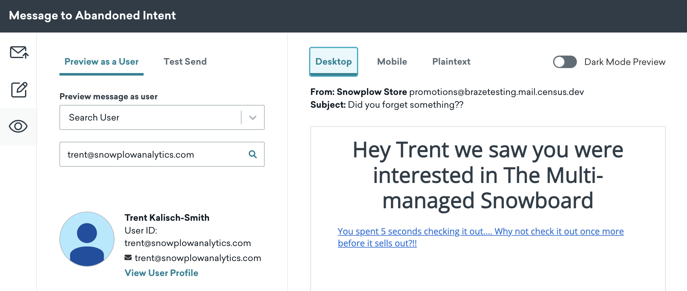

This guide will walk you through setting up and testing an abandoned browse campaign in Braze using the product view data synced from Census.

## Setting Up the Campaign

1. Log into your Braze dashboard
2. Navigate to **Campaigns** and click "Create Campaign"
3. Select "Email Campaign" as the channel
4. Name your campaign (e.g., "Abandoned Browse - Product Reminder")

## Configure Campaign Trigger

1. In the "Delivery" section, select "Action-Based"
2. Set up the trigger criteria

## Create Email Template



1. Click "Edit Campaign" in the campaign builder and click "Edit Email Body"
2. Design your email using Braze's editor:
   ```html
   Subject: Don't miss out on {{custom_attribute.${product}}}!
   
   Hello!
   
   We noticed you were checking out {{custom_attribute.${product}}}. 
   
   <a href="{{custom_attribute.${product_url}}}?abandonedEmail=true">
     Take another look
   </a>
   ```

3. Add personalization:
   - Product name using `{{custom_attribute.${product}}}`
   - Product URL using `{{custom_attribute.${product_url}}}`
   - Add dynamic product images if available
   
:::tip
   - The `abandonedEmail=true` parameter in the URL helps track when users click through from abandoned browse emails
   - You can use this parameter to:
     - Track email campaign success
     - Remove users from the campaign audience once they've engaged
:::

## Campaign Settings

1. Configure timing:
   - Set delay after trigger: 1 hour
   - Set quiet hours: e.g., 9 PM - 9 AM local time
   - Set frequency capping: Max 1 email per user per 24 hours

2. Set conversion tracking:
   - Primary Conversion: "Purchase"
   - Secondary Conversion: "Add to Cart"

## Testing the Campaign

1. Return to "Edit Campaign" and click "Preview" at the bottom of the page
   - Select "Search User" under Preview message as user
   - If the user can't be found, ensure Census has synced product view data for this user
   - Verify custom attributes are populated correctly in the email
   - Click "Send Test" to send the test email

2. Verify email content:
   - Check all personalization renders correctly
   - Verify product links work
   - Test on multiple email clients

3. Verify winback success:
    - Click on the link you receive in the test email with the `abandonedEmail=true` parameter
    - In Snowflake or Census, check the `winback_successful` column for the user has been set to true


## Best Practices

- Keep email content focused on one product
- Include social proof (reviews, ratings)
- Add sense of urgency (limited time offer)
- Ensure mobile responsiveness
- Include clear unsubscribe option

## Congratulations

Thanks for your effort! You have now set up an abandoned browse campaign in Braze, sent an email, and verified winback success. Let's review what we have achieved in the [Conclusion](./conclusion.md). 