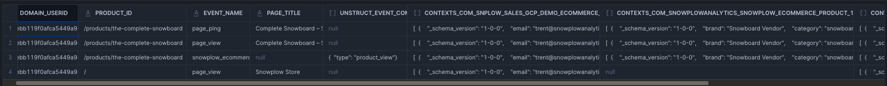
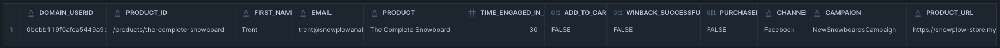

After implementing the tracking setup, send some events and test that they are arriving in your data warehouse. If you don't have a data warehouse, you can sign up for a [free trial of Snowflake](https://www.snowflake.com/).

Once you have sent data to Snowflake, you can run the following query to verify the events are coming through. The [Snowflake Streaming loader](http://localhost:3000/docs/api-reference/loaders-storage-targets/snowflake-streaming-loader/) has a latency of several seconds so you should see results immediately.

```sql
SELECT
    domain_userid,
    user_id,
    page_urlpath AS product_id,
    event_name,
    page_title,
    unstruct_event_com_snowplowanalytics_snowplow_ecommerce_snowplow_ecommerce_action_1,
    contexts_com_snowplowanalytics_snowplow_ecommerce_product_1,
    contexts_com_snowplowanalytics_snowplow_web_page_1
FROM DATABASE.ATOMIC.EVENTS
WHERE
    DATE(load_tstamp) = CURRENT_DATE()
ORDER BY load_tstamp DESC;
```

The output of this query should be similar to below:


## Identifying most viewed but not added-to-cart products

Once events are confirmed, use the following query to check that we can aggregate the data correctly. This query will be used in the next step to build an abandoned browse audience in Census.

The SQL query identifies users who have viewed product pages today but have not completed a purchase. It aggregates data from Snowplow events to calculate the total time a user has engaged with product pages, checks if they have added items to their cart, and determines if they have previously received a win-back email. The second part of the query then selects the most engaged product for each user and ensures that only users who are logged in are included.

Snowplow loads to most data warehouses / lakes in real-time so this query will include users that have been active within the last couple seconds!

```sql
WITH productsViewedToday AS (
    SELECT
        domain_userid,
        page_urlpath AS product_id,
        MAX(user_id) AS email,
        MAX(product.value:name::STRING) AS product,
        5 * SUM(CASE WHEN event_name = 'page_ping' THEN 1 ELSE 0 END) AS time_engaged_in_s,
        MAX(
            CASE
                WHEN ecom_action.value:type = 'add_to_cart'
                THEN TRUE
                ELSE FALSE
            END
        ) AS add_to_cart,
        MAX(
            CASE
                WHEN page_urlquery = 'abandonedEmail=true'
                THEN TRUE
                ELSE FALSE
            END
        ) AS winback_successful,
        MAX(page_url) AS product_url
    FROM
        SNOWPLOW_SALES_AWS_PROD1_DB.ATOMIC.EVENTS,
        LATERAL FLATTEN(input => contexts_com_snowplowanalytics_snowplow_ecommerce_product_1) product,
        LATERAL FLATTEN(input => contexts_com_snowplowanalytics_snowplow_web_page_1) page,
        LATERAL FLATTEN(input => unstruct_event_com_snowplowanalytics_snowplow_ecommerce_snowplow_ecommerce_action_1) ecom_action
    WHERE
        DATE(load_tstamp) = CURRENT_DATE()
        AND page_urlpath LIKE '/product%'
    GROUP BY
        1, 2
    ORDER BY
        time_engaged_in_s DESC
)

SELECT
    a.*
FROM
    productsViewedToday a
LEFT JOIN
    productsViewedToday b
    ON a.email = b.email
    AND a.time_engaged_in_s < b.time_engaged_in_s
WHERE
    b.time_engaged_in_s IS NULL
    AND a.email IS NOT NULL;
```
The output of this query should be similar to below:


## Next step

Proceed to the [reverse ETL setup](./reverse-etl.md) to sync this data to your marketing platform.
