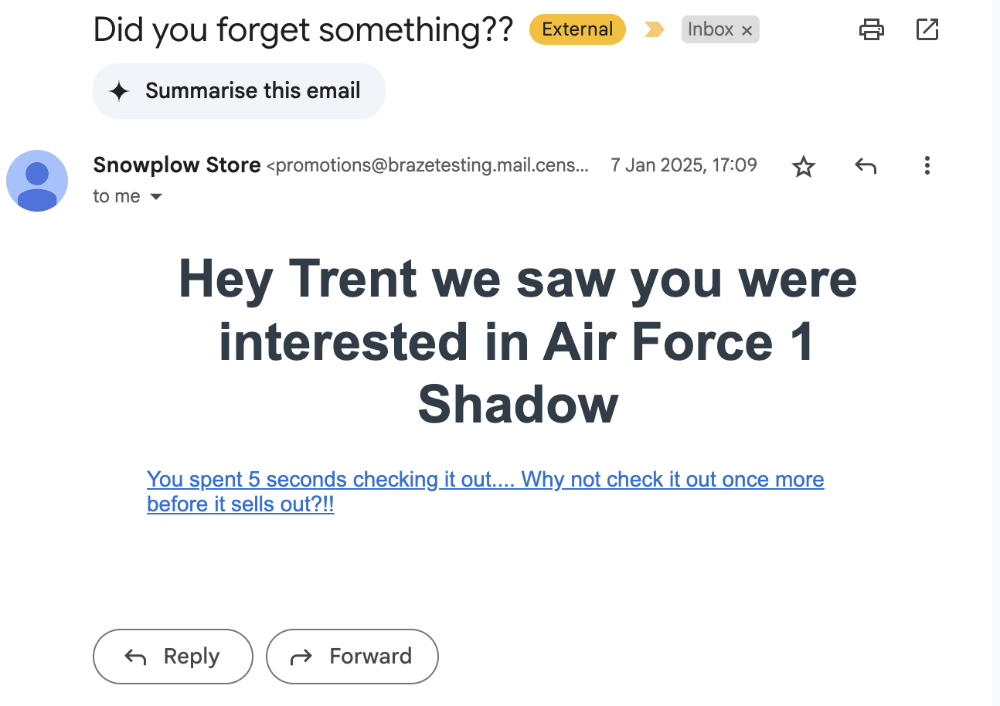

Abandoned browse is a common ecommerce problem where users show interest in products but don't complete a purchase. It is also referred to as "shopping cart abandonment," "abandoned basket," or "abandoned cart." Despite how common it is, it is still a challenge to implement a successful re-engagement campaign when using traditional marketing tools because they lack all the context needed to create a compelling personalized message. At Snowplow, we have found that a composable CDP approach is the best way to solve this problem. This tutorial has been written to show that it is straightforward to get started.

---

---

This tutorial demonstrates how to implement an abandoned browse tracking and re-engagement system using [Snowplow](https://snowplow.io/), [Snowflake](https://www.snowflake.com/), and [Census](https://www.getcensus.com/). This solution helps ecommerce businesses identify and re-engage users who have shown interest in a product (e.g., viewed something for 10+ seconds) but haven't proceeded further.

---

---

## Prerequisites

- An ecommerce website with a product catalog to track events from
- **Snowplow instance**:
    - [Localstack](https://github.com/snowplow-incubator/snowplow-local) (recommended)
    - [Community edition](/docs/get-started/snowplow-community-edition)
    - Snowplow CDI if you're already a customer
- **Access to a data warehouse**: e.g., [Snowflake](https://www.snowflake.com)
- **Reverse ETL**: [Census Reverse ETL](https://www.getcensus.com) or Snowplow Reverse ETL
- **Marketing automation platform**: e.g., [Braze](https://www.braze.com)

## What you'll learn

- How to implement product view tracking using Snowplow's JavaScript tracker
- Setting up time-on-page tracking to measure user engagement
- Creating SQL queries to identify abandoned browse behavior
- Implementing Reverse ETL workflows to sync data to marketing platforms
- Building automated re-engagement campaigns

## Business outcomes

- Identify users showing genuine interest in products
- Measure product engagement through view time and interaction
- Create targeted re-engagement campaigns
- Increase conversion rates through personalized messaging
- Track campaign effectiveness and ROI

## Similar use cases

This solution can be adapted for:

1. **Abandoned cart recovery**: extend the tracking to include cart additions and checkout steps
2. **Product recommendations**: use viewing patterns to suggest related items
3. **Category affinity analysis**: understand user preferences across product categories
4. **Price drop alerts**: notify users when viewed items go on sale
5. **Inventory alerts**: alert users when viewed out-of-stock items become available

By following this tutorial, you'll establish a complete abandoned browse tracking and re-engagement system that can be expanded to support various ecommerce marketing initiatives.

## Next step

Proceed to the [tracking setup](./tracking-setup.md) step to implement the tracking setup.
