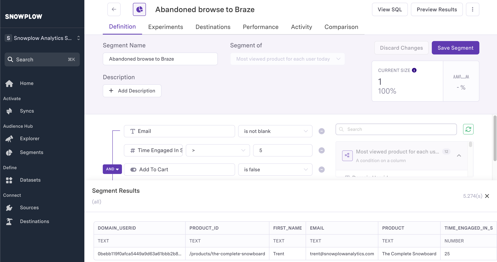

Next we will set up a Census sync to build an audience using our query from Snowflake, filter the audience to focus on users who have shown interest in products but haven't purchased, and sync the data to Braze.

## Connect Census to Snowflake

1. Log into your Census account ([sign up if needed](https://www.getcensus.com/))
2. Go to **Sources**
3. Click "New Source" 
4. Select Snowflake
5. Enter your Snowflake connection details
6. Test the connection and save

## Create Your Abandoned Browse Audience

Use the query from the [Data Modeling](./data-modeling.md#identifying-most-viewed-but-not-added-to-cart-products) step to identify users who have shown interest in products but haven't purchased. Here it is again:

```sql
WITH productsViewedToday AS (
    SELECT 
        domain_userid, 
        page_urlpath AS product_id, 
        MAX(user_id) AS email,
        MAX(product.value:name::STRING) AS product,
        5 * SUM(CASE WHEN event_name = 'page_ping' THEN 1 ELSE 0 END) AS time_engaged_in_s,
        MAX(
            CASE 
                WHEN ecom_action.value:type = 'add_to_cart' 
                THEN TRUE 
                ELSE FALSE 
            END
        ) AS add_to_cart,
        MAX(
            CASE 
                WHEN page_urlquery = 'abandonedEmail=true' 
                THEN TRUE 
                ELSE FALSE 
            END
        ) AS winback_successful,
        MAX(page_url) AS product_url
    FROM 
        SNOWPLOW_SALES_AWS_PROD1_DB.ATOMIC.EVENTS,
        LATERAL FLATTEN(input => contexts_com_snowplowanalytics_snowplow_ecommerce_product_1) product,
        LATERAL FLATTEN(input => contexts_com_snowplowanalytics_snowplow_web_page_1) page,
        LATERAL FLATTEN(input => unstruct_event_com_snowplowanalytics_snowplow_ecommerce_snowplow_ecommerce_action_1) ecom_action
    WHERE 
        DATE(load_tstamp) = CURRENT_DATE()
        AND page_urlpath LIKE '/product%'
    GROUP BY 
        1, 2
    ORDER BY 
        time_engaged_in_s DESC
)

SELECT 
    a.* 
FROM 
    productsViewedToday a
LEFT JOIN 
    productsViewedToday b
    ON a.email = b.email 
    AND a.time_engaged_in_s < b.time_engaged_in_s
WHERE 
    b.time_engaged_in_s IS NULL 
    AND a.email IS NOT NULL;
```

## Set Up the Census Sync

1. In Census, go to **Syncs** and click "Create New Sync"
2. For the Source:
   - Select your Snowflake connection
   - Configure the authentication method

3. Configure the dataset
    - Select dataset from the menu
    - Select the Snowflake source
    - Enter the SQL query above
    - Click "Preview" and ensure it returns data


4. Configure the audience segment:
    - Select Segments from the menu
    - Click "New Segment"
    - Under "Segment Of", select the dataset from the previous step
    - Add filters to the segment based on the image below. 
    - Click preview to confirm that the correct data is being returned



5. Configure the sync settings:
    - Select Syncs from the menu
    - Click "New Sync"
    - Under Source, select the audience from the previous step
    - Under Destination, select Braze
    - Configure the mapping as shown in the image below
    - Click "Run Now"


## Monitoring and Optimization

- Monitor sync status in Census dashboard
- Track campaign performance metrics
- A/B test different message content and timing
- Adjust view time thresholds based on results

## Best Practices

- Review view time thresholds (10+ seconds) to ensure genuine interest
- Include product images and details in your messages
- Add urgency elements (e.g., limited time offers)
- Test different message sequences and timings
- Monitor unsubscribe rates to avoid message fatigue

By following these steps, you'll have an automated system that identifies users showing genuine interest in products and triggers relevant abandoned browse campaigns to encourage purchases.

## Next Step

Proceed to the [Creating Campaigns in Braze](./braze-campaign.md) step to set up your marketing automation campaign.