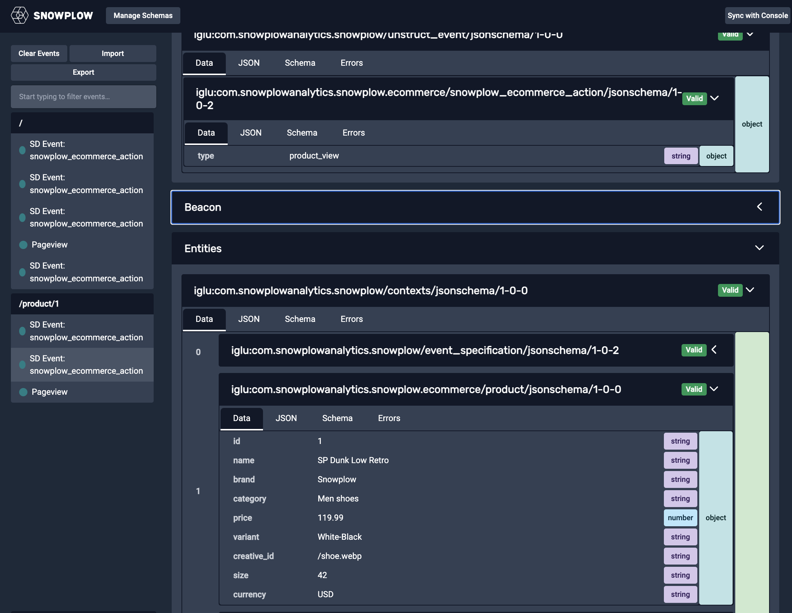

## Initialize Snowplow JavaScript tracker

To begin, we will set up Snowplow tracking on your ecommerce website. In this section we will capture what products a customer views, how long they view them for and if they add them to their cart. We assume that you already have a Snowplow pipeline. If you do not yet have a pipeline running, please return to the [Introduction](/tutorials/abandoned-browse-ccdp/introduction) information on the different deployment options.


First, [initialize the Snowplow JavaScript tracker](/docs/sources/trackers/web-trackers/quick-start-guide). Below is an example of how to set up the tracker:

```javascript
; (function (p, l, o, w, i, n, g) {
  if (!p[i]) {
    p.GlobalSnowplowNamespace = p.GlobalSnowplowNamespace || [];
    p.GlobalSnowplowNamespace.push(i); p[i] = function () {
      (p[i].q = p[i].q || []).push(arguments)
    }; p[i].q = p[i].q || []; n = l.createElement(o); g = l.getElementsByTagName(o)[0]; n.async = 1;
    n.src = w; g.parentNode.insertBefore(n, g)
  }
}(window, document, "script", "https://cdn.jsdelivr.net/npm/@snowplow/javascript-tracker@latest/dist/sp.lite.js", "snowplow"));

// Replace with your collector URL
var collector = "yourcollector.site.com";

window.snowplow('newTracker', 'trackerName', collector, {
  encodeBase64: false,
  appId: 'ecommerceDemo',
  platform: 'web',
  contexts: {
    webPage: true,
    performanceTiming: true
  }
});

// Add ecommerce accelerator plugin
window.snowplow(
  'addPlugin',
  'https://cdn.jsdelivr.net/npm/@snowplow/browser-plugin-snowplow-ecommerce@latest/dist/index.umd.min.js',
  ['snowplowEcommerceAccelerator', 'SnowplowEcommercePlugin']
);
```

### Track page views and user engagement time

We want to understand how long a product is viewed for in order to determine the which product each customer is paying the most attention to.

Use the `enableActivityTracking` function to calculate the time the user is actively engaged on the page:
- **minimumVisitLength**: the minimum time (in seconds) a user must stay on the page before tracking starts
- **heartbeatDelay**: the interval (in seconds) at which activity pings are sent

If you change these parameters, make sure to update the values in the [data modeling](./data-modeling.md#identifying-most-viewed-but-not-added-to-cart-products) step.

This event must be called before the `trackPageView` function.

```javascript
snowplow('enableActivityTracking', {
  minimumVisitLength: 5,
  heartbeatDelay: 5
});

snowplow('trackPageView');
```

### Test your tracking

To verify your tracking implementation, use the [Snowplow Chrome extension](https://chrome.google.com/webstore/detail/snowplow-inspector/maplkdomeamdlngconidoefjpogkmljm). This extension allows you to inspect Snowplow events in real-time as they are sent from your website. Navigate to your product pages and add items to cart while monitoring the extension to ensure events are firing correctly with all expected parameters. The extension will show you the full event payload including all entities and properties, making it easy to debug your implementation.



### Track product views

Implement the product view tracking when a product is viewed. This will create a column in the warehouse dedicated to storing information on viewed products. Please ensure you use the correct data type for each variable. Refer to the [ecommerce documentation](https://docs.snowplow.io/docs/sources/trackers/web-trackers/tracking-events/ecommerce) for further information.
```javascript
  snowplow('trackProductView', {
    id: "12345",
    name: "Baseball T",
    brand: "Snowplow",
    category: "apparel",
    price: 200,
    currency: "USD",
});
```

### Track "add to cart" events

Track "add to cart" events so users that perform this action can be filtered out or be placed in a different cohort. Below is an example implementation, showing a single product being added to the cart.

```javascript
window.snowplow("trackAddToCart", {
  products: [
    {
      id: "P125",
      name: "Baseball T",
      brand: "Snowplow",
      category: "Mens/Apparel",
      price: 200,
      currency: "USD",
    },
  ],
  total_value: 200,
  currency: "USD",
});
```

Once add to cart events are tracked, the event should look like this in your Snowplow Chrome extension.


### Explanation of parameters

- **id**: the unique identifier for the product
- **name**: the product's name
- **price**: the product's price as a floating-point number
- **brand**: the brand associated with the product
- **currency**: the currency code (e.g., USD, EUR)
- **category**: the product's category or taxonomy
- **total_value**: the updated total cart value after adding the product

## Next step

With this implementation, you have page view, time spent, and add to cart tracking. If you want to add more ecommerce tracking, please refer to the [Snowplow ecommerce accelerator](https://docs.snowplow.io/accelerators/ecommerce) or the detailed [ecommerce documentation](/docs/sources/trackers/web-trackers/tracking-events/ecommerce). Next progress to the [data modeling](./data-modeling.md) step to verify your tracking setup in the data warehouse.
