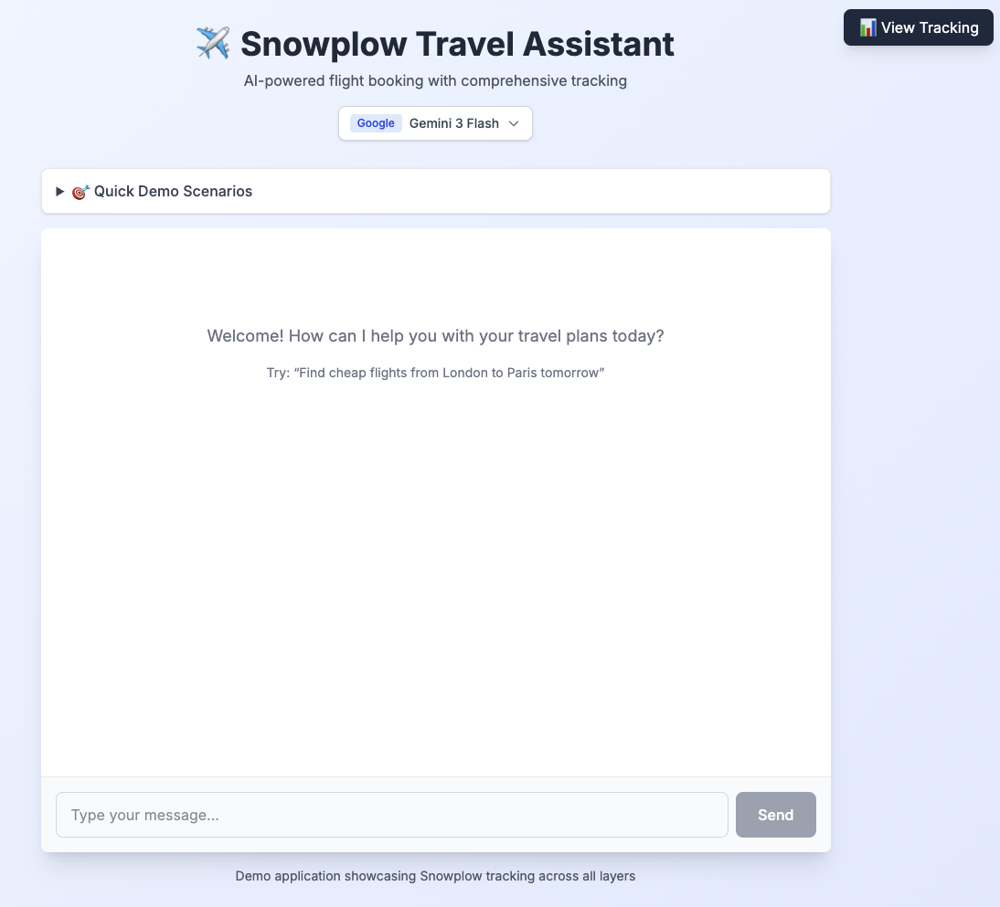
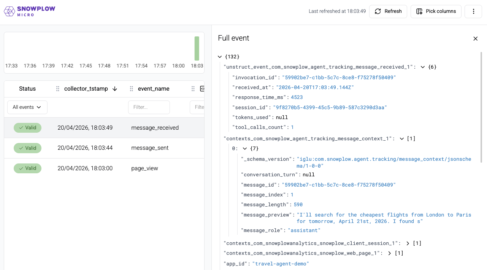

import SchemaProperties from "@site/docs/reusable/schema-properties/_index.md"

In this stage, you'll add the first layer of tracking: client-side events that capture what the user does in the browser.

:::tip[Code-along or Read-along]
If you're coding along, create the files described below on the starter branch.

If you're reading along, check out this tag and review the changes:

```bash
git checkout v0.1-client-tracking
npm install
```

To see exactly what changed: `git diff v0.0-starter..v0.1-client-tracking`
:::

## What you'll add

This stage introduces:

- One new dependency: `@snowplow/browser-tracker`
- Two event schemas from Iglu Central: `message_sent` and `message_received`
- One entity schema from Iglu Central: `message_context`
- One new file: `src/lib/tracking/client.ts` - the client tracking module
- One new file: `start.sh` - dev startup script that runs Snowplow Micro alongside Next.js
- Modifications to: `src/app/page.tsx` to add tracking

## Install the Snowplow tracker

Install the [Browser tracker](/docs/sources/web-trackers/):

```bash
npm install @snowplow/browser-tracker
```

## Create the client tracking module

This module initializes the Snowplow browser tracker and provides two functions for tracking messages.

```typescript title="src/lib/tracking/client.ts"
'use client';

import {
  newTracker,
  trackPageView,
  trackSelfDescribingEvent,
} from '@snowplow/browser-tracker';

// ---------------------------------------------------------------------------
// Tracker initialisation
// ---------------------------------------------------------------------------

let trackerInitialized = false;

/**
 * Initialise the Snowplow browser tracker.
 * Call once on app mount (e.g. in a useEffect).
 */
export const initClientTracker = () => {
  if (trackerInitialized) return;

  const collectorUrl = process.env.NEXT_PUBLIC_SNOWPLOW_COLLECTOR_URL;
  const appId = process.env.NEXT_PUBLIC_SNOWPLOW_APP_ID;

  if (!collectorUrl || !appId) {
    console.warn(
      'Snowplow browser tracker not initialized: missing NEXT_PUBLIC_SNOWPLOW_COLLECTOR_URL or NEXT_PUBLIC_SNOWPLOW_APP_ID',
    );
    return;
  }

  newTracker('sp', collectorUrl, {
    appId,
    contexts: {
      webPage: true,
      session: true,
    },
    anonymousTracking: false,
    stateStorageStrategy: 'localStorage',
  });

  trackerInitialized = true;
  trackPageView();
};
```

The `initClientTracker()` function initalizes the tracker as a singleton. The function reads the Collector URL and app ID from environment variables, enables the built-in [web page and session entities](/docs/sources/web-trackers/tracking-events/#add-contextual-data-with-entities), and fires an initial page view.

:::tip[Activity tracking]
For production Snowplow implementations, we recommend enabling [activity tracking](/docs/sources/web-trackers/tracking-events/activity-page-pings/). We've left it out of this accelerator to keep the focus on agentic tracking.
:::

Next, add the two tracking functions within the same file.

The tracking uses the [Iglu Central](https://iglucentral.com/) schemas `message_sent`, `message_received`, and `message_context`. See the [Schema reference](#schema-reference) section below for details on these schemas.

The `invocation_id` in the `message_received` event links it to the server-side events you'll add in the next section.

```typescript title="src/lib/tracking/client.ts (continued)"
// ---------------------------------------------------------------------------
// Context entity builder
// ---------------------------------------------------------------------------

export interface MessageContextData {
  message_id: string;
  message_role: 'user' | 'assistant';
  message_length: number;
  message_preview: string | null;
  message_index: number;
  conversation_turn: number | null;
}

const buildMessageContext = (data: MessageContextData) => ({
  schema: 'iglu:com.snowplow.agent.tracking/message_context/jsonschema/1-0-0' as const,
  data: data as unknown as Record<string, unknown>,
});

// ---------------------------------------------------------------------------
// Event: message sent
// ---------------------------------------------------------------------------

export interface MessageSentParams {
  sessionId: string;
  messageId: string;
  message: string;
  messageIndex: number;
  conversationTurn?: number;
}

export const trackMessageSent = (params: MessageSentParams) => {
  trackSelfDescribingEvent({
    event: {
      schema: 'iglu:com.snowplow.agent.tracking/message_sent/jsonschema/1-0-0',
      data: {
        session_id: params.sessionId,
        sent_at: new Date().toISOString(),
      },
    },
    context: [
      buildMessageContext({
        message_id: params.messageId,
        message_role: 'user',
        message_length: params.message.length,
        message_preview: params.message.substring(0, 100),
        message_index: params.messageIndex,
        conversation_turn: params.conversationTurn ?? null,
      }),
    ],
  });
};

// ---------------------------------------------------------------------------
// Event: message received
// ---------------------------------------------------------------------------

export interface MessageReceivedParams {
  sessionId: string;
  invocationId: string;
  messageId: string;
  responseText: string;
  tokensUsed?: number | null;
  toolCallsCount: number;
  responseTimeMs: number;
  messageIndex: number;
  conversationTurn?: number;
  modelName: string;
  modelProvider: 'anthropic' | 'openai' | 'google';
}

export const trackMessageReceived = (params: MessageReceivedParams) => {
  trackSelfDescribingEvent({
    event: {
      schema: 'iglu:com.snowplow.agent.tracking/message_received/jsonschema/1-0-0',
      data: {
        session_id: params.sessionId,
        invocation_id: params.invocationId,
        tokens_used: params.tokensUsed ?? null,
        response_time_ms: params.responseTimeMs,
        tool_calls_count: params.toolCallsCount,
        received_at: new Date().toISOString(),
      },
    },
    context: [
      buildMessageContext({
        message_id: params.messageId,
        message_role: 'assistant',
        message_length: params.responseText.length,
        message_preview: params.responseText.substring(0, 100),
        message_index: params.messageIndex,
        conversation_turn: params.conversationTurn ?? null,
      }),
    ],
  });
};
```

Both functions, `trackMessageSent()` and `trackMessageReceived()`, track the message data as a [self-describing event](/docs/fundamentals/events/#self-describing-events) with an attached `message_context` entity.

:::note[Privacy pattern]
The `message_preview` field is capped at 100 characters. Full message content is never sent to the Collector. This is a good practice for any user-generated content - capture enough for debugging and analysis, but respect user privacy.
:::

## Add tracking to the UI

Connect the tracking module to four places in `src/app/page.tsx`.

### Initialize the tracker on mount

Import the tracking functions and initialize the tracker in a `useEffect`:

```typescript title="src/app/page.tsx"
import {
  initClientTracker,
  trackMessageSent,
  trackMessageReceived,
} from '@/lib/tracking/client';

// Inside the Home component:
useEffect(() => {
  initClientTracker();
}, []);
```

### Track message sent on submit

In the `onSubmit` handler, call `trackMessageSent()` before sending the message to the API:

```typescript title="src/app/page.tsx"
const onSubmit = (e: React.FormEvent) => {
  e.preventDefault();
  if (!input.trim()) return;

  startTimeRef.current = Date.now();
  const activeSessionId = ensureActiveSessionId();

  trackMessageSent({
    sessionId: activeSessionId,
    messageId: crypto.randomUUID(),
    message: input,
    messageIndex: messageIndex,
  });

  sendMessage(
    { role: 'user', parts: [{ type: 'text', text: input }] },
    { body: { sessionId: activeSessionId, modelId: selectedModelId } },
  );
  setInput('');
};
```

### Track message sent from demo scenarios

The scenario handler follows the same pattern:

```typescript title="src/app/page.tsx"
const handleScenarioSelect = (message: string) => {
  startTimeRef.current = Date.now();
  const activeSessionId = ensureActiveSessionId();

  trackMessageSent({
    sessionId: activeSessionId,
    messageId: crypto.randomUUID(),
    message: message,
    messageIndex: messageIndex,
  });

  sendMessage(
    { role: 'user', parts: [{ type: 'text', text: message }] },
    { body: { sessionId: activeSessionId, modelId: selectedModelId } },
  );
};
```

### Track message received on completion

In the `useChat` hook's `onFinish` callback, call `trackMessageReceived()` with the response metadata:

```typescript title="src/app/page.tsx"
const { messages, sendMessage, status } = useChat<UIMessage>({
  transport: chatTransport,
  onFinish: ({ message }) => {
    const responseTime = Date.now() - startTimeRef.current;
    const textContent = extractTextContent(message.parts);
    const toolCallsCount = extractToolCalls(message.parts).length;
    const activeSessionId = ensureActiveSessionId();

    trackMessageReceived({
      sessionId: activeSessionId,
      invocationId: message.id,
      messageId: message.id,
      responseText: textContent,
      tokensUsed: null,
      toolCallsCount: toolCallsCount,
      responseTimeMs: responseTime,
      messageIndex: messageIndex + 1,
      modelName: selectedModelId,
      modelProvider: selectedModelProvider,
    });

    setMessageIndex((prev) => prev + 2);
  },
});
```

The `onFinish` callback fires once the full response has been streamed.

## Enable the `LiveTrackingPanel` component

The `LiveTrackingPanel` component is already in the codebase. Render it in the JSX:

```tsx title="src/app/page.tsx"
<LiveTrackingPanel sessionId={sessionId} />
```

This component polls Snowplow Micro's API every two seconds and displays events in a real-time sidebar. It requires Micro to be running.

## Run the application

Start Snowplow Micro on port 9090 and Next.js on port 3000 by running:

```bash
npm run start:dev
```

This runs the `start.sh` script, which starts Snowplow Micro in a Docker container and then starts the Next.js development server:

```bash title="start.sh"
#!/bin/bash
# Start Snowplow Micro and Next.js server

# Load environment variables from .env.local
if [ -f .env.local ]; then
  export $(grep -v '^#' .env.local | grep -v '^$' | xargs)
fi

# Generic schemas (com.snowplow.agent.tracking) resolve from Iglu Central automatically.
# The local mount provides app-specific custom entities added in later stages.
docker run -d --name snowplow-micro \
  -p 9090:9090 \
  -v "$(pwd)/snowplow/iglu-local:/config/iglu-client-embedded" \
  snowplow/snowplow-micro:3.0.1

sleep 2

# Start Next.js dev server
npm run dev
```



Snowplow Micro validates every incoming event against its schema. Micro resolves Iglu Central schemas automatically, so you don't need local copies.

The `-v` mount maps the local `snowplow/iglu-local` directory into the container. This directory is where you'll add your own custom entity schemas later on.

## Explore the tracking

With both services running:

1. Open [http://localhost:3000](http://localhost:3000) and send a message: "Find flights from London to Paris tomorrow".
2. Open the **LiveTrackingPanel** sidebar on the right - you'll see events appearing in real-time.
3. Open **Snowplow Micro UI** at [http://localhost:9090/micro/ui](http://localhost:9090/micro/ui). Press **Refresh** to see events arriving. You can click on individual events to explore their properties and attached entities. The [UI](/docs/testing/snowplow-micro/local/#checking-the-results) also shows any events that failed schema validation.
4. Examine a `message_sent` event in the Micro UI. Notice the self-describing event structure and the attached `message_context` entity showing `"role": "user"`, the message length, and the truncated preview.
5. Examine a `message_received` event. Notice the `response_time_ms` showing how long the agent took, and `tool_calls_count` showing how many tools it used.



:::warning[Chat never responds?]
If the chatbot accepts your message but **never responds**, check that `.env.local` has a **real** API key for the provider and model you selected. Placeholder or invalid keys often fail **silently** (see [Configure environment variables](../setup#configure-environment-variables)).
:::

:::note[Programmatic access]
Micro also exposes raw JSON endpoints at `/micro/good` and `/micro/bad` if you prefer programmatic access, but the UI is the recommended way to explore events throughout this accelerator.
:::

## Schema reference

You used these schemas in the client tracking module. Find their definitions and properties below.

### `message_sent`

The `message_sent` event is deliberately minimal. It captures only the session and timestamp. Most of the message data will be tracked in the attached `message_context` entity.

<SchemaProperties
  overview={{event: true}}
  example={{
    session_id: "550e8400-e29b-41d4-a716-446655440000",
    sent_at: "2024-01-15T10:30:00.000Z"
  }}
  schema={{ "$schema": "http://iglucentral.com/schemas/com.snowplowanalytics.self-desc/schema/jsonschema/1-0-0#", "description": "User sends a message in the chat interface. Message details are in the attached message_context entity.", "self": { "vendor": "com.snowplow.agent.tracking", "name": "message_sent", "format": "jsonschema", "version": "1-0-0" }, "type": "object", "properties": { "session_id": { "type": "string", "description": "Chat session identifier", "format": "uuid" }, "sent_at": { "type": "string", "format": "date-time", "description": "Timestamp when message was sent" } }, "required": ["session_id", "sent_at"], "additionalProperties": false }} />

### `message_received`

The `message_received` event captures performance and usage metrics about the agent's response that are only available once the response completes.

The `invocation_id` links this event to the server-side events you'll add in the next section.

<SchemaProperties
  overview={{event: true}}
  example={{
    session_id: "550e8400-e29b-41d4-a716-446655440000",
    invocation_id: "7c9e6679-7425-40de-944b-e07fc1f90ae7",
    tokens_used: 342,
    response_time_ms: 1850,
    tool_calls_count: 2,
    received_at: "2024-01-15T10:30:02.500Z"
  }}
  schema={{ "$schema": "http://iglucentral.com/schemas/com.snowplowanalytics.self-desc/schema/jsonschema/1-0-0#", "description": "User receives a response from the agent. Message details are in the attached message_context entity. Agent details are in the attached agent_context entity.", "self": { "vendor": "com.snowplow.agent.tracking", "name": "message_received", "format": "jsonschema", "version": "1-0-0" }, "type": "object", "properties": { "session_id": { "type": "string", "description": "Chat session identifier", "format": "uuid" }, "invocation_id": { "type": "string", "description": "Agent invocation that generated this response", "format": "uuid" }, "tokens_used": { "type": ["integer", "null"], "description": "Total tokens used in generation", "minimum": 0, "maximum": 2147483647 }, "response_time_ms": { "type": "integer", "description": "Time taken to generate response", "minimum": 0, "maximum": 300000 }, "tool_calls_count": { "type": "integer", "description": "Number of tool calls made during this response", "minimum": 0, "maximum": 100 }, "received_at": { "type": "string", "format": "date-time", "description": "Timestamp when response was received" } }, "required": ["session_id", "invocation_id", "response_time_ms", "tool_calls_count", "received_at"], "additionalProperties": false }} />

### `message_context`

The `message_context` entity will be attached to both events. It describes the message itself: who sent it, how long it is, and its position in the conversation.

<SchemaProperties
  overview={{entity: true}}
  example={{
    message_id: "3f2504e0-4f89-11d3-9a0c-0305e82c3301",
    message_role: "user",
    message_length: 47,
    message_preview: "Find flights from London to Paris tomorrow",
    message_index: 0,
    conversation_turn: 1
  }}
  schema={{ "$schema": "http://iglucentral.com/schemas/com.snowplowanalytics.self-desc/schema/jsonschema/1-0-0#", "description": "Context entity describing a chat message, its content, and metadata. Attached to message_sent and message_received events.", "self": { "vendor": "com.snowplow.agent.tracking", "name": "message_context", "format": "jsonschema", "version": "1-0-0" }, "type": "object", "properties": { "message_id": { "type": "string", "description": "Unique identifier for this message", "format": "uuid" }, "message_role": { "type": "string", "enum": ["user", "assistant"], "description": "Who sent the message (user or AI assistant)" }, "message_length": { "type": "integer", "description": "Length of message in characters", "minimum": 0, "maximum": 100000 }, "message_preview": { "type": ["string", "null"], "description": "Truncated message content for privacy (first 100 chars)", "maxLength": 100 }, "message_index": { "type": "integer", "description": "Position of this message in the conversation", "minimum": 0, "maximum": 10000 }, "conversation_turn": { "type": ["integer", "null"], "description": "Turn number in the conversation (pair of user + assistant messages)", "minimum": 0, "maximum": 5000 } }, "required": ["message_id", "message_role", "message_length", "message_index"], "additionalProperties": false }} />
