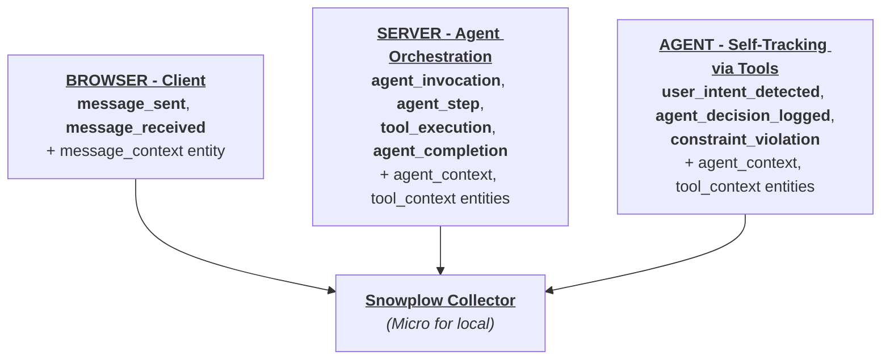

---

title: "Instrument an AI agent with behavioral tracking"
sidebar_label: "Introduction"
position: 1
description: "Learn how to instrument an AI-powered chatbot with Snowplow behavioral tracking across three architectural layers: client-side interactions, server-side agent orchestration, and agent self-tracking."
keywords: ["snowplow", "agentic", "tracking", "ai", "observability", "llm"]
date: "2026-03-26"

---

AI-powered applications have a visibility problem. Traditional analytics tells you what users clicked and which pages they visited. When your product is an AI agent, however, the interesting behavior happens in layers you can't see from the browser.

Consider a travel booking chatbot. A user types "find me cheap flights to Paris tomorrow." Behind the scenes:

1. The browser sends the message and eventually renders a response - but that's all it knows.
2. The server orchestrates an entire reasoning loop - the LLM is invoked, it decides which tools to call, it executes a flight search, it processes results, and it streams a response. Multiple steps, multiple tool calls, token consumption, latency - none of this is visible to the client.
3. The agent itself makes decisions you can't observe from either the client or the server framework. It interprets the user's intent ("they want cheap flights, so I'll sort by price"). It chooses parameters for tools. It detects when a requirement can't be met ("$50 to Tokyo isn't possible"). This reasoning is invisible unless the agent explicitly reports it.

Each of these layers answers a different question:

- **Client-side tracking:** "What did the user do?"
- **Server-side tracking:** "What did the agent do?"
- **Agent self-tracking:** "What did the agent think?"

This tutorial walks you through instrumenting all three layers with [Snowplow](https://snowplow.io/) behavioral data tracking, progressively building from zero observability to complete transparency.

## What you'll build

You'll work with a fully functional travel booking chatbot built with Next.js, React, and the Vercel AI SDK. The app supports multiple LLM providers (Anthropic Claude, OpenAI GPT, Google Gemini) and has three business tools: flight search, flight booking, and calendar checking.

Snowplow provides a set of generic agentic tracking [schemas](https://docs.snowplow.io/docs/fundamentals/schemas/) on [Iglu Central](https://docs.snowplow.io/docs/pipeline-components-and-applications/iglu/iglu-central/) that cover the agent lifecycle out of the box - invocations, steps, tool executions, completions, and more. For domain-specific data like extracted travel intent or flight search parameters, you create your own custom [entities](https://docs.snowplow.io/docs/fundamentals/entities/) and attach them alongside the generic schemas. This tutorial covers both.

By the end of this tutorial, you'll have added:

- 10 event schemas and three entities from Iglu Central covering the generic agent lifecycle
- Three custom entities for travel-specific data: extracted intent, tool parameters, and tool results
- Schema validation against all events locally via Snowplow Micro
- A real-time event panel in the UI visualizing the event stream as it happens

## Architecture

The three tracking layers correspond to where events are emitted and what they capture:




All events flow to the same Snowplow collector. In this tutorial, you'll use [Snowplow Micro](https://docs.snowplow.io/docs/testing-debugging/snowplow-micro/what-is-micro/) running locally in Docker to validate events against their schemas in real-time.

## How to follow this tutorial

This tutorial supports two learning paths:

**Code-along:** You build tracking from scratch on your own copy of the starter app. The tutorial gives you code to write, where to put it, and why.

**Read-along:** You check out each git tag, read the code, run the app, and observe events in Snowplow Micro. The tutorial explains what was done and why.

:::tip Which path should I choose?
- **Developer / Architect** - choose **code-along** if you want hands-on implementation experience. You'll write tracking code, create schemas, and debug validation errors yourself.
- **Analyst / Data Architect** - choose **read-along** if you want to understand the architecture and data model without writing every line. You'll focus on how the tracking layers fit together, what the schemas capture, and how to design your own entity model.

Both paths cover the same concepts. You can switch between them at any stage.
:::

The [companion repository](https://github.com/snowplow-industry-solutions/agentic-app-tracking-tutorial) has four tagged commits, one for each stage:


| Tag                     | Stage                 | Question answered           |
| ----------------------- | --------------------- | --------------------------- |
| `v0.0-starter`          | The starter app       | (no tracking yet)           |
| `v0.1-client-tracking`  | Client-side tracking  | "What did the user do?"     |
| `v0.2-server-tracking`  | Server-side tracking  | "What did the agent do?"    |
| `v0.3-agentic-tracking` | Agentic self-tracking | "What did the agent think?" |


Each section makes both paths clear. When the instructions diverge, you'll see callouts for each path.

## Prerequisites

Before you begin, make sure you have:

- Node.js 18+ installed
- Docker installed and running (required from stage one onwards for Snowplow Micro)
- At least one LLM API key: Anthropic (`ANTHROPIC_API_KEY`), OpenAI (`OPENAI_API_KEY`), or Google (`GOOGLE_GENERATIVE_AI_API_KEY`)
- Git installed

## Setup

Clone the repository and install dependencies:

```bash
git clone https://github.com/snowplow-industry-solutions/agentic-app-tracking-tutorial.git
cd agentic-app-tracking-demo
git checkout v0.0-starter
npm install
```

Create your environment file:

```bash
cp .env.example .env.local
```

Open `.env.local` and add at least one LLM API key. The flight search, booking, and calendar tools all use mock data, so you do not need any external travel API keys. You do need a valid LLM key because the chatbot calls a real language model. The file looks like this:

```bash title=".env.example"
# --- LLM Provider API Keys (configure at least one) ---
ANTHROPIC_API_KEY=sk-ant-...
OPENAI_API_KEY=sk-...
GOOGLE_GENERATIVE_AI_API_KEY=...

# --- Snowplow Client-Side Tracking (active from v0.1-client-tracking) ---
NEXT_PUBLIC_SNOWPLOW_COLLECTOR_URL=http://localhost:9090
NEXT_PUBLIC_SNOWPLOW_APP_ID=travel-agent-demo

# --- Snowplow Server-Side Tracking (active from v0.2-server-tracking) ---
SNOWPLOW_COLLECTOR_URL=http://localhost:9090
SNOWPLOW_APP_ID=travel-agent-demo
```

:::warning Check your API key
Replace the placeholder values (`sk-ant-...`, `sk-...`) with your real key. If the value is still a placeholder, the app starts but the chatbot silently fails to respond. The UI lets you select any model regardless of which keys are configured - if you pick a provider without a valid key, the request fails without a visible error.
:::

The environment variables break down by stage:


| Variable                                                                | Used from | Purpose                                                             |
| ----------------------------------------------------------------------- | --------- | ------------------------------------------------------------------- |
| `ANTHROPIC_API_KEY` / `OPENAI_API_KEY` / `GOOGLE_GENERATIVE_AI_API_KEY` | v0.0      | LLM provider authentication                                         |
| `NEXT_PUBLIC_SNOWPLOW_COLLECTOR_URL`                                    | v0.1      | Snowplow collector endpoint (client-side, exposed to browser)       |
| `NEXT_PUBLIC_SNOWPLOW_APP_ID`                                           | v0.1      | Application identifier (client-side)                                |
| `SNOWPLOW_COLLECTOR_URL`                                                | v0.2      | Snowplow collector endpoint (server-side, never exposed to browser) |
| `SNOWPLOW_APP_ID`                                                       | v0.2      | Application identifier (server-side)                                |


:::note Why two sets of Snowplow variables?
Next.js exposes `NEXT_PUBLIC_*` variables to the browser bundle. Server-only variables (without the prefix) stay on the server. You need both because client-side and server-side trackers initialize independently - the client tracker runs in the browser, the server tracker runs in the Node.js process.
:::

You're ready to start. The next section explores the starter app before any tracking is added.
