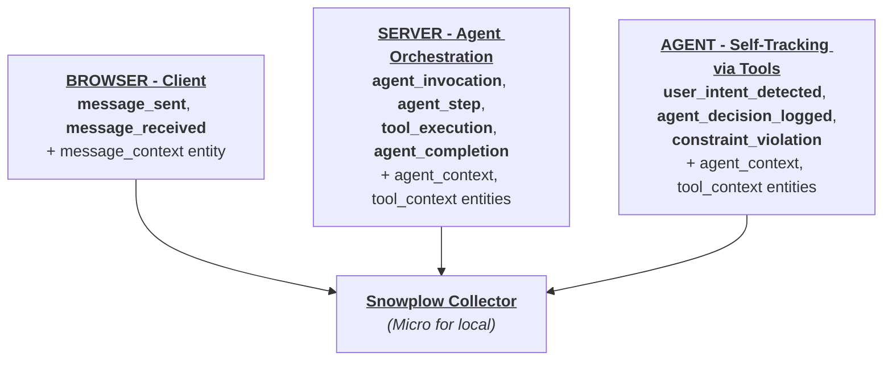

AI-powered applications have a visibility problem. Traditional analytics tells you what users clicked and which pages they visited. When your product is an AI agent, however, interesting behavior happens in layers you can't see from the browser.

Consider a travel booking chatbot. A user types "find me cheap flights to Paris tomorrow." Behind the scenes:

1. The browser sends the message.
2. The server orchestrates a reasoning loop that's not visible to the client.
   - The LLM is invoked
   - It decides which tools to call
   - It executes a flight search
   - It processes results
   - It streams a response
3. The agent makes decisions you can't observe from either the client or the server framework, such as intepreting user intent, choosing parameters for tool calls, or detecting when requirements can't be met.

Tracking for each of these layers will answer a different question:
- **Client-side tracking:** "What did the user do?"
- **Server-side tracking:** "What did the agent do?"
- **Agent self-tracking:** "What did the agent think?"

By combining all three layers, you'll be able to answer questions like:
- How many messages do users send per session?
- How long do agent responses take?
- Which tools get called most often? Do they succeed or fail?
- How many LLM steps and tokens does each request use?
- Why did the agent give that particular answer?
- When can't the agent meet a user's request, and how often does that happen?

This accelerator walks you through instrumenting all three tracking layers with [Snowplow](https://snowplow.io/) behavioral data tracking.

You **don't need a Snowplow account** to follow this accelerator.

## What you'll build

You'll work with a fully functional travel booking chatbot built with Next.js and the Vercel AI SDK. The app supports multiple LLM providers (Anthropic Claude, OpenAI GPT, Google Gemini) and has three business tools: flight search, flight booking, and calendar checking.

Snowplow provides a set of generic agentic tracking [schemas](/docs/fundamentals/schemas/) on [Iglu Central](https://iglucentral.com/) that cover the agent lifecycle out of the box - invocations, steps, tool executions, completions, and more.

For domain-specific data such as extracted travel intent or flight search parameters, this accelerator will help you create your own custom [entities](/docs/fundamentals/entities/) and attach them alongside the generic schemas.

By the end of this accelerator, you'll have added:

- Ten event schemas and three entities from Iglu Central covering the generic agent lifecycle
- Three custom entities for travel-specific data: extracted intent, tool parameters, and tool results
- Schema validation against all events locally via [Snowplow Micro](/docs/testing/snowplow-micro/)
- A real-time event panel in the UI visualizing the event stream as it happens

## Architecture

The three tracking layers correspond to where events are emitted and what they capture:



All events flow to the same Snowplow Collector. In this accelerator, you'll use a [Snowplow Micro](/docs/testing/snowplow-micro/) pipeline running locally in Docker to validate events against their schemas in real-time.

### Data lineage

Every event in the system connects to others through shared identifiers. A single user message triggers events across all three layers, traceable through two IDs:

- `session_id` - generated once per browser session and stored in localStorage. It links all activity for a given user session.
- `invocation_id` - generated per API request. It links every event within a single agent lifecycle.

Here's how they connect:

```
session_id (browser localStorage UUID)
  └→ invocation_id (created per /api/chat request)
       ├→ message_sent (client) ────────── message_context
       ├→ agent_invocation (server) ────── agent_context
       ├→ user_intent_detected (agent) ─── agent_context + tool_context
       ├→ agent_decision_logged (agent) ── agent_context + tool_context
       ├→ agent_step (server) ──────────── agent_context
       ├→ tool_execution (server) ──────── agent_context + tool_context
       ├→ constraint_violation (agent) ─── agent_context + tool_context
       ├→ agent_completion (server) ────── agent_context
       └→ message_received (client) ────── message_context
```

You can start from any event and trace outward:

- From a `constraint_violation`, find the `user_intent_detected` in the same invocation to see what the user originally asked for
- From an `agent_completion` with high `total_tokens`, drill into the `agent_step` events to see which steps consumed the most tokens
- From a `message_received` with a long `response_time_ms`, trace the `tool_execution` events to find which tool was slow
- From a `user_intent_detected` with low `confidence`, check if the agent asked for clarification or guessed wrong

## How to follow this accelerator

This accelerator supports two learning paths:

**Code-along:** you build tracking from scratch on your own copy of the starter app. The accelerator gives you code to write, where to put it, and why.

**Read-along:** you check out each git tag, read the code, run the app, and observe events in Snowplow Micro. The accelerator explains what was done and why.

:::tip[Which path should I choose?]
- **Developer or Architect** - choose **code-along** if you want hands-on implementation experience. You'll write tracking code, create schemas, and debug validation errors yourself.
- **Analyst or Data Architect** - choose **read-along** if you want to understand the architecture and data model without writing every line. You'll focus on how the tracking layers fit together, what the schemas capture, and how to design your own entity model.

Both paths cover the same concepts. You can switch between them at any stage.
:::

The [companion repository](https://github.com/snowplow-industry-solutions/agentic-app-tracking-tutorial) has four tagged commits, one for each stage:


| Tag                     | Stage                   | Question answered           |
| ----------------------- | ----------------------- | --------------------------- |
| `v0.0-starter`          | The initial application | (no tracking yet)           |
| `v0.1-client-tracking`  | Client-side tracking    | "What did the user do?"     |
| `v0.2-server-tracking`  | Server-side tracking    | "What did the agent do?"    |
| `v0.3-agentic-tracking` | Agentic self-tracking   | "What did the agent think?" |

## Prerequisites

You'll need:

- Node.js 18+ installed
- Docker installed and running
- At least one LLM API key
  - Anthropic `ANTHROPIC_API_KEY`
  - OpenAI `OPENAI_API_KEY`
  - Google `GOOGLE_GENERATIVE_AI_API_KEY`
- Git installed
