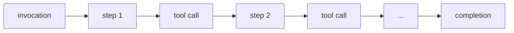

---

title: "Server-side tracking"
sidebar_label: "Server-side tracking"
position: 4
description: "Add server-side Snowplow tracking for the agent's orchestration loop - invocations, steps, tool executions, and completions - with full lifecycle tracing."
keywords: ["snowplow", "agentic", "tracking", "ai", "server-side", "node tracker", "agent lifecycle"]
date: "2026-03-26"

---

Client-side tracking tells you what the user did. Now you'll add server-side tracking for the agent's orchestration loop, capturing every invocation, reasoning step, tool execution, and completion with token counts, latency, and success/failure status.

:::tip Code-along / Read-along
If you're coding along, continue from the previous stage and create the files described below. If you're reading along:

```bash
git checkout v0.2-server-tracking
npm install
```

To see exactly what changed: `git diff v0.1-client-tracking..v0.2-server-tracking`
:::

## Why client-side isn't enough

The browser sees two things: the user sent a message, and eventually a response appeared. But between those two points, the server orchestrates an entire reasoning loop:




Each step involves an LLM call. Each tool call has its own latency and can succeed or fail. The agent consumes tokens, makes decisions, and may loop multiple times before producing a final response. None of this is visible from the client.

Server-side tracking answers: how many steps did the agent take? How many tokens did it use? How long did each tool take? Did the agent succeed?

:::note[The agent lifecycle]
Every request to the chat API triggers an invocation - a complete cycle of the agent doing its work. Within an invocation, the agent takes steps (LLM reasoning iterations). Some steps include tool executions. When the agent has a final response, the invocation reaches completion.

All events in a single lifecycle share an `invocation_id` for correlation. This ID joins client events (which carry it in `message_received`) with server events.
:::

## What you'll add

This stage introduces:

- One new dependency: `@snowplow/node-tracker`
- Four event schemas from Iglu Central: `agent_invocation`, `agent_step`, `tool_execution`, `agent_completion`
- Two entity schemas from Iglu Central: `agent_context`, `tool_context`
- Two custom entity schemas (created locally): `tool_params`, `tool_results` - domain-specific entities for the travel app's business tools
- One new file: `src/lib/tracking/server.ts` - the server tracking module
- Modifications to: `src/app/api/chat/route.ts` (wiring tracking into the agent lifecycle) and `src/lib/tools/business-tools.ts` (tools self-instrument their execution)

## Define the schemas

The six generic schemas used in this stage - four events and two entities - are published on [Iglu Central](https://github.com/snowplow/iglu-central) under vendor `com.snowplow.agent.tracking`, just like the client-side schemas from the previous stage. You'll also create two custom entities for domain-specific data that live in your local `iglu-local` directory.

### agent_context entity

The `agent_context` entity is attached to every server-side event. It identifies the invocation, session, model, and current state.

```yaml title="agent_context schema (Iglu Central)"
apiVersion: v1
resourceType: data-structure
meta:
  hidden: false
  schemaType: entity
  customData: {}
data:
  $schema: 'http://iglucentral.com/schemas/com.snowplowanalytics.self-desc/schema/jsonschema/1-0-0#'
  description: 'Context entity describing the agent and its current state.'
  self:
    vendor: com.snowplow.agent.tracking
    name: agent_context
    format: jsonschema
    version: 1-0-0
  type: object
  properties:
    invocation_id:
      type: string
      description: 'Unique identifier for current agent invocation'
      maxLength: 36
    session_id:
      type: string
      description: 'User session identifier'
      maxLength: 36
    user_id:
      type:
        - string
        - 'null'
      description: 'User identifier if authenticated'
    agent_type:
      type: string
      description: 'Type/name of agent'
      maxLength: 100
    model_name:
      type: string
      description: 'LLM model identifier'
      maxLength: 100
    model_provider:
      type: string
      description: 'LLM provider (e.g., anthropic, openai)'
      maxLength: 50
    conversation_messages_count:
      type:
        - integer
        - 'null'
      description: 'Number of messages in conversation history'
    current_step_number:
      type:
        - integer
        - 'null'
      description: 'Current step number within the invocation'
  required:
    - invocation_id
    - session_id
    - agent_type
    - model_name
    - model_provider
  additionalProperties: false
```

### tool_context entity

The `tool_context` entity is attached to tool-related events. It identifies the tool and its category.

```yaml title="tool_context schema (Iglu Central)"
apiVersion: v1
resourceType: data-structure
meta:
  hidden: false
  schemaType: entity
  customData: {}
data:
  $schema: 'http://iglucentral.com/schemas/com.snowplowanalytics.self-desc/schema/jsonschema/1-0-0#'
  description: 'Context entity describing a tool being invoked by the agent.'
  self:
    vendor: com.snowplow.agent.tracking
    name: tool_context
    format: jsonschema
    version: 1-0-0
  type: object
  properties:
    tool_name:
      type: string
      description: 'Name of the tool being executed'
      maxLength: 100
    tool_category:
      type: string
      examples:
        - business
        - self_tracking
        - retrieval
        - orchestration
      description: 'Category of tool (application-defined)'
      maxLength: 100
    tool_call_id:
      type: string
      description: 'Unique identifier for this specific tool invocation'
      format: uuid
    tool_description:
      type:
        - string
        - 'null'
      description: 'Brief description of what this tool does'
      maxLength: 500
  required:
    - tool_name
    - tool_category
    - tool_call_id
  additionalProperties: false
```

:::note[Entity attachment]
Every server-side event carries an `agent_context` entity. Tool-related events additionally carry a `tool_context` entity. You can filter events by model, session, or invocation - and for tool events, also by tool name or category. The entities are attached at tracking time, not joined later.
:::

### Review the event schemas

The four server events form the agent lifecycle. Here's the `agent_invocation` event as an example - the others follow the same pattern:

```yaml title="agent_invocation schema (Iglu Central)"
apiVersion: v1
resourceType: data-structure
meta:
  hidden: false
  schemaType: event
  customData: {}
data:
  $schema: 'http://iglucentral.com/schemas/com.snowplowanalytics.self-desc/schema/jsonschema/1-0-0#'
  description: 'Marks the start of an agent invocation.'
  self:
    vendor: com.snowplow.agent.tracking
    name: agent_invocation
    format: jsonschema
    version: 1-0-0
  type: object
  properties:
    invocation_id:
      type: string
      description: 'Unique identifier for this agent invocation'
      maxLength: 36
    session_id:
      type: string
      description: 'User session identifier'
      maxLength: 36
    user_message_preview:
      type:
        - string
        - 'null'
      description: 'Truncated user message that triggered invocation'
      maxLength: 500
    invoked_at:
      type: string
      format: date-time
      description: 'Timestamp when invocation started'
  required:
    - invocation_id
    - session_id
    - invoked_at
  additionalProperties: false
```

The other three event schemas cover:

- `agent_step`: each reasoning iteration - `step_number`, `step_type` (initial/continue/tool-result), `input_tokens`, `output_tokens`, `finish_reason`, `tool_calls_count`
- `tool_execution`: each tool call - `execution_duration_ms`, `success`, `error_type`, `error_message`
- `agent_completion`: the invocation summary - `total_steps`, `total_duration_ms`, `total_tokens`, `tools_called`, `finish_reason`, `success`

### Create custom entities for domain-specific data

The generic schemas above capture the agent lifecycle - that a tool was called, how long it took, whether it succeeded. But they don't capture *what* was searched for or *what* came back. That data is specific to your application's domain.

This is where [custom entities](/docs/fundamentals/entities/#custom-entities) come in. You create schemas for your own domain data and attach them to the generic events as additional entities. The generic `tool_execution` event carries the lifecycle data; your custom entities carry the business data.

For the travel app, you'll create two custom entities under vendor `com.snowplow.demo.travel`:

- `tool_params` - the parameters passed to each business tool (origin, destination, dates, etc.)
- `tool_results` - the results returned from each business tool (flights found, booking ID, etc.)

Both entities use a consolidated design - one schema covers all three business tools, with nullable fields for each tool's specific data. Which fields are populated depends on `tool_context.tool_name`. This keeps the number of schemas small at the cost of some sparsity in the warehouse columns.

Create the `tool_params` entity at `snowplow/iglu-local/schemas/com.snowplow.demo.travel/tool_params/jsonschema/1-0-0`:

```json title="snowplow/iglu-local/schemas/com.snowplow.demo.travel/tool_params/jsonschema/1-0-0"
{
  "$schema": "http://iglucentral.com/schemas/com.snowplowanalytics.self-desc/schema/jsonschema/1-0-0#",
  "description": "Parameters passed to business tools in the travel demo app. Consolidated entity covering search_flights, book_flight, and check_calendar.",
  "self": {
    "vendor": "com.snowplow.demo.travel",
    "name": "tool_params",
    "format": "jsonschema",
    "version": "1-0-0"
  },
  "type": "object",
  "properties": {
    "origin": {
      "type": ["string", "null"],
      "description": "Origin city or airport code (search_flights)",
      "maxLength": 200
    },
    "destination": {
      "type": ["string", "null"],
      "description": "Destination city or airport code (search_flights)",
      "maxLength": 200
    },
    "date": {
      "type": ["string", "null"],
      "description": "Departure date in YYYY-MM-DD format (search_flights)",
      "maxLength": 10
    },
    "return_date": {
      "type": ["string", "null"],
      "description": "Return date for round-trip (search_flights)",
      "maxLength": 10
    },
    "passengers": {
      "type": ["integer", "null"],
      "description": "Number of passengers (search_flights)",
      "minimum": 1
    },
    "cabin_class": {
      "type": ["string", "null"],
      "description": "Cabin class (search_flights)",
      "maxLength": 50
    },
    "sort_by": {
      "type": ["string", "null"],
      "description": "Sort order for results (search_flights)",
      "maxLength": 50
    },
    "max_results": {
      "type": ["integer", "null"],
      "description": "Maximum number of results to return (search_flights)",
      "minimum": 1
    },
    "flight_id": {
      "type": ["string", "null"],
      "description": "Unique identifier of the flight to book (book_flight)",
      "maxLength": 200
    },
    "airline": {
      "type": ["string", "null"],
      "description": "Airline name (book_flight)",
      "maxLength": 200
    },
    "flight_number": {
      "type": ["string", "null"],
      "description": "Flight number (book_flight)",
      "maxLength": 50
    },
    "passenger_name": {
      "type": ["string", "null"],
      "description": "Passenger full name (book_flight)",
      "maxLength": 500
    },
    "payment_method": {
      "type": ["string", "null"],
      "description": "Payment method (book_flight)",
      "maxLength": 50
    },
    "start_date": {
      "type": ["string", "null"],
      "description": "Start date in YYYY-MM-DD format (check_calendar)",
      "maxLength": 10
    },
    "end_date": {
      "type": ["string", "null"],
      "description": "End date in YYYY-MM-DD format (check_calendar)",
      "maxLength": 10
    },
    "user_id": {
      "type": ["string", "null"],
      "description": "User ID for calendar check (check_calendar)",
      "maxLength": 200
    }
  },
  "additionalProperties": false
}
```

Create the `tool_results` entity at `snowplow/iglu-local/schemas/com.snowplow.demo.travel/tool_results/jsonschema/1-0-0`:

```json title="snowplow/iglu-local/schemas/com.snowplow.demo.travel/tool_results/jsonschema/1-0-0"
{
  "$schema": "http://iglucentral.com/schemas/com.snowplowanalytics.self-desc/schema/jsonschema/1-0-0#",
  "description": "Results returned from business tools in the travel demo app. Consolidated entity covering search_flights, book_flight, and check_calendar.",
  "self": {
    "vendor": "com.snowplow.demo.travel",
    "name": "tool_results",
    "format": "jsonschema",
    "version": "1-0-0"
  },
  "type": "object",
  "properties": {
    "flights_found": {
      "type": ["integer", "null"],
      "description": "Number of flights matching the search criteria (search_flights)",
      "minimum": 0
    },
    "price_min": {
      "type": ["number", "null"],
      "description": "Lowest price among matching flights (search_flights)"
    },
    "price_max": {
      "type": ["number", "null"],
      "description": "Highest price among matching flights (search_flights)"
    },
    "price_currency": {
      "type": ["string", "null"],
      "description": "Currency code for price fields (search_flights)",
      "maxLength": 10
    },
    "booking_id": {
      "type": ["string", "null"],
      "description": "Unique booking identifier (book_flight)",
      "maxLength": 200
    },
    "confirmation_code": {
      "type": ["string", "null"],
      "description": "Booking confirmation code (book_flight)",
      "maxLength": 50
    },
    "booking_status": {
      "type": ["string", "null"],
      "description": "Status of the booking (book_flight)",
      "maxLength": 50
    },
    "conflicts_found": {
      "type": ["integer", "null"],
      "description": "Number of calendar conflicts found (check_calendar)",
      "minimum": 0
    },
    "available_dates_count": {
      "type": ["integer", "null"],
      "description": "Number of available dates in the range (check_calendar)",
      "minimum": 0
    }
  },
  "additionalProperties": false
}
```

These differ from the Iglu Central schemas in a few ways:

- Vendor: `com.snowplow.demo.travel` instead of `com.snowplow.agent.tracking`. This is your application's namespace, not the shared registry.
- Location: these live in `snowplow/iglu-local/`, not on Iglu Central. Snowplow Micro resolves them from the mounted volume.
- No required fields: every field is nullable. A `search_flights` call populates `origin`, `destination`, `date`, etc. while `flight_id`, `passenger_name`, and the calendar fields remain null.
- Format: these are JSON Schema files (not YAML) in Iglu's directory convention: `schemas/{vendor}/{name}/jsonschema/{version}`.

Snowplow Micro automatically picks up schemas from `iglu-local` alongside those it resolves from Iglu Central. No configuration changes needed - the `start.sh` volume mount you set up in the previous stage already handles this.

<details>
<summary>Alternative approach: per-tool entities (six schemas instead of two)</summary>

The consolidated approach above uses one `tool_params` schema and one `tool_results` schema for all three business tools. An alternative is to create separate schemas per tool - one params and one results entity for each:

| Entity                   | Fields                                                                                                | Attached to                                         |
| ------------------------ | ----------------------------------------------------------------------------------------------------- | --------------------------------------------------- |
| `search_flights_params`  | `origin`, `destination`, `date`, `return_date`, `passengers`, `cabin_class`, `sort_by`, `max_results` | `tool_execution` where `tool_name = search_flights` |
| `search_flights_results` | `flights_found`, `price_min`, `price_max`, `price_currency`                                           | same                                                |
| `book_flight_params`     | `flight_id`, `airline`, `flight_number`, `passenger_name`, `payment_method`                           | `tool_execution` where `tool_name = book_flight`    |
| `book_flight_results`    | `booking_id`, `confirmation_code`, `booking_status`                                                   | same                                                |
| `check_calendar_params`  | `start_date`, `end_date`, `user_id`                                                                   | `tool_execution` where `tool_name = check_calendar` |
| `check_calendar_results` | `conflicts_found`, `available_dates_count`                                                            | same                                                |

Trade-offs:

|                   | Consolidated (two schemas)                                                                                 | Per-tool (six schemas)                                                        |
| ----------------- | ---------------------------------------------------------------------------------------------------------- | ----------------------------------------------------------------------------- |
| Schema count      | Fewer schemas to maintain                                                                                  | More schemas, but each is small and focused                                   |
| Warehouse columns | Sparse - many null columns per row (a `search_flights` row has null `booking_id`, `conflicts_found`, etc.) | Dense - every column is meaningful for every row                              |
| Querying          | One table to query, filter by `tool_name` to find relevant columns                                         | Separate tables per tool, no filtering needed, each column is always relevant |
| Adding tools      | Add fields to existing schemas (new schema version)                                                        | Add a new pair of schemas (no version bump on existing ones)                  |
| Type safety       | Looser - nothing prevents setting `booking_id` on a `search_flights` event                                 | Tighter - each schema only has fields that apply to that tool                 |

The consolidated approach works well for demos and applications with a small number of tools where sparsity is manageable. The per-tool approach is better for production applications with many tools or where strict typing and dense warehouse tables matter. This accelerator uses the consolidated approach for simplicity.

</details>

## Create the server tracking module

The server tracking module follows the same singleton pattern as the client module, but uses the Node.js tracker and server-side environment variables.

### Initialize the tracker

```typescript title="src/lib/tracking/server.ts"
import {
  newTracker,
  buildSelfDescribingEvent,
  type Tracker,
} from '@snowplow/node-tracker';

let serverTracker: Tracker | null = null;

const initServerTracker = (): Tracker | null => {
  if (serverTracker) return serverTracker;

  const collectorUrl = process.env.SNOWPLOW_COLLECTOR_URL;
  const appId = process.env.SNOWPLOW_APP_ID;

  if (!collectorUrl || !appId) {
    console.warn(
      'Snowplow server tracker not initialized: missing SNOWPLOW_COLLECTOR_URL or SNOWPLOW_APP_ID',
    );
    return null;
  }

  serverTracker = newTracker(
    {
      namespace: 'travel-agent-server',
      appId: appId,
      encodeBase64: false,
    },
    {
      endpoint: collectorUrl,
      protocol: 'http',
      eventMethod: 'post',
      bufferSize: 1,
    },
  );

  return serverTracker;
};
```

`bufferSize: 1` flushes events to the Collector immediately after each one is tracked. In production you'd use a larger buffer for efficiency, but for development this ensures events appear in Micro instantly.

The environment variables don't have the `NEXT_PUBLIC_` prefix - they're server-only and never included in the browser bundle.

### Build the context entity helpers

The generic entity builders reference schemas on Iglu Central:

```typescript title="src/lib/tracking/server.ts (continued)"
export interface AgentContextData {
  invocation_id: string;
  session_id: string;
  user_id?: string | null;
  agent_type: string;
  model_name: string;
  model_provider: string;
  conversation_messages_count?: number | null;
  current_step_number?: number | null;
}

const buildAgentContext = (data: AgentContextData) => ({
  schema: 'iglu:com.snowplow.agent.tracking/agent_context/jsonschema/1-0-0' as const,
  data: data as unknown as Record<string, unknown>,
});

export interface ToolContextData {
  tool_name: string;
  tool_category: 'business' | 'self_tracking';
  tool_call_id: string;
  tool_description?: string | null;
}

const buildToolContext = (data: ToolContextData) => ({
  schema: 'iglu:com.snowplow.agent.tracking/tool_context/jsonschema/1-0-0' as const,
  data: data as unknown as Record<string, unknown>,
});
```

The custom entity builders reference the local schemas you created in `iglu-local`:

```typescript title="src/lib/tracking/server.ts (continued)"
export interface ToolParamsData {
  origin?: string | null;
  destination?: string | null;
  date?: string | null;
  return_date?: string | null;
  passengers?: number | null;
  cabin_class?: string | null;
  sort_by?: string | null;
  max_results?: number | null;
  flight_id?: string | null;
  airline?: string | null;
  flight_number?: string | null;
  passenger_name?: string | null;
  payment_method?: string | null;
  start_date?: string | null;
  end_date?: string | null;
  user_id?: string | null;
}

const buildToolParams = (data: ToolParamsData) => ({
  schema: 'iglu:com.snowplow.demo.travel/tool_params/jsonschema/1-0-0' as const,
  data: data as unknown as Record<string, unknown>,
});

export interface ToolResultsData {
  flights_found?: number | null;
  price_min?: number | null;
  price_max?: number | null;
  price_currency?: string | null;
  booking_id?: string | null;
  confirmation_code?: string | null;
  booking_status?: string | null;
  conflicts_found?: number | null;
  available_dates_count?: number | null;
}

const buildToolResults = (data: ToolResultsData) => ({
  schema: 'iglu:com.snowplow.demo.travel/tool_results/jsonschema/1-0-0' as const,
  data: data as unknown as Record<string, unknown>,
});
```

The schema URIs use vendor `com.snowplow.demo.travel` - these resolve from `iglu-local`, not from Iglu Central.

### Add the tracking functions

Each lifecycle event gets its own function. Here's `trackAgentInvocation`:

```typescript title="src/lib/tracking/server.ts (continued)"
export const trackAgentInvocation = (params: AgentInvocationParams) => {
  const t = initServerTracker();
  if (!t) return;

  t.track(
    buildSelfDescribingEvent({
      event: {
        schema: 'iglu:com.snowplow.agent.tracking/agent_invocation/jsonschema/1-0-0',
        data: {
          invocation_id: params.invocationId,
          session_id: params.sessionId,
          user_message_preview: params.userMessagePreview ?? null,
          invoked_at: new Date().toISOString(),
        },
      },
    }),
    [
      buildAgentContext({
        invocation_id: params.invocationId,
        session_id: params.sessionId,
        agent_type: params.agentType || 'travel_assistant',
        model_name: params.modelName,
        model_provider: params.modelProvider,
        conversation_messages_count: params.conversationMessagesCount ?? null,
      }),
    ],
  );
};
```

All four tracking functions lazy-initialize the tracker, return early if it can't initialize (the app works with or without tracking), build the event, and attach the relevant entities.

`trackToolExecution` is worth showing separately because it conditionally attaches the custom entities:

```typescript title="src/lib/tracking/server.ts (continued)"
export const trackToolExecution = (params: ToolExecutionParams) => {
  const t = initServerTracker();
  if (!t) return;

  const contexts: Array<{ schema: string; data: Record<string, unknown> }> = [
    buildToolContext({
      tool_name: params.toolName,
      tool_category: params.toolCategory,
      tool_call_id: params.toolCallId,
    }),
    buildAgentContext({
      invocation_id: params.invocationId,
      session_id: params.sessionId,
      agent_type: 'travel_assistant',
      model_name: params.modelName,
      model_provider: params.modelProvider,
      current_step_number: params.currentStepNumber ?? null,
    }),
  ];

  if (params.toolParams) {
    contexts.push(buildToolParams(params.toolParams));
  }

  if (params.toolResults) {
    contexts.push(buildToolResults(params.toolResults));
  }

  t.track(
    buildSelfDescribingEvent({
      event: {
        schema: 'iglu:com.snowplow.agent.tracking/tool_execution/jsonschema/1-0-0',
        data: {
          invocation_id: params.invocationId,
          step_number: params.stepNumber ?? null,
          execution_duration_ms: params.executionDurationMs,
          success: params.success,
          error_type: params.errorType ?? null,
          error_message: params.errorMessage ?? null,
          executed_at: new Date().toISOString(),
        },
      },
    }),
    contexts,
  );
};
```

The entities array starts with the two generic entities (`tool_context` and `agent_context`) and conditionally adds the custom entities. On a successful `search_flights` call, a single `tool_execution` event carries four entities: two from Iglu Central, two from `iglu-local`.

## Wire tracking into the chat route

The chat route needs a request-scoped context object to track state across the entire invocation, and hooks into the Vercel AI SDK's lifecycle callbacks.

### Add the request context

```typescript title="src/app/api/chat/route.ts"
export interface RequestContext {
  invocationId: string;
  sessionId: string;
  stepNumber: number;
  invocationStartTime: number;
  totalToolsCalled: number;
  businessToolsCalled: number;
  selfTrackingToolsCalled: number;
  modelName: string;
  modelProvider: ModelProvider;
}
```

This mutable context is created at the start of each request and passed to all tools and callbacks. It accumulates counters (steps taken, tools called) as the invocation progresses.

### Track the invocation at request entry

At the top of the `POST` handler, create the context and fire the invocation event:

```typescript title="src/app/api/chat/route.ts"
const requestContext: RequestContext = {
  invocationId: crypto.randomUUID(),
  sessionId: sessionId || crypto.randomUUID(),
  stepNumber: 1,
  invocationStartTime: Date.now(),
  totalToolsCalled: 0,
  businessToolsCalled: 0,
  selfTrackingToolsCalled: 0,
  modelName: modelConfig.id,
  modelProvider: modelConfig.provider,
};

trackAgentInvocation({
  invocationId: requestContext.invocationId,
  sessionId: requestContext.sessionId,
  userMessagePreview: userMessagePreview.substring(0, 500),
  agentType: 'travel_assistant',
  modelName: requestContext.modelName,
  modelProvider: requestContext.modelProvider,
  conversationMessagesCount: messages.length,
});
```

### Track steps and completion via callbacks

The Vercel AI SDK provides `onStepFinish` and `onFinish` callbacks:

```typescript title="src/app/api/chat/route.ts"
const result = streamText({
  model: model,
  messages: modelMessages,
  stopWhen: stepCountIs(10),
  system: `...`,
  tools: {
    search_flights: createSearchFlightsTool(requestContext),
    book_flight: createBookFlightTool(requestContext),
    check_calendar: createCheckCalendarTool(requestContext),
  },
  onStepFinish: async ({ text, toolCalls, usage, finishReason }) => {
    const stepType =
      requestContext.stepNumber === 1
        ? 'initial'
        : toolCalls.length > 0
          ? 'continue'
          : 'tool-result';

    trackAgentStep({
      invocationId: requestContext.invocationId,
      sessionId: requestContext.sessionId,
      stepNumber: requestContext.stepNumber,
      stepType,
      inputTokens: usage.inputTokens ?? 0,
      outputTokens: usage.outputTokens ?? 0,
      finishReason: mapFinishReasonForStep(finishReason),
      toolCallsCount: toolCalls.length,
      textLength: text.length,
      modelName: requestContext.modelName,
      modelProvider: requestContext.modelProvider,
      conversationMessagesCount: messages.length,
    });

    requestContext.stepNumber++;
  },
  onFinish: async ({ text, finishReason, totalUsage }) => {
    const totalDuration = Date.now() - requestContext.invocationStartTime;
    const totalTokens =
      totalUsage.totalTokens ??
      (totalUsage.inputTokens ?? 0) + (totalUsage.outputTokens ?? 0);

    trackAgentCompletion({
      invocationId: requestContext.invocationId,
      sessionId: requestContext.sessionId,
      totalSteps: requestContext.stepNumber,
      totalDurationMs: totalDuration,
      totalTokens,
      toolsCalled: requestContext.totalToolsCalled,
      businessToolsCalled: requestContext.businessToolsCalled,
      selfTrackingToolsCalled: requestContext.selfTrackingToolsCalled,
      finishReason: finishReason === 'error' ? 'error' : 'stop',
      success: finishReason !== 'error',
      finalResponseLength: text.length,
      modelName: requestContext.modelName,
      modelProvider: requestContext.modelProvider,
    });
  },
});
```

The tool factories receive `requestContext` as a parameter - `createSearchFlightsTool(requestContext)` - so they can access the shared context for tracking.

## Instrument the business tools

Each tool factory takes a `RequestContext` parameter and wraps its execution with timing and tracking. The domain-specific data - what was searched for, what came back - is attached as custom entities:

```typescript title="src/lib/tools/business-tools.ts"
export function createSearchFlightsTool(ctx: RequestContext) {
  return tool({
    description: 'Search for flights between two cities on a specific date',
    inputSchema: searchFlightsSchema,
    execute: async (params) => {
      const startTime = Date.now();
      const toolCallId = crypto.randomUUID();
      ctx.totalToolsCalled++;
      ctx.businessToolsCalled++;

      try {
        const results = await searchFlights(params);
        const duration = Date.now() - startTime;

        trackToolExecution({
          invocationId: ctx.invocationId,
          sessionId: ctx.sessionId,
          stepNumber: ctx.stepNumber,
          toolCallId,
          toolName: 'search_flights',
          toolCategory: 'business',
          executionDurationMs: duration,
          success: true,
          toolParams: {
            origin: params.origin,
            destination: params.destination,
            date: params.date,
            return_date: params.return_date ?? null,
            passengers: params.passengers,
            cabin_class: params.cabin_class,
            sort_by: params.sort_by,
            max_results: params.max_results,
          },
          toolResults: {
            flights_found: results.flights.length,
            price_min:
              results.flights.length > 0
                ? Math.min(...results.flights.map((f) => f.price.amount))
                : null,
            price_max:
              results.flights.length > 0
                ? Math.max(...results.flights.map((f) => f.price.amount))
                : null,
            price_currency:
              results.flights.length > 0
                ? results.flights[0].price.currency
                : null,
          },
          modelName: ctx.modelName,
          modelProvider: ctx.modelProvider,
          currentStepNumber: ctx.stepNumber,
        });

        return results;
      } catch (error) {
        const duration = Date.now() - startTime;

        trackToolExecution({
          invocationId: ctx.invocationId,
          sessionId: ctx.sessionId,
          stepNumber: ctx.stepNumber,
          toolCallId,
          toolName: 'search_flights',
          toolCategory: 'business',
          executionDurationMs: duration,
          success: false,
          errorType: 'execution_error',
          errorMessage: error instanceof Error ? error.message : 'Unknown error',
          modelName: ctx.modelName,
          modelProvider: ctx.modelProvider,
          currentStepNumber: ctx.stepNumber,
        });

        throw error;
      }
    },
  });
}
```

A few things to note in the code above:

- `startTime` is captured before execution, duration calculated after
- `ctx.totalToolsCalled++` and `ctx.businessToolsCalled++` keep the counters accurate for the completion event
- `toolParams` and `toolResults` are passed as structured objects that `trackToolExecution` attaches as custom entities alongside `tool_context` and `agent_context`
- Both success and failure paths are tracked - failure records `errorType` and `errorMessage` instead of custom entities
- `search_flights` populates `origin`, `destination`, `date` in params and `flights_found`, `price_min`, `price_max` in results; `book_flight` and `check_calendar` populate their respective fields in the same consolidated schemas

## Try it out

Check that `.env.local` has a valid API key for the model you plan to use - placeholder values like `sk-ant-...` cause silent failures.

```bash
git checkout v0.2-server-tracking  # (or verify your code-along)
npm run start:dev
```

1. Send "Find flights from London to Paris tomorrow"
2. Open **Snowplow Micro UI** at [http://localhost:9090/micro/ui](http://localhost:9090/micro/ui) - press **Refresh** to see both client and server events arriving
3. Find the `agent_invocation` event - note the `invocation_id` that links all events in this lifecycle
4. Find the `agent_step` events - observe `step_number` incrementing, token counts, and `finish_reason` ("tool_calls" when the agent wants to call a tool, "stop" when it has a final response)
5. Find the `tool_execution` for `search_flights` - note `execution_duration_ms` and the `success: true` flag. Drill into the event's entities and find the `tool_params` entity (with `origin`, `destination`, `date`) and `tool_results` entity (with `flights_found`, `price_min`, `price_max`) alongside the generic `tool_context` and `agent_context`
6. Find the `agent_completion` - note `total_steps`, `total_tokens`, `total_duration_ms`, and the aggregate tool counts
7. Trace the `invocation_id` across all events - use the Micro UI to drill into each event's entities and see how they form a complete lifecycle linked by this ID

:::note[Stage summary]
- Files: one added, three modified
- Events: `agent_invocation`, `agent_step`, `tool_execution`, `agent_completion`
- Entities: `agent_context`, `tool_context` (Iglu Central) + `tool_params`, `tool_results` (custom)
:::

You have visibility into both the user's actions and the agent's execution. But there's still a blind spot: *why* did the agent do what it did? When it chose to search for flights sorted by price, what was its reasoning? When it couldn't meet a user's budget, did it recognize the constraint? The next section gives the agent the ability to report its own thinking.
