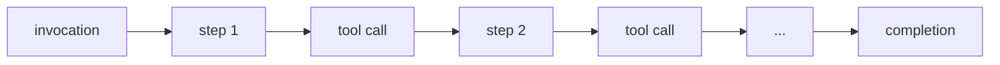

# Server-side tracking

In this stage, you'll add server-side tracking for the agent's orchestration loop. By the end, every invocation, reasoning step, tool execution, and completion will be captured with token counts, latency, and success/failure status.

:::tip Code-along / Read-along
If you're coding along, continue from the previous stage and create the files described below. If you're reading along:
```bash
git checkout v0.2-server-tracking
npm install
```
To see exactly what changed: `git diff v0.1-client-tracking..v0.2-server-tracking`
:::

## Why client-side isn't enough

The browser sees two things: the user sent a message, and eventually a response appeared. But between those two points, the server orchestrates an entire reasoning loop:



Each step involves an LLM call. Each tool call has its own latency and can succeed or fail. The agent consumes tokens, makes decisions, and may loop multiple times before producing a final response. None of this is visible from the client.

Server-side tracking answers: **How many steps did the agent take? How many tokens did it use? How long did each tool take? Did the agent succeed?**

:::info Key concept: The agent lifecycle
Every request to the chat API triggers an **invocation** - a complete cycle of the agent doing its work. Within an invocation, the agent takes **steps** (LLM reasoning iterations). Some steps include **tool executions**. When the agent has a final response, the invocation reaches **completion**.

All events in a single lifecycle share an `invocation_id` for correlation. This is the key to joining client events (which carry the same ID in `message_received`) with server events.
:::

## What you'll add

This stage introduces:

- **1 new dependency:** `@snowplow/node-tracker`
- **4 event schemas:** `agent_invocation`, `agent_step`, `tool_execution`, `agent_completion`
- **2 entity schemas:** `agent_context`, `tool_context`
- **1 new file:** `src/lib/tracking/server.ts` - the server tracking module
- **Modifications to:** `src/app/api/chat/route.ts` (wiring tracking into the agent lifecycle) and `src/lib/tools/business-tools.ts` (tools self-instrument their execution)

## Define the schemas

### agent_context entity

The `agent_context` entity is attached to every server-side event. It identifies the invocation, session, model, and current state.

```yaml title="snowplow/data-structures/entities/agent_context.yml"
apiVersion: v1
resourceType: data-structure
meta:
  hidden: false
  schemaType: entity
  customData: {}
data:
  $schema: 'http://iglucentral.com/schemas/com.snowplowanalytics.self-desc/schema/jsonschema/1-0-0#'
  description: 'Context entity describing the agent and its current state.'
  self:
    vendor: com.snowplow.demo
    name: agent_context
    format: jsonschema
    version: 1-0-0
  type: object
  properties:
    invocation_id:
      type: string
      description: 'Unique identifier for current agent invocation'
      maxLength: 36
    session_id:
      type: string
      description: 'User session identifier'
      maxLength: 36
    user_id:
      type:
        - string
        - 'null'
      description: 'User identifier if authenticated'
    agent_type:
      type: string
      description: 'Type/name of agent'
      maxLength: 100
    model_name:
      type: string
      description: 'LLM model identifier'
      maxLength: 100
    model_provider:
      type: string
      description: 'LLM provider (e.g., anthropic, openai)'
      maxLength: 50
    conversation_messages_count:
      type:
        - integer
        - 'null'
      description: 'Number of messages in conversation history'
    current_step_number:
      type:
        - integer
        - 'null'
      description: 'Current step number within the invocation'
  required:
    - invocation_id
    - session_id
    - agent_type
    - model_name
    - model_provider
  additionalProperties: false
```

### tool_context entity

The `tool_context` entity is attached to tool-related events. It identifies the tool, its category, and what parameters were passed.

```yaml title="snowplow/data-structures/entities/tool_context.yml"
apiVersion: v1
resourceType: data-structure
meta:
  hidden: false
  schemaType: entity
  customData: {}
data:
  $schema: 'http://iglucentral.com/schemas/com.snowplowanalytics.self-desc/schema/jsonschema/1-0-0#'
  description: 'Context entity describing a tool being invoked by the agent.'
  self:
    vendor: com.snowplow.demo
    name: tool_context
    format: jsonschema
    version: 1-0-0
  type: object
  properties:
    tool_name:
      type: string
      description: 'Name of the tool being executed'
      maxLength: 100
    tool_category:
      type: string
      enum:
        - business
        - self_tracking
      description: 'Category of tool'
    tool_call_id:
      type: string
      description: 'Unique identifier for this specific tool invocation'
      maxLength: 100
    tool_description:
      type:
        - string
        - 'null'
      description: 'Brief description of what this tool does'
      maxLength: 500
    parameters_summary:
      type:
        - object
        - 'null'
      description: 'Summary of key parameters passed to the tool'
  required:
    - tool_name
    - tool_category
    - tool_call_id
  additionalProperties: false
```

:::note Why this matters: entity attachment pattern
Every server-side event carries an `agent_context` entity. Tool-related events additionally carry a `tool_context` entity. This means you can always filter events by model, session, or invocation - and for tool events, you can also filter by tool name or category. The entities are attached at tracking time, not joined later.
:::

### Event schemas

The four server events form the agent lifecycle. Here's the `agent_invocation` event as an example - the others follow the same pattern:

```yaml title="snowplow/data-structures/events/server/agent_invocation.yml"
apiVersion: v1
resourceType: data-structure
meta:
  hidden: false
  schemaType: event
  customData: {}
data:
  $schema: 'http://iglucentral.com/schemas/com.snowplowanalytics.self-desc/schema/jsonschema/1-0-0#'
  description: 'Marks the start of an agent invocation.'
  self:
    vendor: com.snowplow.demo
    name: agent_invocation
    format: jsonschema
    version: 1-0-0
  type: object
  properties:
    invocation_id:
      type: string
      description: 'Unique identifier for this agent invocation'
      maxLength: 36
    session_id:
      type: string
      description: 'User session identifier'
      maxLength: 36
    user_message_preview:
      type:
        - string
        - 'null'
      description: 'Truncated user message that triggered invocation'
      maxLength: 500
    invoked_at:
      type: string
      format: date-time
      description: 'Timestamp when invocation started'
  required:
    - invocation_id
    - session_id
    - invoked_at
  additionalProperties: false
```

The other three event schemas cover:

- **`agent_step`:** Each reasoning iteration - `step_number`, `step_type` (initial/continue/tool-result), `prompt_tokens`, `completion_tokens`, `finish_reason`, `tool_calls_count`
- **`tool_execution`:** Each tool call - `execution_duration_ms`, `success`, `error_type`, `error_message`, `result_summary`
- **`agent_completion`:** The invocation summary - `total_steps`, `total_duration_ms`, `total_tokens`, `tools_called`, `finish_reason`, `success`

## Create the server tracking module

The server tracking module follows the same singleton pattern as the client module, but uses the Node.js tracker and server-side environment variables.

### Initialize the tracker

```typescript title="src/lib/tracking/server.ts"
import {
  newTracker,
  buildSelfDescribingEvent,
  type Tracker,
} from '@snowplow/node-tracker';

let serverTracker: Tracker | null = null;

const initServerTracker = (): Tracker | null => {
  if (serverTracker) return serverTracker;

  const collectorUrl = process.env.SNOWPLOW_COLLECTOR_URL;
  const appId = process.env.SNOWPLOW_APP_ID;

  if (!collectorUrl || !appId) {
    console.warn(
      'Snowplow server tracker not initialized: missing SNOWPLOW_COLLECTOR_URL or SNOWPLOW_APP_ID',
    );
    return null;
  }

  serverTracker = newTracker(
    {
      namespace: 'travel-agent-server',
      appId: appId,
      encodeBase64: false,
    },
    {
      endpoint: collectorUrl,
      protocol: 'http',
      eventMethod: 'post',
      bufferSize: 1,
    },
  );

  return serverTracker;
};
```

Notice `bufferSize: 1` - this flushes events to the collector immediately after each one is tracked. In production you'd use a larger buffer for efficiency, but for development this ensures events appear in Micro instantly.

Also notice the environment variables don't have the `NEXT_PUBLIC_` prefix. These are server-only - they're never included in the browser bundle.

### Context entity builders

```typescript title="src/lib/tracking/server.ts (continued)"
export interface AgentContextData {
  invocation_id: string;
  session_id: string;
  user_id?: string | null;
  agent_type: string;
  model_name: string;
  model_provider: string;
  conversation_messages_count?: number | null;
  current_step_number?: number | null;
}

const buildAgentContext = (data: AgentContextData) => ({
  schema: 'iglu:com.snowplow.demo/agent_context/jsonschema/1-0-0' as const,
  data: data as unknown as Record<string, unknown>,
});

export interface ToolContextData {
  tool_name: string;
  tool_category: 'business' | 'self_tracking';
  tool_call_id: string;
  tool_description?: string | null;
  parameters_summary?: Record<string, unknown> | null;
}

const buildToolContext = (data: ToolContextData) => ({
  schema: 'iglu:com.snowplow.demo/tool_context/jsonschema/1-0-0' as const,
  data: data as unknown as Record<string, unknown>,
});
```

### Tracking functions

Each lifecycle event gets its own function. Here's `trackAgentInvocation` as the pattern example:

```typescript title="src/lib/tracking/server.ts (continued)"
export const trackAgentInvocation = (params: AgentInvocationParams) => {
  const t = initServerTracker();
  if (!t) return;

  t.track(
    buildSelfDescribingEvent({
      event: {
        schema: 'iglu:com.snowplow.demo/agent_invocation/jsonschema/1-0-0',
        data: {
          invocation_id: params.invocationId,
          session_id: params.sessionId,
          user_message_preview: params.userMessagePreview ?? null,
          invoked_at: new Date().toISOString(),
        },
      },
    }),
    [
      buildAgentContext({
        invocation_id: params.invocationId,
        session_id: params.sessionId,
        agent_type: params.agentType || 'travel_assistant',
        model_name: params.modelName,
        model_provider: params.modelProvider,
        conversation_messages_count: params.conversationMessagesCount ?? null,
      }),
    ],
  );
};
```

Every tracking function follows this pattern:

1. Get the tracker (lazy-initialize if needed)
2. Return early if the tracker can't initialize (graceful degradation - the app works with or without tracking)
3. Build the event with its schema and data
4. Attach the relevant context entities

The remaining functions - `trackAgentStep`, `trackToolExecution`, and `trackAgentCompletion` - follow the same structure with their respective schemas and data fields.

## Wire tracking into the chat route

The chat route needs a request-scoped context object to track state across the entire invocation, and hooks into the Vercel AI SDK's lifecycle callbacks.

### Add the request context

```typescript title="src/app/api/chat/route.ts"
export interface RequestContext {
  invocationId: string;
  sessionId: string;
  stepNumber: number;
  invocationStartTime: number;
  totalToolsCalled: number;
  businessToolsCalled: number;
  selfTrackingToolsCalled: number;
  modelName: string;
  modelProvider: ModelProvider;
}
```

This mutable context is created at the start of each request and passed to all tools and callbacks. It accumulates counters (steps taken, tools called) as the invocation progresses.

### Track the invocation at request entry

At the top of the `POST` handler, create the context and fire the invocation event:

```typescript title="src/app/api/chat/route.ts"
const requestContext: RequestContext = {
  invocationId: crypto.randomUUID(),
  sessionId: sessionId || crypto.randomUUID(),
  stepNumber: 1,
  invocationStartTime: Date.now(),
  totalToolsCalled: 0,
  businessToolsCalled: 0,
  selfTrackingToolsCalled: 0,
  modelName: modelConfig.id,
  modelProvider: modelConfig.provider,
};

trackAgentInvocation({
  invocationId: requestContext.invocationId,
  sessionId: requestContext.sessionId,
  userMessagePreview: userMessagePreview.substring(0, 500),
  agentType: 'travel_assistant',
  modelName: requestContext.modelName,
  modelProvider: requestContext.modelProvider,
  conversationMessagesCount: messages.length,
});
```

### Track steps and completion via callbacks

The Vercel AI SDK provides `onStepFinish` and `onFinish` callbacks:

```typescript title="src/app/api/chat/route.ts"
const result = streamText({
  model: model,
  messages: modelMessages,
  stopWhen: stepCountIs(10),
  system: `...`,
  tools: {
    search_flights: createSearchFlightsTool(requestContext),
    book_flight: createBookFlightTool(requestContext),
    check_calendar: createCheckCalendarTool(requestContext),
  },
  onStepFinish: async ({ text, toolCalls, usage, finishReason }) => {
    const stepType =
      requestContext.stepNumber === 1
        ? 'initial'
        : toolCalls.length > 0
          ? 'continue'
          : 'tool-result';

    trackAgentStep({
      invocationId: requestContext.invocationId,
      sessionId: requestContext.sessionId,
      stepNumber: requestContext.stepNumber,
      stepType,
      promptTokens: usage.inputTokens ?? 0,
      completionTokens: usage.outputTokens ?? 0,
      finishReason: mapFinishReasonForStep(finishReason),
      toolCallsCount: toolCalls.length,
      textLength: text.length,
      modelName: requestContext.modelName,
      modelProvider: requestContext.modelProvider,
      conversationMessagesCount: messages.length,
    });

    requestContext.stepNumber++;
  },
  onFinish: async ({ text, finishReason, totalUsage }) => {
    const totalDuration = Date.now() - requestContext.invocationStartTime;
    const totalTokens =
      totalUsage.totalTokens ??
      (totalUsage.inputTokens ?? 0) + (totalUsage.outputTokens ?? 0);

    trackAgentCompletion({
      invocationId: requestContext.invocationId,
      sessionId: requestContext.sessionId,
      totalSteps: requestContext.stepNumber,
      totalDurationMs: totalDuration,
      totalTokens,
      toolsCalled: requestContext.totalToolsCalled,
      businessToolsCalled: requestContext.businessToolsCalled,
      selfTrackingToolsCalled: requestContext.selfTrackingToolsCalled,
      finishReason: finishReason === 'error' ? 'error' : 'stop',
      success: finishReason !== 'error',
      finalResponseLength: text.length,
      modelName: requestContext.modelName,
      modelProvider: requestContext.modelProvider,
    });
  },
});
```

Notice how the tool factories now receive `requestContext` as a parameter - `createSearchFlightsTool(requestContext)`. This is how tools access the shared context for tracking.

## Instrument the business tools

Each tool factory now takes a `RequestContext` parameter and wraps its execution with timing and tracking:

```typescript title="src/lib/tools/business-tools.ts"
export function createSearchFlightsTool(ctx: RequestContext) {
  return tool({
    description: 'Search for flights between two cities on a specific date',
    inputSchema: searchFlightsSchema,
    execute: async (params) => {
      const startTime = Date.now();
      const toolCallId = crypto.randomUUID();
      ctx.totalToolsCalled++;
      ctx.businessToolsCalled++;

      try {
        const results = await searchFlights(params);
        const duration = Date.now() - startTime;

        trackToolExecution({
          invocationId: ctx.invocationId,
          sessionId: ctx.sessionId,
          stepNumber: ctx.stepNumber,
          toolCallId,
          toolName: 'search_flights',
          toolCategory: 'business',
          executionDurationMs: duration,
          success: true,
          resultSummary: {
            flights_found: results.flights.length,
            price_range: results.flights.length > 0
              ? {
                  min: Math.min(...results.flights.map((f) => f.price.amount)),
                  max: Math.max(...results.flights.map((f) => f.price.amount)),
                  currency: results.flights[0].price.currency,
                }
              : null,
            origin: params.origin,
            destination: params.destination,
            date: params.date,
          },
          modelName: ctx.modelName,
          modelProvider: ctx.modelProvider,
          currentStepNumber: ctx.stepNumber,
        });

        return results;
      } catch (error) {
        const duration = Date.now() - startTime;

        trackToolExecution({
          invocationId: ctx.invocationId,
          sessionId: ctx.sessionId,
          stepNumber: ctx.stepNumber,
          toolCallId,
          toolName: 'search_flights',
          toolCategory: 'business',
          executionDurationMs: duration,
          success: false,
          errorType: 'execution_error',
          errorMessage: error instanceof Error ? error.message : 'Unknown error',
          modelName: ctx.modelName,
          modelProvider: ctx.modelProvider,
          currentStepNumber: ctx.stepNumber,
        });

        throw error;
      }
    },
  });
}
```

The key patterns here:

- **Timing:** `startTime` is captured before execution, duration calculated after
- **Counter incrementing:** `ctx.totalToolsCalled++` and `ctx.businessToolsCalled++` so the completion event has accurate totals
- **Both paths tracked:** Success records a `result_summary` with structured output metadata; failure records `errorType` and `errorMessage`
- **Tool-specific summaries:** `search_flights` records `flights_found` and `price_range`; `book_flight` records `booking_id` and `confirmation_code`; `check_calendar` records `conflicts_found` and `available_dates_count`

The `book_flight` and `check_calendar` tools follow the same wrapping pattern.

## Try it out

```bash
git checkout v0.2-server-tracking  # (or verify your code-along)
npm run start:dev
```

1. Send "Find flights from London to Paris tomorrow"
2. Open the **Snowplow Micro UI** at [http://localhost:9090/micro/ui](http://localhost:9090/micro/ui) - press refresh to see both client and server events arriving
3. Find the **`agent_invocation`** event - note the `invocation_id` that links all events in this lifecycle
4. Find the **`agent_step`** events - observe `step_number` incrementing, token counts, and `finish_reason` ("tool_calls" when the agent wants to call a tool, "stop" when it has a final response)
5. Find the **`tool_execution`** for `search_flights` - note `execution_duration_ms`, the `success: true` flag, and the `result_summary` showing how many flights were found and the price range
6. Find the **`agent_completion`** - note `total_steps`, `total_tokens`, `total_duration_ms`, and the aggregate tool counts
7. Trace the **`invocation_id`** across all events - use the Micro UI to drill into each event's entities and see how they form a complete lifecycle linked by this ID

---

> **Summary**
> **Files:** 1 added, 3 modified | **Events:** `agent_invocation`, `agent_step`, `tool_execution`, `agent_completion` | **Entities:** `agent_context`, `tool_context`
> **Key takeaway:** You can now trace the agent's entire reasoning lifecycle - every step, every tool call, every token. This answers "what did the agent do?"

You now have visibility into both the user's actions and the agent's execution. But there's still a blind spot: *why* did the agent do what it did? When it chose to search for flights sorted by price, what was its reasoning? When it couldn't meet a user's budget, did it recognize the constraint? The next section gives the agent the ability to report its own thinking.
