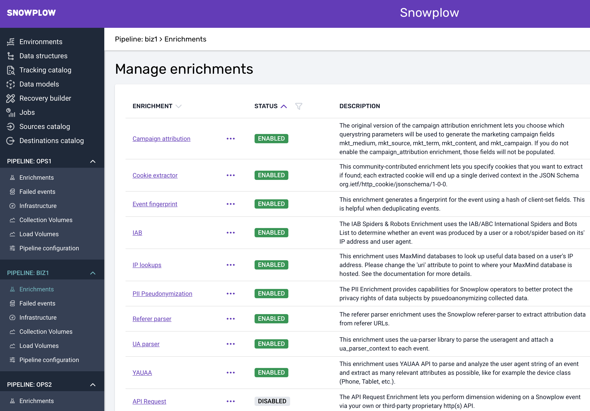

Snowplow offers a large number of enrichments that can be used to enhance your event data. An enrichment either updates or populates fields of the atomic event or adds a self-describing context to derived_contexts.

For this project, we need to enable the campaign attribution enrichment.

## Campaign Attribution

The campaign attribution enrichment takes the UTM parameters (or other marketing parameters from other systems) from a given URL and splits them out into separate columns that can subsequently be used for analysis. The snowplow-fractribution package needs these columns for its analysis.

### BDP Cloud

For BDP Cloud users adding enrichments is fairly straightforward: Simply click on `Enabled/Disabled` to change the status of the enrichment for your pipeline under `Enrichments`:



### Open Source

For Open Source users adding enrichments can be achieved by adding the following json file to your enrichment configuration:

`campaign_attribution.json`:

```json
{
	"schema": "iglu:com.snowplowanalytics.snowplow/campaign_attribution/jsonschema/1-0-1",
	"data": {
		"name": "campaign_attribution",
		"vendor": "com.snowplowanalytics.snowplow",
		"enabled": true,
		"parameters": {
			"mapping": "static",
			"fields": {
				"mktMedium": ["utm_medium"],
				"mktSource": ["utm_source"],
				"mktTerm": ["utm_term"],
				"mktContent": ["utm_content"],
				"mktCampaign": ["utm_campaign"]
			}
		}
	}
}
```

Enabling this enrichment will populate the mkt_medium, mkt_source, mkt_term, mkt_content and mkt_campaign columns in your events table, according to the mapping specified in the enrichment.

For full details on each of these enriched fields please refer to the full documentation available [here](https://docs.snowplow.io/docs/enriching-your-data/available-enrichments/campaign-attribution-enrichment/).
