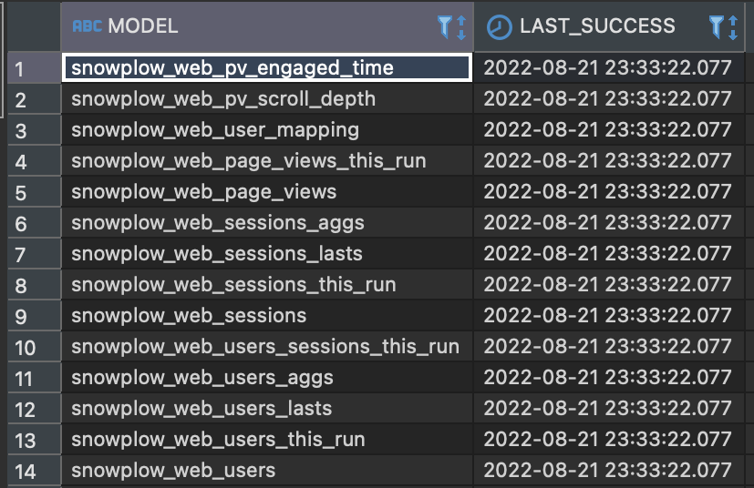

Congratulations! You have successfully completed the end-to-end attribution modeling tutorial. You now have a comprehensive understanding of how to implement fractional attribution analysis on your Snowplow data to make data-driven marketing decisions.

## What you've achieved

Through this tutorial, you have:

- **Uploaded and modeled sample data** using both the snowplow-web and snowplow-fractribution dbt packages to understand the attribution modeling process
- **Explored attribution results** demonstrating how different attribution models affect channel performance analysis and ROAS calculations
- **Implemented comprehensive tracking** for page views and e-commerce transactions needed for attribution analysis
- **Set up campaign attribution enrichment** to capture UTM parameters and marketing channel information
- **Configured fractional attribution analysis** using Python scripts or Docker containers to calculate channel contributions

The attribution modeling system you've built provides sophisticated analysis that goes beyond simple last-touch attribution, giving you a more accurate view of how marketing channels contribute to conversions.

## Next steps

Now that you have set up tracking and learned how to perform attribution modeling with the sample dataset, you can apply these techniques to your own production pipeline data.

### Model your pipeline data

If you have tracking and enrichment set up with data in your `ATOMIC.EVENTS` table:

1. **Complete refresh of your Snowplow web package** - Start fresh with your production data by running a full refresh with manifest reset:

```bash
dbt run --selector snowplow_web --full-refresh --vars 'snowplow__allow_refresh: true'
```

2. **Modify variables** for your production environment:
   - Remove the `snowplow__events` variable (defaults to `atomic.events`)
   - Set `snowplow__start_date` according to your actual data

3. **Run the snowplow_web model** on your production data:

```bash
dbt run --selector snowplow_web
```

4. **Test the output** to ensure data quality:

```bash
dbt test --selector snowplow_web_lean_tests
```

### Update attribution modeling for your data

For production attribution modeling, you'll need to update the channel spend data to reflect your actual advertising costs:

1. **Copy the channel_spend.sql macro** from `[dbt_project_name]/dbt_packages/snowplow_fractribution/macros/channel_spend.sql` and add it to your own dbt project's macros folder

2. **Update the SQL** in this macro to join the channel names to your ad spend per channel for the given window

3. **Run the snowplow_fractribution package** again with the updated spend data:

```bash
dbt run --select package:snowplow_fractribution --full-refresh
```

4. **Run the attribution script** (or Docker container) again with your production data to get accurate ROAS calculations based on real spend data

### Explore advanced use cases

With your attribution modeling foundation in place, consider extending your analytics capabilities:

- **Custom attribution models** - Experiment with different attribution models (shapley, first_touch, last_touch, position_based, linear) to understand their impact on your channel analysis
- **Advanced channel classification** - Customize the channel_classification macro to better reflect your specific marketing channels and campaigns
- **Time-based attribution analysis** - Perform attribution analysis for different time periods to understand seasonal effects and campaign performance
- **Cross-device attribution** - Extend the analysis to understand customer journeys across multiple devices
- **Integration with marketing platforms** - Connect attribution results with your marketing automation and campaign management tools

For more implementation guides and best practices, explore additional Snowplow tutorials and accelerators to realize even greater value from your attribution modeling data.



The attribution modeling system provides a powerful foundation for making data-driven marketing decisions based on a sophisticated understanding of how your marketing channels work together to drive conversions and revenue.
