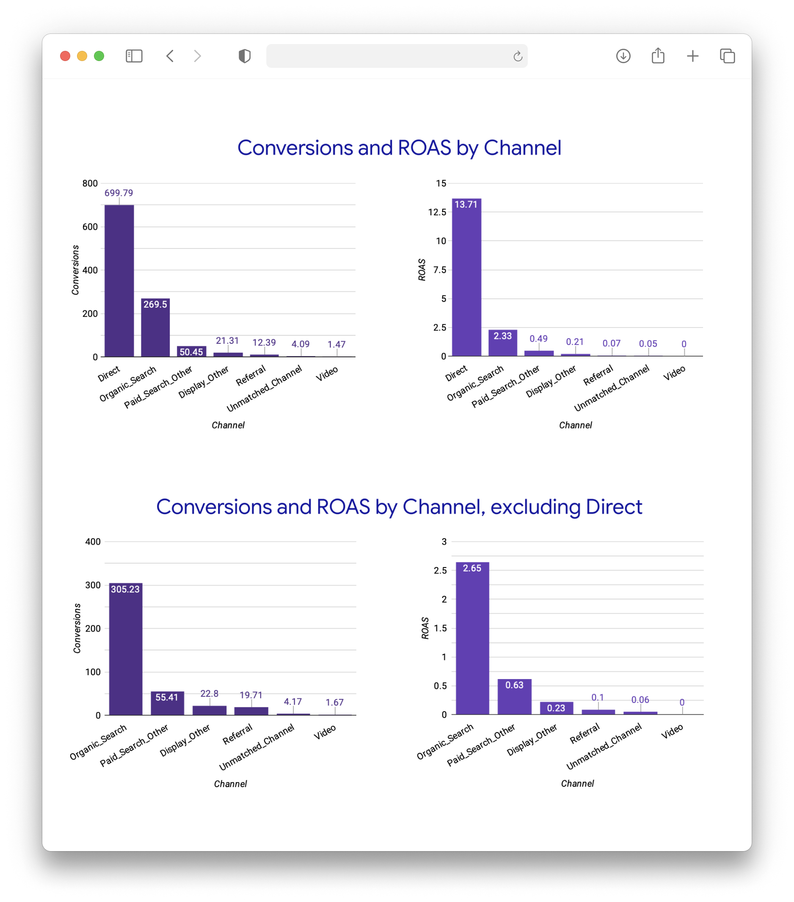

After running the attribution analysis, you'll have three key output tables in your data warehouse. Let's explore what these tables contain and how to interpret the results.

## Attribution output tables

The attribution analysis creates three main tables:

- `snowplow_fractribution_report_table`: The main output table that shows conversions, revenue, spend and ROAS per channel
- `snowplow_fractribution_channel_attribution`: The conversion and revenue attribution per channel (used to create the report table)
- `snowplow_fractribution_path_summary_with_channels`: An intermediate table that shows, for each unique path, a summary of conversions, non conversions and revenue, as well as which channels were assigned a contribution

## Example attribution report table

Below is an example of an attribution report table, which shows the calculated ROAS by attribution channel.

| conversion_window_start_date | conversion_window_end_date | channel           | conversions | revenue  | spend   | roas |
| ---------------------------- | -------------------------- | ----------------- | ----------- | -------- | ------- | ---- |
| 2022-06-03                   | 2022-08-01                 | Direct            | 699.8       | 137050.5 | 10000.0 | 13.7 |
| 2022-06-03                   | 2022-08-01                 | Organic_Search    | 269.5       | 23292.3  | 10000.0 | 2.33 |
| 2022-06-03                   | 2022-08-01                 | Paid_Search_Other | 50.4        | 4875.5   | 10000.0 | 0.49 |
| 2022-06-03                   | 2022-08-01                 | Display_Other     | 21.3        | 2069.0   | 10000.0 | 0.21 |
| 2022-06-03                   | 2022-08-01                 | Referral          | 12.4        | 653.3    | 10000.0 | 0.07 |
| 2022-06-03                   | 2022-08-01                 | Unmatched_Channel | 4.08        | 544.6    | 10000.0 | 0.05 |
| 2022-06-03                   | 2022-08-01                 | Video             | 1.5         | 29.5     | 10000.0 | 0.003|

This table shows the ROAS figures for each channel during the conversion window specified. It also shows the conversions attributed to each channel, and the revenue associated with that channel. In our example we have a uniform spend ($10000) for each channel but you can substitute and join this to your own internal dataset to accurately account for spend and ROAS for your own marketing budgets.

## Impact of channel exclusion

If we had instead specified to remove the `Direct` channel using the `snowplow__channels_to_exclude` variable, the table would look as follows:

| conversion_window_start_date | conversion_window_end_date | channel           | conversions | revenue  | spend   | roas |
| ---------------------------- | -------------------------- | ----------------- | ----------- | -------- | ------- | ---- |
| 2022-06-03                   | 2022-08-01                 | Organic_Search    | 305.2       | 26517.5  | 10000.0 | 2.65 |
| 2022-06-03                   | 2022-08-01                 | Paid_Search_Other | 55.4        | 6250.6   | 10000.0 | 0.63 |
| 2022-06-03                   | 2022-08-01                 | Display_Other     | 22.8        | 2254.1   | 10000.0 | 0.23 |
| 2022-06-03                   | 2022-08-01                 | Referral          | 19.7        | 951.1    | 10000.0 | 0.10 |
| 2022-06-03                   | 2022-08-01                 | Unmatched_Channel | 4.17        | 552.0    | 10000.0 | 0.06 |
| 2022-06-03                   | 2022-08-01                 | Video             | 1.7         | 29.1     | 10000.0 | 0.003|

## Comparison with last-touch attribution

For comparison, below is an example of the output of running a traditional last-touch attribution model on the same sample data. The arrows beside the values indicate the direction of the difference in attribution calculated.

| conversion_window_start_date | conversion_window_end_date | channel           | conversions | revenue      | spend   | roas      |
| ---------------------------- | -------------------------- | ----------------- | ----------- | ------------ | ------- | --------- |
| 2022-06-03                   | 2022-08-01                 | Direct            | (↓) 687     | (↓) 121247.1 | 10000.0 | (↓) 12.1  |
| 2022-06-03                   | 2022-08-01                 | Organic_Search    | (↑) 289     | (↑) 26409.3  | 10000.0 | (↑) 2.64  |
| 2022-06-03                   | 2022-08-01                 | Paid_Search_Other | (↓) 44      | (↓) 3743.0   | 10000.0 | (↓) 0.37  |
| 2022-06-03                   | 2022-08-01                 | Display_Other     | (↓) 18      | (↓) 1727.1   | 10000.0 | (↓) 0.17  |
| 2022-06-03                   | 2022-08-01                 | Referral          | (↑) 14      | (↑) 788.8    | 10000.0 | (↑) 0.08  |
| 2022-06-03                   | 2022-08-01                 | Unmatched_Channel | (↓) 4       | (↓) 517.7    | 10000.0 | 0.05      |
| 2022-06-03                   | 2022-08-01                 | Video             | (↓) 1       | (↓) 8.49     | 10000.0 | (↓) 0.001 |

## Visualization example

The above attribution data can also be visualized in your preferred BI tool, for example:

## Key insights from fractional attribution

Fractional attribution provides several advantages over traditional attribution models:

1. **More balanced attribution**: Unlike last-touch attribution which gives all credit to the final touchpoint, fractional attribution distributes credit across the customer journey
2. **Better understanding of channel synergies**: Shows how different channels work together to drive conversions
3. **More accurate ROAS calculations**: Provides a more realistic view of return on advertising spend across channels
4. **Informed budget allocation**: Helps make data-driven decisions about marketing spend distribution

Use these insights to optimize your marketing mix and budget allocation across channels for maximum return on investment.
