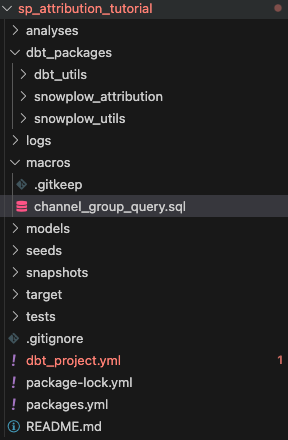
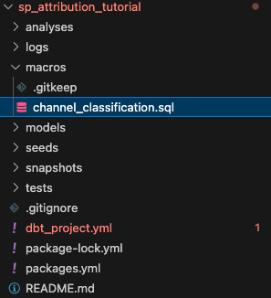

By default, the Attribution Package uses the channel grouping set within the Unified Package. It is recommended to set the channel grouping within the Unified Package, so you have matching channel groups across both packages. 

Optionally, you can choose to have differing channel groupings within the Attribution Package by customizing the macro only within the Attribution Package.

:::info Please Note: You only need to follow **one** of the configuration guides below.
:::

### Configuring within the Unified Package

1. Create a new file called `channel_group_query.sql` in your root dbt projects macro folder
    

    
2. Open [this link](https://github.com/snowplow/dbt-snowplow-unified/blob/main/macros/field_definitions/channel_group_query.sql) to find the GitHub link to the channel_group_query.sql macro within Unified Package. Within the file there are three macros, find the one relevant to you:
    1. bigquery__channel_group_query - BigQuery
    2. redshift__channel_group_query - Redshift
    3. default__channel_group_query - Any other Data Warehouse or Query Engine
    
3. Copy the relevant macro into the file you created within step 1. Ensure you copy the full macro.

```sql

...

```

4. Customize the `CASE` statement to capture your requirements. For example, you may want to set `Unassigned` to be called `Direct`.

```sql
CASE	
...
	else 'Direct'
END
```

5. Next time you run the Unified Package the macro you created will be prioritized over the built-in package macro.

### Configuring within the Attribution Package

1. Create a new file called `channel_classification.sql` in your root dbt projects macro folder
    

    
2. Paste the following into the file you created within step 1.

```sql


  default_channel_group


```

3. Customize the macro to capture your requirements. See the example below on how you may want to set traffic to the channel `Unassigned` to be called `Direct`. 
    
    The `default_channel_group` field is from the Unified Package.
    

```sql


  CASE
	  WHEN default_channel_group = 'Unassigned' THEN 'Direct'
	  ELSE default_channel_group
	END


```

4. Next time you run the Attribution Package the macro you created will be prioritized over the built-in package macro.
