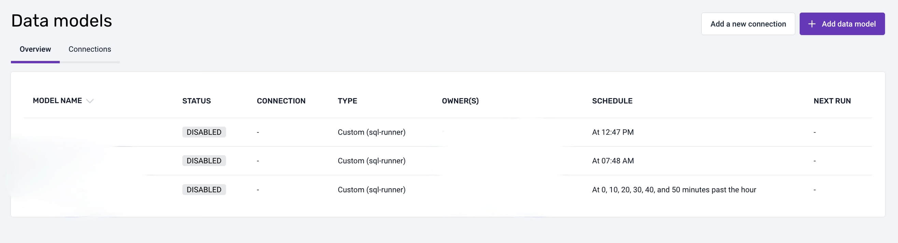
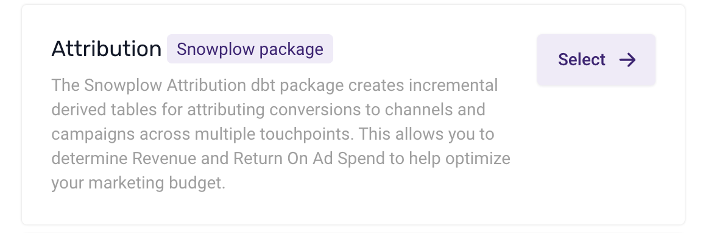
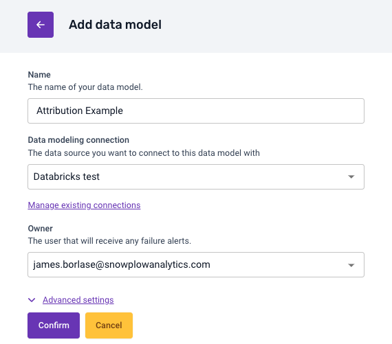
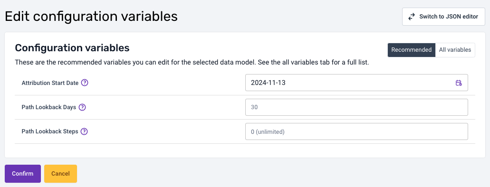
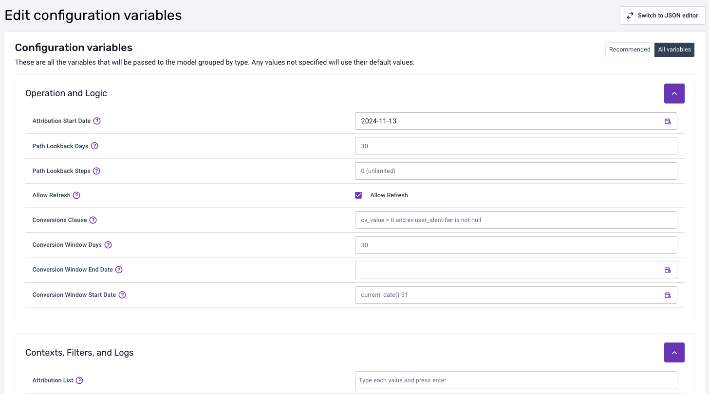
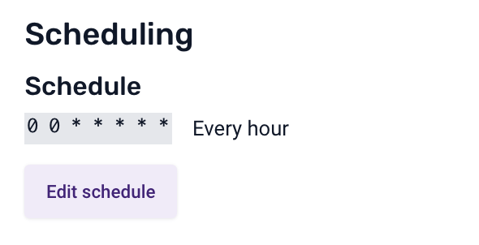
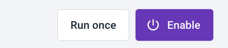

# Setting up via Snowplow Console

Snowplow provides a fully managed service for running data models. We recommend this if you are just getting started out, or don’t anticipate needing to build your own custom models. To get started, follow these steps:

1. Navigate to the Data models section of the Snowplow Console and click `Add data model`

2. Select `Attribution`

3. Set a name, warehouse connection and owner who will receive failure alerts.

4. Click Confirm - and then wait for the data model to be created and show up as ‘Disabled’ in the Data Models tab.

5. Open up your newly created data model

6. Configure the Recommended Configuration Variables:
    - Attribution Start Date: The date to start processing events from in the package on first run or a full refresh, based on the cv_tstamp (conversion timestamp).
    - Path Lookback Days: Restricts the model to marketing channels within this many days of the conversion (values of 30, 14 or 7 are recommended).
    - Path Lookback Steps: The limit for the number of marketing channels to look at before the conversion.
    

7. (Optional) Configure all the potential Configuration Variables for the Attribution Model. Once you are happy with the changes - click ‘Confirm’ to save.
    
:::info 
Please Note: See the information about each of [the options here](https://docs.snowplow.io/docs/modeling-your-data/modeling-your-data-with-dbt/dbt-configuration/attribution/).
 
For a more detailed guide check out the [Setting Variables](/tutorials/attribution/setting-up-locally/#setting-variables) section of the local setup section of this tutorial.
:::

8. (Optional) Configure the default schedule - use a CRON editor if necessary

9. Enable the model by clicking the Enable button in the top right

