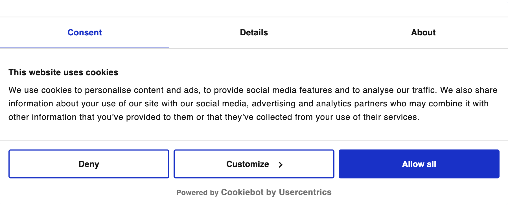
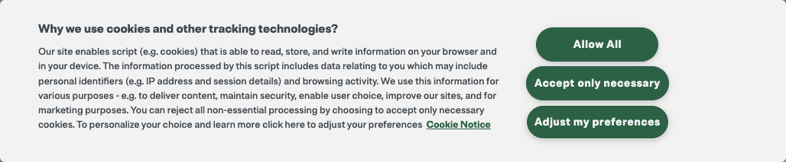

Most companies use consent management platforms to manage consent selection for their website visitors. A CMP allows users to understand how and why data is collected from a website and then accept, deny or configure which scopes they consent to.

We'll demonstrate how you can use [Cookiebot](https://www.cookiebot.com/) and [Onetrust](https://www.onetrust.com/products/cookie-consent/) methods to hook into consent preference selection programmatically and send this data to Snowplow. Most CMPs have similar functionality so everything shown in this guide can be adjusted to suit your needs.

:::note
The examples below assume that `partial consent` is when the visitor does not accept all the available scopes, but a selection of them. The use case for your application could as well be targeting the type of button that was pressed which reveals different intent. The API is designed to fit a variety of use-cases, you just need to add the code modified for your selected consent management platform.
:::

## Using Cookiebot



### Subscribe to consent selection events

Based on the Cookiebot developer [documentation](https://www.cookiebot.com/en/developer/#h-event-handling) you can subscribe to many different events relating to user actions. The ones we are interested in for preference selection are the `CookiebotOnAccept` and `CookiebotOnDecline`. These events fire when a visitor selects to deny or accept, partially or completely, all optional data collection scopes on a website.

To do that we're going to create a function called `trackConsent` and listen to both of the events listed above.

```js
window.addEventListener("CookiebotOnAccept", trackConsent, false);
window.addEventListener("CookiebotOnDecline", trackConsent, false);
```

Any other consent management platform will have similar capabilities to hook into these events.

### Send consent preference selection events to Snowplow

The `trackConsent` function will try to discern the cases in which the visitor denied, accepted or partially accepted data collection scopes and send the appropriate action to Snowplow.

#### Browser API

```js
import { trackConsentDeny, trackConsentSelected, trackConsentAllow } from '@snowplow/browser-plugin-enhanced-consent';

function trackConsent() {
  /*
   * Use window.Cookiebot.consent which contains the selected scopes.
   */
  const availableScopes = Object.keys(window.Cookiebot.consent).filter(
    (key) => typeof window.Cookiebot.consent[key] === "boolean"
  );
  const consentScopes = availableScopes.filter(
    (key) => window.Cookiebot.consent[key]
  );

  /*
   * Build the enhanced consent object to send to Snowplow.
   */
  const enhancedConsent = {
    consentScopes,
    basisForProcessing: "consent",
    consentUrl: "https://www.example.com/",
    consentVersion: "1.0",
    domainsApplied: ["https://www.example.com/"],
    gdprApplies: window.Cookiebot.regulations.gdprApplies
  };

  /* If it is a selection and not a page load. */
  if (window.Cookiebot.changed) {
    /* Necessary cookies are always included. */
    if (consentScopes.length === 1) {
      trackConsentDeny(enhancedConsent);
    } else if (
      /* Not all scopes are consented to. */
      consentScopes.length !== availableScopes.length
    ) {
      trackConsentSelected(enhancedConsent);
    } else {
      trackConsentAllow(enhancedConsent);
    }
  }
}
```

#### JavaScript API

```js
function trackConsent() {
  /*
   * Use window.Cookiebot.consent which contains the selected scopes.
   */
  const availableScopes = Object.keys(window.Cookiebot.consent).filter(
    (key) => typeof window.Cookiebot.consent[key] === "boolean"
  );
  const consentScopes = availableScopes.filter(
    (key) => window.Cookiebot.consent[key]
  );

  /*
   * Build the enhanced consent object to send to Snowplow.
   */
  const enhancedConsent = {
    consentScopes,
    basisForProcessing: "consent",
    consentUrl: "https://www.example.com/",
    consentVersion: "1.0",
    domainsApplied: ["https://www.example.com/"],
  };

  /* If it is a selection and not a page load. */
  if (window.Cookiebot.changed) {
    /* Necessary cookies are always included. */
    if (consentScopes.length === 1) {
      window.snowplow("trackConsentDeny:{trackerName}", enhancedConsent);
    } else if (
      /* Not all scopes are consented to. */
      consentScopes.length !== availableScopes.length
    ) {
      window.snowplow("trackConsentSelected:{trackerName}", enhancedConsent);
    } else {
      window.snowplow("trackConsentAllow:{trackerName}", enhancedConsent);
    }
  }
}
```

## Using OneTrust



### Subscribe to consent selection events

Based on the OneTrust developer [documentation](https://developer.onetrust.com/onetrust/docs/javascript-api) you can subscribe to many different events relating to user actions. The one we are interested in for preference selection is the `OnConsentChanged` event hook. This event is fired when a visitor selects to deny or accept, partially or completely, all optional data collection scopes on a website.

To do that we're going to create a function called `trackConsent` and call it using the `OnConsentChanged` hook.

```js
/**
 * The OptanonWrapper function will be called by the OneTrust CMP when it loads.
 * If you will use the OptanonWrapper function will depend on your setup.
 */
function OptanonWrapper() {
  OneTrust.OnConsentChanged(function () {
    trackConsent();
  });
}
```

Any other consent management platform will have similar capabilities to hook into these events.

### Send consent preference selection events to Snowplow

The `trackConsent` function will try to discern the cases in which the visitor denied, accepted or partially accepted data collection scopes and send the appropriate action to Snowplow.

#### Browser API

```js
import { trackConsentDeny, trackConsentSelected, trackConsentAllow } from '@snowplow/browser-plugin-enhanced-consent';

function trackConsent() {
  /*
   * Use OneTrust.GetDomainData().Groups which contains the available groups.
   */
  const availableGroups = window.OneTrust.GetDomainData().Groups.filter(
    (group) => group.Cookies.length
  );

  const activeGroupIds = OptanonActiveGroups.split(",").filter(Boolean);
  const consentScopes = activeGroupIds.map((groupId) => {
    return availableGroups.find((group) => groupId === group.CustomGroupId)
      .GroupName;
  });

  /*
   * Build the enhanced consent object to send to Snowplow.
   */
  const enhancedConsent = {
    consentScopes,
    basisForProcessing: "consent",
    consentUrl: "https://www.example.com/",
    consentVersion: "1.0",
    domainsApplied: ["https://www.example.com/"],
  };

  /* Necessary cookies are always included. */
  if (consentScopes.length === 1) {
    trackConsentDeny(enhancedConsent);
  } else if (
    /* Not all scopes are consented to. */
    consentScopes.length !== availableGroups.length
  ) {
    trackConsentSelected(enhancedConsent);
  } else {
    trackConsentAllow(enhancedConsent);
  }
}
```

#### JavaScript API

```js
function trackConsent() {
  /*
   * Use OneTrust.GetDomainData().Groups which contains the available groups.
   */
  const availableGroups = window.OneTrust.GetDomainData().Groups.filter(
    (group) => group.Cookies.length
  );

  const activeGroupIds = OptanonActiveGroups.split(",").filter(Boolean);
  const consentScopes = activeGroupIds.map((groupId) => {
    return availableGroups.find((group) => groupId === group.CustomGroupId)
      .GroupName;
  });

  /*
   * Build the enhanced consent object to send to Snowplow.
   */
  const enhancedConsent = {
    consentScopes,
    basisForProcessing: "consent",
    consentUrl: "https://www.example.com/",
    consentVersion: "1.0",
    domainsApplied: ["https://www.example.com/"],
  };

  /* Necessary cookies are always included. */
  if (consentScopes.length === 1) {
      window.snowplow("trackConsentDeny:{trackerName}", enhancedConsent);
  } else if (
    /* Not all scopes are consented to. */
    consentScopes.length !== availableGroups.length
  ) {
    window.snowplow("trackConsentSelected:{trackerName}", enhancedConsent);
  } else {
    window.snowplow("trackConsentAllow:{trackerName}", enhancedConsent);
  }
}
```
