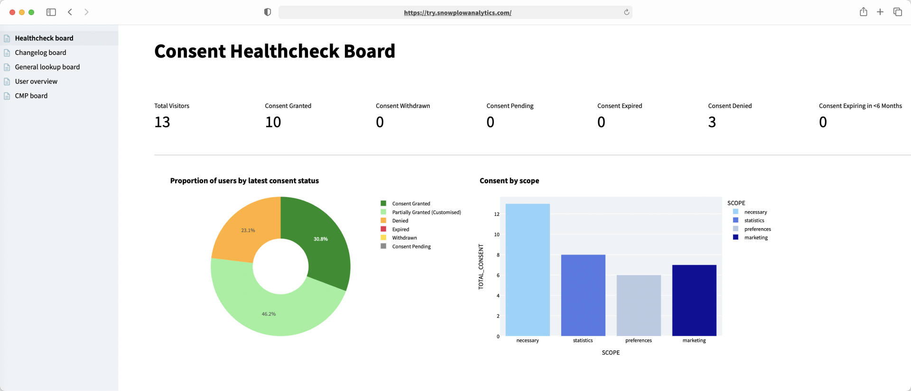

Welcome to the **track user consent with enhanced consent plugin** tutorial. This accelerator will assist you in collecting user interactions and preferences from your Consent Management Platform (CMP) using Snowplow's enhanced consent plugin.

User consent for data collection is essential for personalization, marketing, and ML driven actions. While CMPs provide some data on user preferences, Snowplow's enhanced consent plugin allows you to gather more detailed information about user consent.

By using Snowplow to collect consent preference data, you can enhance your data model with granular, context-rich selection data at the user level. Having access to user consent data in your data storage enables you to incorporate it into your segments or machine learning models and take action based on customer preferences.

In this tutorial you will learn how to:

- Set up Snowplow consent tracking on your CMP (examples using Cookiebot and OneTrust)
- Model your data using the Snowplow-consent model
- Create a consent health check dashboard from your data in Streamlit

## Who this tutorial is for

Data practitioners who would like to:
- Get familiar with the Snowplow enhanced-consent-plugin
- Learn how to use the snowplow-consent dbt package and set up tracking using their company's website or single page application, to gain insight from their customers' behavioral data as quickly as possible

## What you will achieve

In approximately 5 working hours you can achieve the following:

- **Track** - Set up and deploy tracking to your website or single page application to allow consent tracking
- **Enrich** - Add extra properties and values to your collected data
- **Model** - Enable and run the consent module within the snowplow-web data model
- **Visualize** - Visualize the modeled data with Streamlit

## Prerequisites

{}
Complete our [Advanced Analytics for Web](https://docs.snowplow.io/accelerators/web/) accelerator if you don't have any Snowplow modeled web data in your warehouse yet. You don't need a working Snowplow pipeline, a sample events dataset is provided.
{}

**Modeling and Visualization**
- [dbt CLI](https://docs.getdbt.com/docs/core/installation) installed or [dbt Cloud](https://docs.getdbt.com/docs/cloud/about-cloud-setup) account available
- New dbt [project](https://docs.getdbt.com/docs/build/projects) created and configured
- Python 3 installed
- Snowflake, BigQuery or Databricks account (apart from the Streamlit visualization you should be able to follow along if you are on Redshift / Postgres as the data model supports those, too!)

**Tracking and Enrichment**
- Snowplow pipeline
- Web app to implement tracking
- CMP set up

## Model outputs

The consent module creates several useful tables for analyzing user consent:

- **snowplow_web_consent_log**: Snowplow incremental table showing the audit trail of consent and Consent Management Platform (cmp) events
- **snowplow_web_consent_users**: Incremental table of user consent tracking stats
- **snowplow_web_consent_totals**: Summary of the latest consent status, per consent version
- **snowplow_web_consent_scope_status**: Aggregate of current number of users consented to each consent scope
- **snowplow_web_cmp_stats**: Used for modeling cmp_visible events and related metrics
- **snowplow_web_consent_versions**: Incremental table used to keep track of each consent version and its validity

