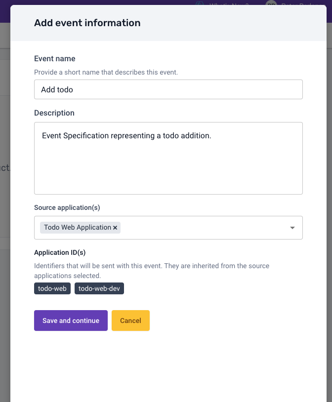
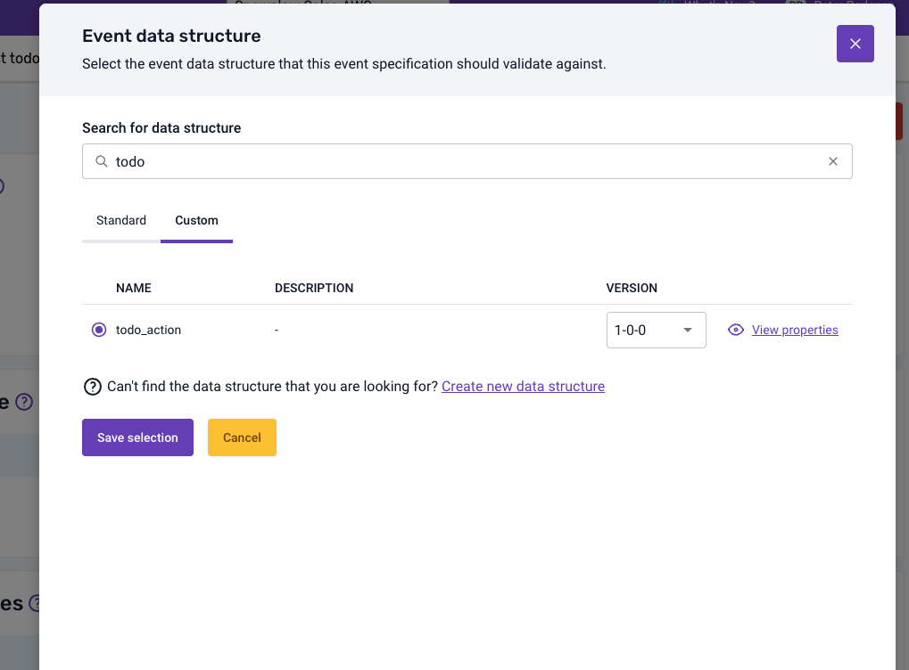

Now you can create the Event Specification representing the todo addition. Click `Create new event specification`, fill the event information modal with the following inputs and click `Save and continue`.

The next step is to add the event Data Structure `todo_action` you created previously to represent the todo addition interaction. Select the Event Specification and on the `Event data structure` panel click `Add existing data structure` and select the `todo_action` custom Data Structure.

To make sure your intention on this Event Specification is clear and also instructions for implementation are as precise as possible, you should go ahead and add instructions for this event. Click the `Add instructions` button and click `Edit` on the `value` attribute. Now you can fill the instructions with the following inputs, indicating exactly what is expected for this event.

:::tip
Information for implementation instructions, cardinality rules and trigger details will be available for the implementation engineers directly through Snowtype [instructions feature](/docs/event-studio/snowtype/using-the-cli/#generating-event-specification-instructions).
:::

Now on the Entity data structures section, click `Add existing data structure`, find and select the todo entity created earlier. On the next modal step you can define the expected cardinality, of this entity on the event specification. For the todo entity, you want to have exactly 1 instance.

Finally you should add a trigger to represent exactly the conditions when this event should be fired. For this case, you expect the event to be fired when a user hits the Enter key after adding a title for the todo.

**A similar process can be taken to create both the completion and removal Event Specifications.**
