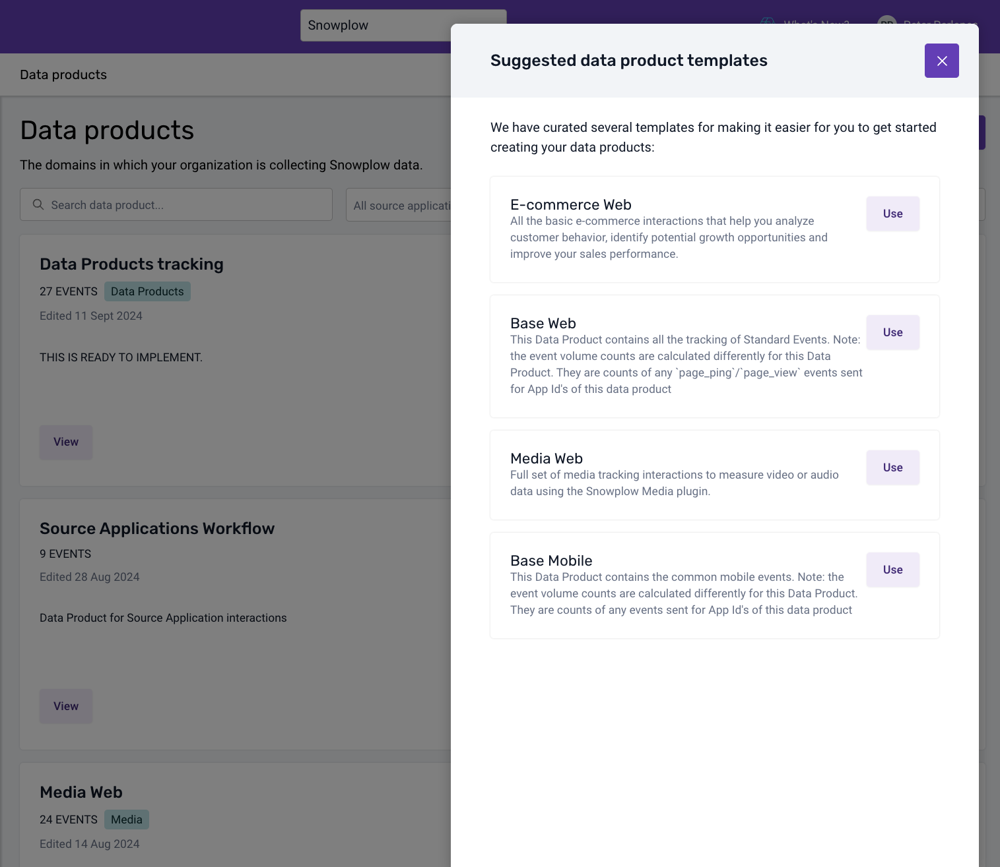
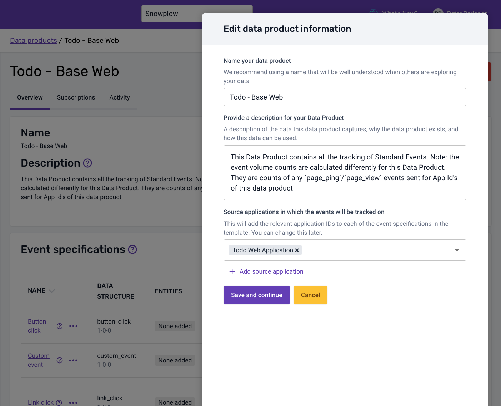

After creating a Source Application, the recommended way to keep track of what we consider base events for a tracking setup is through the Base tracking plan templates. For this application you can use the [Base Web](https://docs.snowplow.io/docs/understanding-tracking-design/defining-the-data-to-collect-with-data-products/data-product-templates/#base-web).

To create a Base Web tracking plan for your application, navigate to the Tracking Plans section and after clicking the `Templates` button, select the Base Web template.

By default, a Base tracking plan is not connected to a Source Application and will show all the Base Event application IDs, so for this you need to edit the tracking plan and set the Source Application to `Todo Web Application`.

The Base Web (_or Mobile_) tracking plan will monitor and count base events as they are sent for the selected Source Application app IDs, as we will see later on. There is no need for additional implementation.
