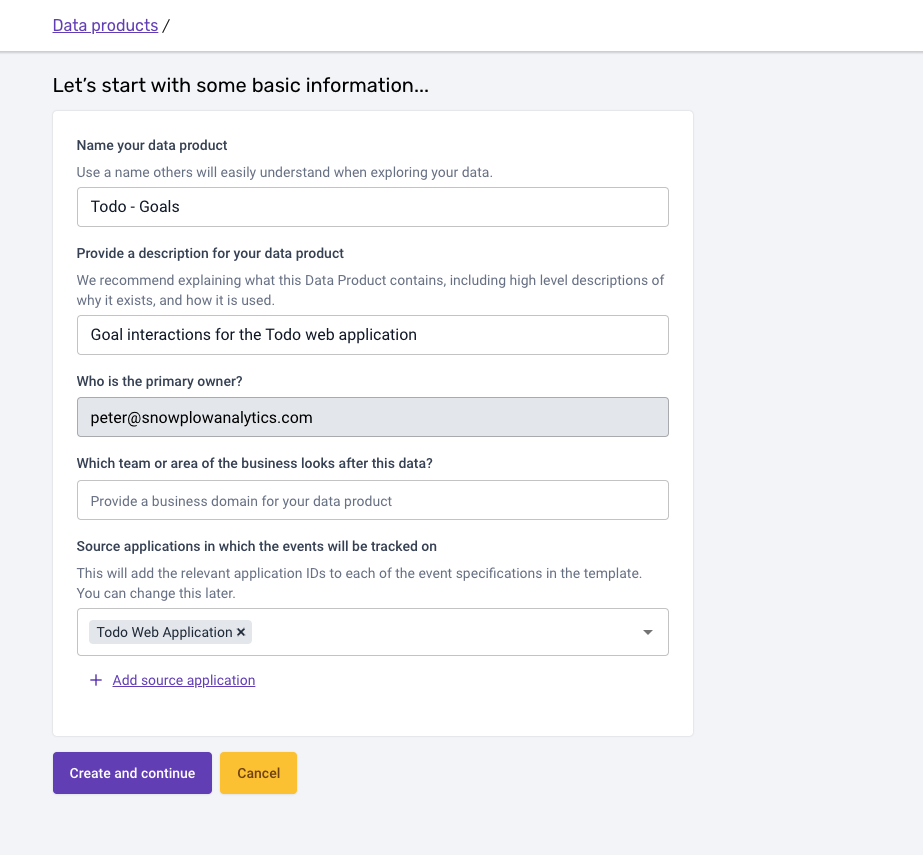

As in every application, there are interactions that are important to the business and are measured in a custom way. For this application the interactions you need to measure are:

- Adding a todo
- Completing a todo
- Removing a todo

We are going to show how you can create the Data Product for the goal interactions and the Event Specification for a todo addition.

### Create the custom Data Product

To start off, navigate to the Data Products section and click through the `Create` button and `Start` to create a new custom Data Product.

On the basic information screen you can add the inputs as shown below and also select the `Todo Web Application` as the connected Source Application. You can name the Data Product something similar to `Todo - Goals`.

Finally click `Create and continue`.

:::tip
When connecting a Source Application to a Data Product there are a few benefits you get automatically:
- All Event Specifications inherit the expected app IDs from the Source Application. _That way you can be sure that an Event Specification is fired in all environments it needs to._
- All Event Specifications automatically reference the Application Context Data Structures that are expected to be available with each event. _This prevents duplicate information and also understanding which context is going to be available in addition to your Event Specification entities._
:::
