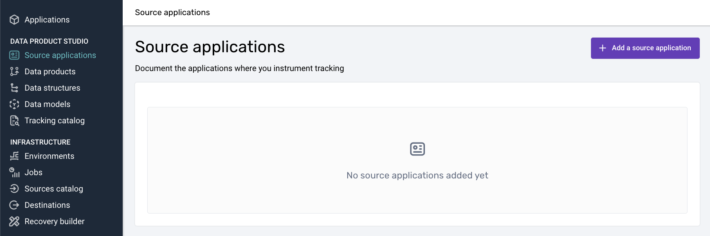

The basis for every tracking setup is the Source Application. It represents the tracking estate, in a specific platform (_web, Android, iOS, etc._), for an application which in our case would be named _'Todo Web Application'_.

Navigate to the Source Applications section and click the `Add a source application` button.

The inputs on the creation screen are:
- **Name**: A name used for this application which is fairly understood across the organization.
- **Description**: A few words on what this Source Application represents and/or any notes.
- **Primary owner**: Owner email address.
- **Application IDs**: The [Application IDs](https://docs.snowplow.io/docs/understanding-tracking-design/organize-data-sources-with-source-applications/#application-ids) expected to be used for this application. _These will automatically flow down to the Data Products and Event specifications you define relating to this Source Application._
- **Application entities**: Here is where you will set the [Application Contexts](https://docs.snowplow.io/docs/understanding-tracking-design/organize-data-sources-with-source-applications/#application-context) you will implement and expect to be available with every event hit coming from this application.

An example of inputs can be the following which you can adjust to your case:

