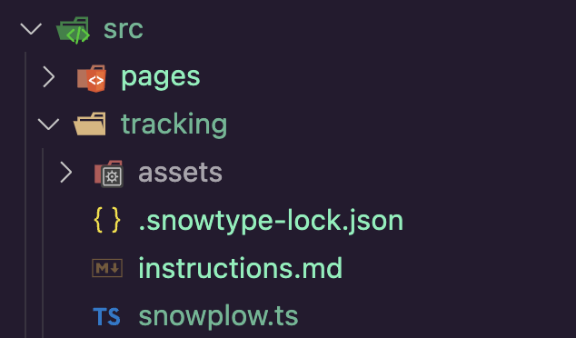
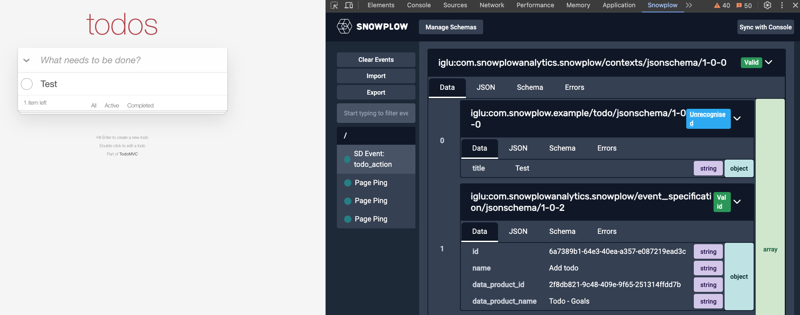
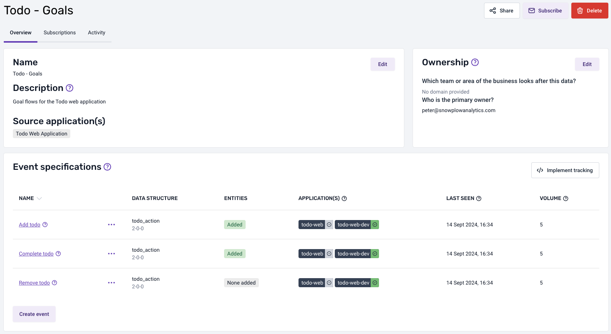

On your terminal now run `npx @snowplow/snowtype@latest generate --instructions`. If all is as expected, after a few seconds, you will have the following files generated:



The `src/tracking/instructions.md` file includes detailed instructions and information about the Event Specifications to be implemented while `src/tracking/snowplow.ts` contains all the required code to be used to track the Event Specifications.

:::info
In some editors like [Visual Studio Code](https://code.visualstudio.com/), the APIs that are available in a project are shown to the developer as they type. For Snowtype exposed APIs to track Event Specifications or event Data Structures start with `track` and then the name of the Data Structure or Event Specification. For Event Specification APIs, there is also the suffix of `Spec` or `spec` depending on the language.
E.g. for our custom Data Product, we have available the `trackAddTodoSpec`, `trackCompleteTodoSpec` and `trackRemoveTodoSpec` methods.
:::

## Tracking Data Product interactions

To track interactions such as adding a new todo, you can add the following piece of code at `src/pagesTodo/components/Header.tsx`

```diff
import { useState } from "react";
import { v4 } from "uuid";
import { Todo } from "../../../types";
+import { createTodo, trackAddTodoSpec } from "../../../tracking/snowplow";

// Rest of the code...

  function addItem(e: React.KeyboardEvent<HTMLInputElement>) {
    if (e.key === "Enter" && value) {
      addTodo((preItems) => {
        return [
          {
            id: v4(),
            value,
            completed: false,
          },
          ...preItems,
        ];
      });
+     trackAddTodoSpec({
+       action: "add",
+       context: [createTodo({ title: value })],
+     });
      setValue("");
    }
  }
```

Finally, you can go to the application, add a new todo and observe on the Snowplow Inspector extension as the addition Event Specification is being sent. The event contexts should include the `todo`, `event_specification` and any other extra context you might add.



After a while the Event Specification volume counts for each event will be available at the Data Products screen.



You can checkout the completed code at the ['implemented' branch](https://github.com/snowplow-incubator/data-products-basic-tracking-recipe/tree/implemented).
