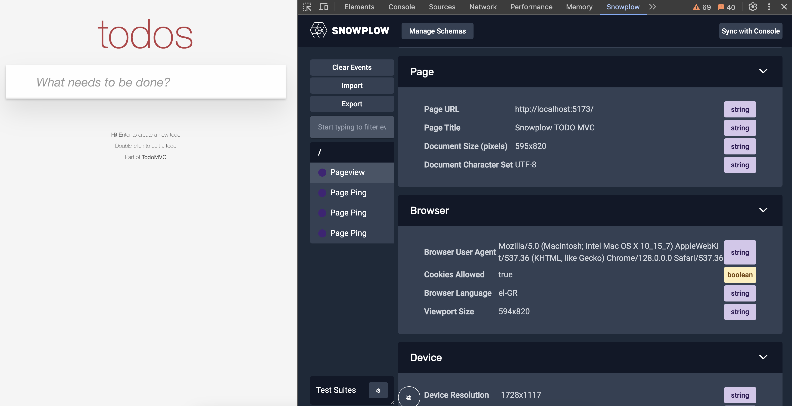
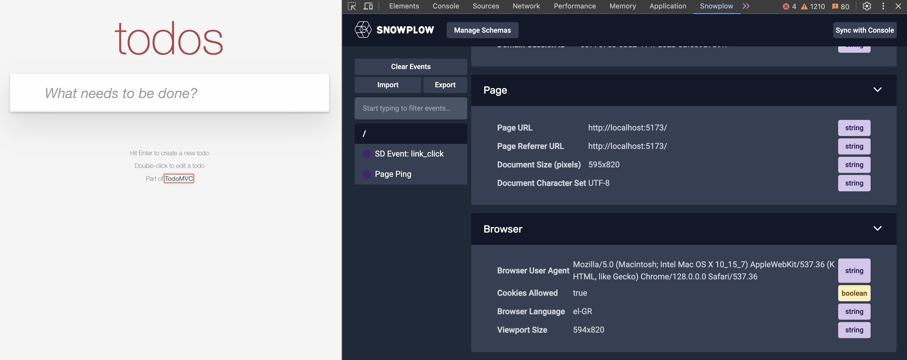

For this example application, we will use the [Browser tracker](/docs/sources/web-trackers/quick-start-guide) which is distributed through npm.

Switch to the project root directory and then install it by running `npm install @snowplow/browser-tracker`.

Next, add the following piece of code at `src/main.tsx`.

```diff
import Todo from "./pages/Todo";
import "./styles.css";

+import {
+  enableActivityTracking,
+  newTracker,
+  trackPageView,
+} from "@snowplow/browser-tracker";

+newTracker("t1", "{{COLLECTOR_URL}}", {
+  appId: "todo-web-dev",
+});

+enableActivityTracking({
+  minimumVisitLength: 30,
+  heartbeatDelay: 10,
+});

+trackPageView();

createRoot(document.getElementById("root")!).render(
```

_For this showcase, placing the initialization code at the main file is enough._

What this code does is:
1. Initializes the tracker with the app ID representing the Todo web application in the development environment.
2. Enables activity tracking which will send periodic page pings.
3. Sends a page view when the main application component is first rendered.

You can validate this step being implemented properly using the [Snowplow Inspector](/docs/testing/snowplow-inspector/) browser extension observing Page view and Page ping events.


## Add link click tracking

As a next step you will implement link click tracking for the main page link pointing to the TodoMVC website. To track this and other links on your pages, you can install the [Link click](/docs/sources/web-trackers/tracking-events/link-click/) tracking plugin. The plugin provides automatic link click tracking for all links on your page.

To enable it in the application, switch to the project root directory and then install it by running `npm install @snowplow/browser-plugin-link-click-tracking`.

Next, add the following piece of code at `src/main.tsx`.

```diff
import {
  enableActivityTracking,
  newTracker,
  trackPageView,
} from "@snowplow/browser-tracker";
+import {
+  LinkClickTrackingPlugin,
+} from "@snowplow/browser-plugin-link-click-tracking";

newTracker("t1", "{{COLLECTOR_URL}}", {
  appId: "todo-web-dev",
+  plugins: [LinkClickTrackingPlugin()],
});
```

And the following on `src/pages/index.tsx`.

```diff
import Info from "./components/Info";
+import { enableLinkClickTracking } from "@snowplow/browser-plugin-link-click-tracking";
+import { useEffect } from "react";

const Todo = function () {
+  useEffect(() => {
+    enableLinkClickTracking();
+  }, [])
```

With this code, all links that are initially rendered on the page will be tracked automatically.

You can verify this using the Snowplow inspector browser extension observing link click events after clicking the TodoMVC link.

