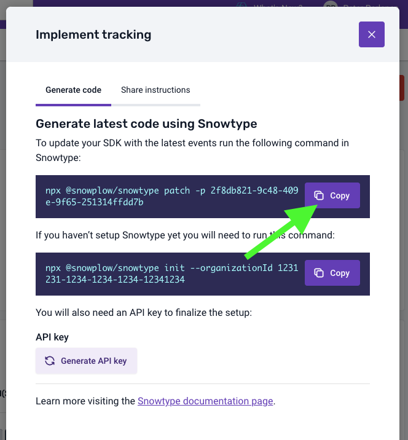

After defining your Event Specifications, the next step is implementing those events on your app. To do that you are going to use Snowtype to generate the required APIs for tracking the Event Specifications.

:::info
For some Event Specification features, such as event counts, it is required that events are tracked together with the `event_specification` entity. Snowtype automatically attaches the entity without any additional work required from the implementation engineers.
:::

## Installing Snowtype

After having set up a [Console API key](https://docs.snowplow.io/docs/collecting-data/code-generation/using-the-cli/#authenticating-with-the-console) you can install Snowtype on this project by switching to the project root directory and running `npm install @snowplow/snowtype@latest --save-dev`.

Since this is a project without previous Snowtype installation, we need to go through the [init flow](https://docs.snowplow.io/docs/collecting-data/code-generation/using-the-cli/#initializing-snowtype-for-your-project).

To do that, you can go to the Data Product page and click on the `Implement tracking` button. There you can copy the second code command which relates to initializing a new Snowtype project.

The inputs should look like the following:

Next you add this Data Product to the Snowtype project by copying the first code command.

Now your Snowtype configuration file should include the Data Product in the `dataProductIds` array.
