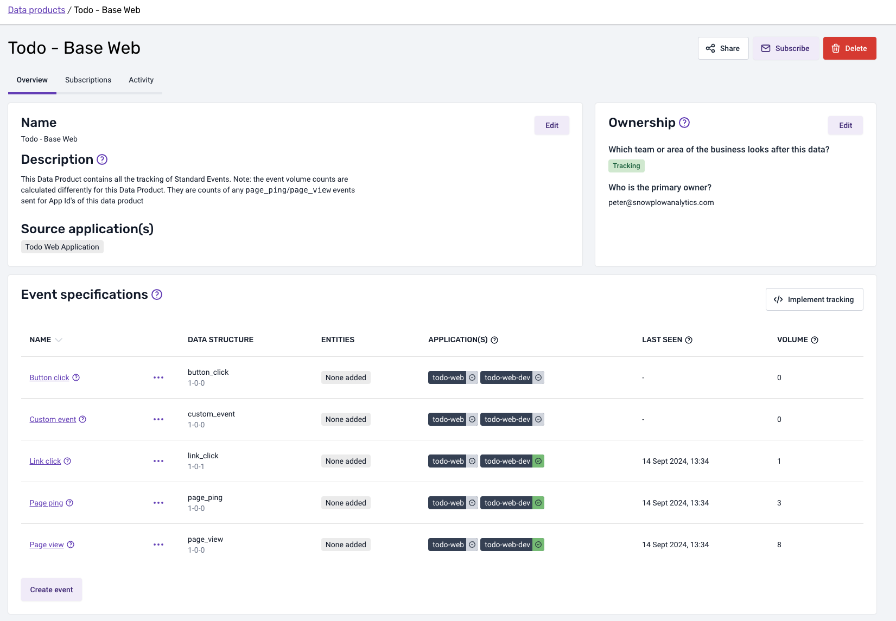

As mentioned previously, if you check the `Todo - Base Web` tracking plan you created, you will be able to see the events coming in from the correct environment based on the app ID.

_Note: You might need to wait for a bit, up to a maximum of 2 hours, until the events are visible._

