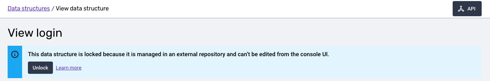

Firstly we'll add a property to our data structure definition. We'd like to know if a login succeeded or failed. Our modified `login.yaml` should look like this

```yml {16,17} title="data-structures/com.example/login.yaml"
apiVersion: v1
resourceType: data-structure
meta:
  hidden: false
  schemaType: event
  customData: {}
data:
  $schema: http://iglucentral.com/schemas/com.snowplowanalytics.self-desc/schema/jsonschema/1-0-0#
  self:
    vendor: com.example
    name: login
    format: jsonschema
    version: 1-0-0
  type: object
  properties:
    result:
      enum: [success, failure]
  additionalProperties: false
```

## Validate

We should validate our changes before we attempt to publish them. Let's do that

```bash
$ snowplow-cli ds validate data-structures/com.example/login.yaml
```
:::tip
You can supply snowplow-cli with a directory and it will look for anything that looks like a data structure. Also given the default data structure directory is being used the previous command is equivalent to `snowplow-cli ds validate`.
:::

You should see output similar to this:
```
3:00PM INFO validating from paths=[data-structures/com.example/login.yaml]
3:00PM INFO will create file=data-structures/com.example/login.yaml vendor=com.example name=login version=1-0-0
3:00PM WARN validation file=data-structures/com.example/login.yaml
  messages=
  │ The schema is missing the "description" property (/properties/result)
  │ The schema is missing the "description" property (/)
```

## Publish to development

Apart from the missing descriptions everything looks good. We can fill them in later. Let's go ahead and publish our data structure to our [development](https://docs.snowplow.io/docs/data-product-studio/data-quality) environment.

```bash
$ snowplow-cli ds publish dev
```
:::tip
We omit the directory here but as with other commands the default directory will get used and it will attempt to publish any data structures it can find.
:::


The command should output something close to the following:

```
3:00PM INFO publishing to dev from paths=[data-structures]
3:00PM INFO will create file=data-structures/com.example/login.yaml vendor=com.example name=login version=1-0-0
3:00PM WARN validation file=data-structures/com.example/login.yaml
  messages=
  │ The schema is missing the "description" property (/properties/result)
  │ The schema is missing the "description" property (/)
3:00PM INFO all done!
```

:::note
Publishing to `dev` will also run validation. It will only fail on ERROR notifications.
:::

You should now be able to see your published data structure in [Console UI](https://console.snowplowanalytics.com/data-structures). If you click through from the data structure listing to view the `login` data structure you should see the following banner.



Any data structures published using snowplow-cli will automatically get this banner and have UI based editing disabled. It is a good idea to settle on one source of truth for each data structure to avoid potential conflicts.

## Publish to production

With our data structure deployed to develop and working as we expect we can safely publish it to production.

```bash
$ snowplow-cli ds publish prod
```
```
3:00PM INFO publishing to prod from paths=[data-structures]
3:00PM INFO will update file=data-structures/com.example/login.yaml local=1-0-0 remote=""
3:00PM INFO all done!
```
:::note
Data structures must be published to `dev` before they can be published to `prod`
:::

We have now seen how to create, validate and then publish a new data structure from the command line. Next we'll look at how to configure github actions to run validation and publishing automatically for us.
