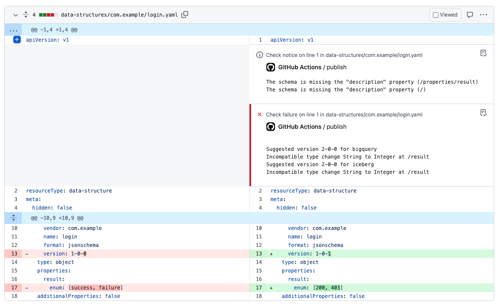

Now we have our workflows in place let's work through an example. Our login data structure needs some attention. Our requirements have changed and rather than 'success' and 'failure' the login result will now need to report numbers and not strings. So instead of `[success, failure]` it'll be `[200, 403]`.

Having created a [new branch](https://git-scm.com/book/en/v2/Git-Branching-Basic-Branching-and-Merging) called `login-results-error-codes` and making the changes locally we should end up here:
```bash title="git diff develop"
--- a/data-structures/com.example/login.yaml
+++ b/data-structures/com.example/login.yaml
@@ -10,9 +10,9 @@ data:
    vendor: com.example
    name: login
    format: jsonschema
-    version: 1-0-0
+    version: 1-0-1
  type: object
  properties:
    result:
-      enum: [success, failure]
+      enum: [200, 403]
  additionalProperties: false
```

That all looks good so we'll go ahead and push to github and [create a pull request](https://docs.github.com/en/pull-requests/collaborating-with-pull-requests/proposing-changes-to-your-work-with-pull-requests/creating-a-pull-request).

We wait patiently for our validate on pull request workflow to run.


Validation has failed. To identify the problem we open the 'file' tab on the pull request and see..


:::note
Validation only takes your configured [destinations](https://console.snowplowanalytics.com/destinations) into account.
:::

Together with the description warnings we forgot to fix earlier we have some errors. Changing the values of the enum would change the type of the `result` property which will cause problems further down the line for our data. The error suggests we need to make a major version bump to avert disaster. We'll do that (and add descriptions).

Our next attempt:
```bash title="git diff develop"
--- a/data-structures/com.example/login.yaml
+++ b/data-structures/com.example/login.yaml
@@ -10,9 +10,11 @@ data:
    vendor: com.example
    name: login
    format: jsonschema
-    version: 1-0-0
+    version: 2-0-0
  type: object
+  description: Login outcome event
  properties:
    result:
-      enum: [success, failure]
+      description: The resulting http error code of a login request
+      enum: [200, 403]
  additionalProperties: false
```

And the workflow result..


Validation has passed. Now our colleagues can feedback on our changes and if everyone is happy we can merge to `develop` which will trigger our `publish-develop.yml` workflow.


Finally, once we are convinced everything works we can open another pull request from `develop` to `main`, merge that and trigger our `publish-production.yml` workflow.
