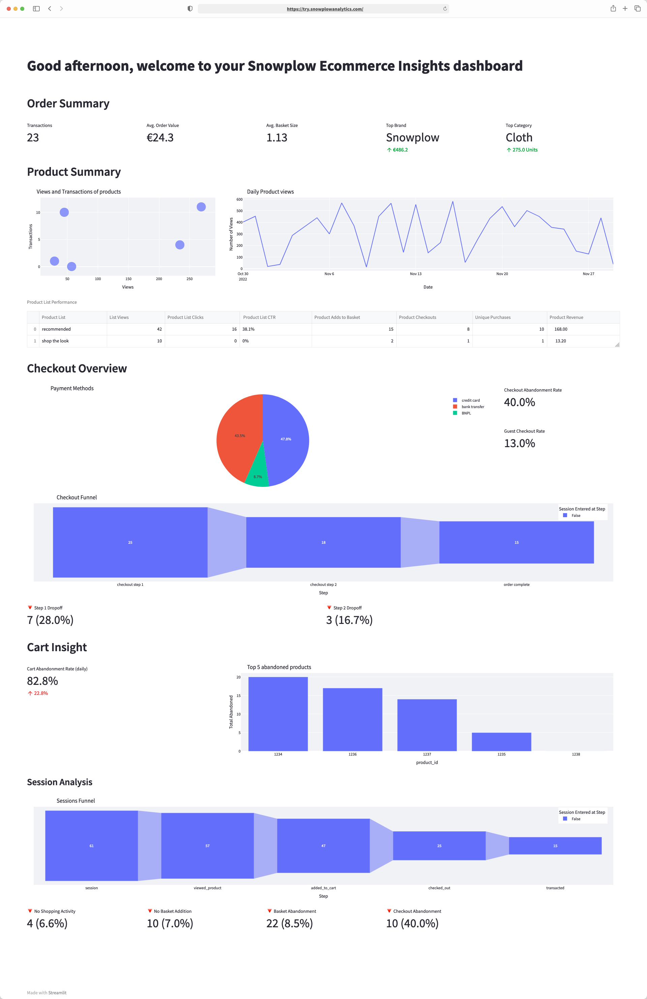

Welcome to the **track and analyze ecommerce behavior** tutorial. This accelerator helps you analyze customer behavior, identify potential growth opportunities, and improve your ecommerce website and app (native iOS and Android) sales performance.

In this tutorial you will learn to:

- Set up the required ecommerce tracking on your website or mobile app
- Model and visualize Snowplow data using the [snowplow-ecommerce](https://hub.getdbt.com/snowplow/snowplow_ecommerce/latest/) dbt package and Streamlit
- Apply these to your own pipeline to gain insights

## Who this tutorial is for

- Data practitioners who would like to get familiar with Snowplow data
- Data practitioners who want to learn how to use the snowplow-ecommerce dbt package and set up tracking on their ecommerce store, so they can learn more about visitor and customer behavioral data as quickly as possible

## What you will achieve

In approximately 1.5 working days (~10 working hours) you can achieve the following:

- **Track** - Set up ecommerce actions tracking on your store
- **Model** - Configure and run the snowplow-ecommerce data model
- **Visualize** - Visualize the modeled data with Streamlit
- **Next steps** - Gain value from your own pipeline data through modeling and visualization

## Prerequisites

**Tracking and Enrichment**
- Snowplow pipeline
- Online store to add the tracking code

**Modeling and Visualization**
- dbt CLI installed / dbt Cloud account available
- New dbt project created and configured
- Python 3 installed
- BigQuery, Snowflake, or Databricks account and a user with access to create schemas and tables

:::note
The tracking and dbt package are supported on Redshift as well as the above warehouses, but the visualization in this accelerator is not set up to connect to a Redshift warehouse.
:::

## What you will build

An example ecommerce dashboard with Streamlit that provides insights into customer behavior, product performance, and sales trends.

