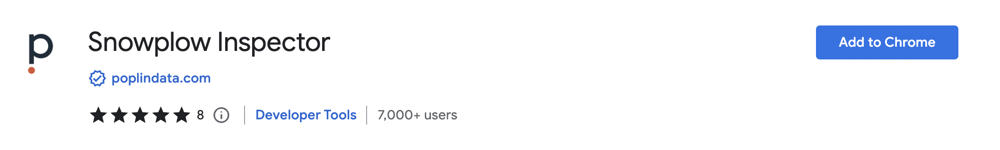
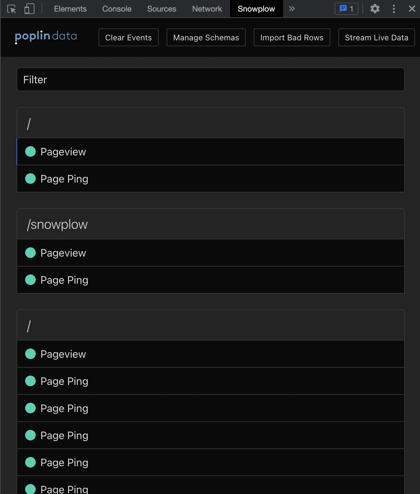
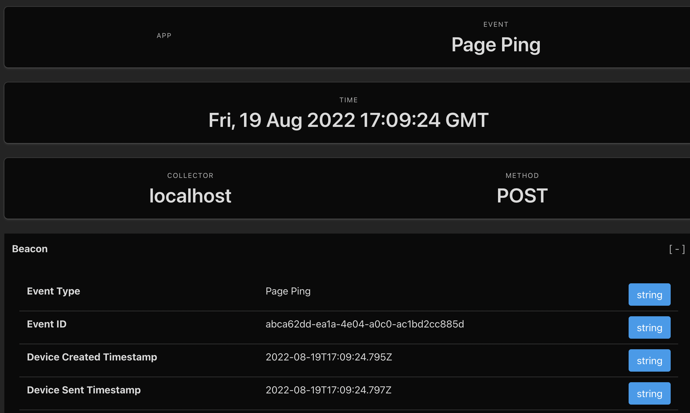

For web, use the Snowplow Inspector browser extension to manually test that events are emitted correctly.

## Testing checklist

Confirm that these happen as expected:
- Product view events fire on product pages
- Add to cart events fire with correct product and cart totals
- Remove from cart events update cart totals correctly
- Checkout steps track with appropriate user selections
- Transaction events fire only on successful purchases
- Promotion events track views and clicks appropriately
- All currencies and prices are formatted correctly
- Product IDs match your internal system identifiers

## Web testing

### Install the Inspector

Install the [Snowplow Inspector](/docs/data-product-studio/data-quality/snowplow-inspector/). You may need to restart your browser.

### Check your data

Open up devtools (F12) and navigate to the Snowplow extension. You should see a list of events start to form as you interact with your site, including:

- Page views and page pings
- Product view events
- Add to cart and remove from cart events
- Checkout step events
- Transaction events
- Promotion events

Click on an event to get a breakdown of the data being captured. You should see your ecommerce events with their associated product and context data.

### Verify event structure

For ecommerce events, check that you can see:

1. **Event type** - Confirm the correct event type is being sent (e.g., `snowplow_ecommerce_action`)
2. **Product data** - Verify product IDs, prices, currencies are correct
3. **Context entities** - Check that ecommerce entities are properly attached
4. **Custom parameters** - Ensure any custom attributes are being tracked

## Mobile testing

For mobile apps, you can use debugging tools and logging.

For iOS, enable debug logging in your tracker configuration to see events in the Xcode console.

For Android, use Android Studio's logcat to verify events are being sent correctly.
