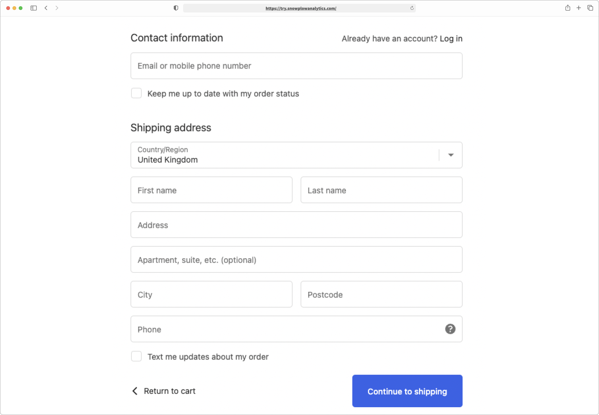

There are a number of different ecommerce events you could track.

## Product view events

Product view events are commonly used to track a user visiting a product page.


Track when users view individual products on your site. This data is essential for understanding which products are most interesting to your customers.

### Web tracking

#### Browser API

```ts
import { trackProductView } from "@snowplow/browser-plugin-snowplow-ecommerce";

trackProductView({
    id: "P125",
    name: "Baseball T",
    brand: "Snowplow",
    category: "Mens/Apparel",
    price: 200,
    currency: "USD",
});
```

#### JavaScript API

```ts
window.snowplow("trackProductView:{trackerName}", {
    id: "12345",
    name: "Baseball T",
    brand: "Snowplow",
    category: "apparel",
    price: 200,
    currency: "USD",
});
```

### Mobile tracking

#### iOS (Swift)

```swift
let product = ProductEntity(id: "P125")
    .name("Baseball T")
    .brand("Snowplow")
    .category("Mens/Apparel")
    .price(200)
    .currency("USD")

let event = ProductViewEvent(product: product)
tracker?.track(event)
```

#### Android (Kotlin)

```kotlin
val product = ProductEntity(id = "P125")
    .name("Baseball T")
    .brand("Snowplow")
    .category("Mens/Apparel")
    .price(200)
    .currency("USD")

val event = ProductViewEvent(product)
tracker.track(event)
```

## Product list view event

Product List events are used for tracking views and interactions of any kind of list of products on an ecommerce store. These events are commonly used for product list pages, but can also be used to track similar list-like elements such as:

- Shop-The-Look lists
- Frequently-Bought-With lists
- Product recommendations
- Product search results


Track when users view a list of products. This helps you understand which product collections are most engaging.

### Web tracking

#### Browser API

```ts
import { trackProductListView } from "@snowplow/browser-plugin-snowplow-ecommerce";

trackProductListView({
  products: [
    {
      id: "P123",
      name: "Fashion red",
      brand: "Snowplow",
      category: "Mens/Apparel",
      price: 100,
      inventory_status: "in stock",
      currency: "USD",
      position: 1,
    },
    {
      id: "P124",
      name: "Fashion green",
      brand: "Snowplow",
      category: "Mens/Apparel",
      price: 119,
      inventory_status: "in stock",
      currency: "USD",
      position: 2,
    },
  ],
  name: "Recommended Products",
});
```

#### JavaScript API

```ts
window.snowplow("trackProductListView:{trackerName}", {
  products: [
    {
      id: "P123",
      name: "Fashion red",
      brand: "Snowplow",
      category: "Mens/Apparel",
      price: 100,
      inventory_status: "in stock",
      currency: "USD",
      position: 1,
    },
  ],
  name: "Recommended Products",
});
```

### Mobile tracking

#### iOS (Swift)

```swift
let products = [
    ProductEntity(id: "P123")
        .name("Fashion red")
        .brand("Snowplow")
        .price(100)
        .currency("USD")
        .position(1)
]

let event = ProductListViewEvent(products: products, name: "Recommended Products")
tracker?.track(event)
```

#### Android (Kotlin)

```kotlin
val products = listOf(
    ProductEntity(id = "P123")
        .name("Fashion red")
        .brand("Snowplow")
        .price(100)
        .currency("USD")
        .position(1)
)

val event = ProductListViewEvent(products, "Recommended Products")
tracker.track(event)
```

## Product list click event

Track when users click or select a product from a list. This helps you understand which products are most appealing within different contexts.

### Web tracking

#### Browser API

```ts
import { trackProductListClick } from "@snowplow/browser-plugin-snowplow-ecommerce";

trackProductListClick({
  product: {
    id: "P124",
    name: "Fashion green",
    brand: "Snowplow",
    category: "Mens/Apparel",
    price: 119,
    inventory_status: "in stock",
    currency: "USD",
    position: 2,
  },
  name: "Recommended Products",
});
```

#### JavaScript API

```ts
window.snowplow("trackProductListClick:{trackerName}", {
  product: {
    id: "P124",
    name: "Fashion green",
    brand: "Snowplow",
    category: "Mens/Apparel",
    price: 119,
    currency: "USD",
    position: 2,
  },
  name: "Recommended Products",
});
```

### Mobile tracking

#### iOS (Swift)

```swift
let product = ProductEntity(id: "P124")
    .name("Fashion green")
    .brand("Snowplow")
    .price(119)
    .currency("USD")
    .position(2)

let event = ProductListClickEvent(product: product, name: "Recommended Products")
tracker?.track(event)
```

#### Android (Kotlin)

```kotlin
val product = ProductEntity(id = "P124")
    .name("Fashion green")
    .brand("Snowplow")
    .price(119)
    .currency("USD")
    .position(2)

val event = ProductListClickEvent(product, "Recommended Products")
tracker.track(event)
```
## Add to cart event

Cart events are used for tracking additions and removals from a shopping cart. These events are crucial for understanding user purchasing behavior and identifying potential drop-off points in the conversion funnel.

Track when users add products to their cart. This helps you understand which products are most likely to be purchased.

### Web tracking

#### Browser API

```ts
import { trackAddToCart } from "@snowplow/browser-plugin-snowplow-ecommerce";

trackAddToCart({
  products: [
    {
      id: "P125",
      name: "Baseball T",
      brand: "Snowplow",
      category: "Mens/Apparel",
      price: 200,
      currency: "USD",
    },
  ],
  total_value: 200,
  currency: "USD",
});
```

#### JavaScript API

```ts
window.snowplow("trackAddToCart:{trackerName}", {
  products: [
    {
      id: "P125",
      name: "Baseball T",
      brand: "Snowplow",
      category: "Mens/Apparel",
      price: 200,
      currency: "USD",
    },
  ],
  total_value: 200,
  currency: "USD",
});
```

### Mobile tracking

#### iOS (Swift)

```swift
let product = ProductEntity(id: "P125")
    .name("Baseball T")
    .brand("Snowplow")
    .category("Mens/Apparel")
    .price(200)
    .currency("USD")

let event = AddToCartEvent(products: [product])
    .totalValue(200)
    .currency("USD")

tracker?.track(event)
```

#### Android (Kotlin)

```kotlin
val product = ProductEntity(id = "P125")
    .name("Baseball T")
    .brand("Snowplow")
    .category("Mens/Apparel")
    .price(200)
    .currency("USD")

val event = AddToCartEvent(listOf(product))
    .totalValue(200)
    .currency("USD")

tracker.track(event)
```

## Remove from cart event

Track when users remove products from their cart. This helps you identify which products are frequently abandoned and understand user shopping behavior.

### Web tracking

#### Browser API

```ts
import { trackRemoveFromCart } from "@snowplow/browser-plugin-snowplow-ecommerce";

trackRemoveFromCart({
  products: [
    {
      id: "P125",
      name: "Baseball T",
      brand: "Snowplow",
      category: "Mens/Apparel",
      price: 200,
      currency: "USD",
    },
  ],
  total_value: 0, // Total cart value after removal of the product
  currency: "USD",
});
```

#### JavaScript API

```ts
window.snowplow("trackRemoveFromCart:{trackerName}", {
  products: [
    {
      id: "P125",
      name: "Baseball T",
      brand: "Snowplow",
      category: "Mens/Apparel",
      price: 200,
      currency: "USD",
    },
  ],
  total_value: 0,
  currency: "USD",
});
```

### Mobile tracking

#### iOS (Swift)

```swift
let product = ProductEntity(id: "P125")
    .name("Baseball T")
    .brand("Snowplow")
    .category("Mens/Apparel")
    .price(200)
    .currency("USD")

let event = RemoveFromCartEvent(products: [product])
    .totalValue(0)
    .currency("USD")

tracker?.track(event)
```

#### Android (Kotlin)

```kotlin
val product = ProductEntity(id = "P125")
    .name("Baseball T")
    .brand("Snowplow")
    .category("Mens/Apparel")
    .price(200)
    .currency("USD")

val event = RemoveFromCartEvent(listOf(product))
    .totalValue(0)
    .currency("USD")

tracker.track(event)
```

## Transaction completion event

Transaction events are used to track the successful completion of a purchase/transaction on your ecommerce store. This is the most critical event for measuring conversion and revenue.

Track when users successfully complete a purchase. This data is essential for understanding revenue, conversion rates, and customer purchasing behavior.

Best practices:
1. **Ensure unique transaction IDs** - Use unique identifiers to avoid duplicate transaction tracking
2. **Include complete product details** - Track all relevant product information for comprehensive analysis
3. **Track the complete transaction value** - Include tax, shipping, and any discounts in your calculations
4. **Fire only on successful completion** - Only send transaction events after payment is confirmed and processed
5. **Include currency consistently** - Always specify currency at both transaction and product levels for international stores

This transaction data forms the foundation of your revenue reporting and conversion analysis, so accuracy is critical.

### Web tracking

#### Browser API

```ts
import { trackTransaction } from "@snowplow/browser-plugin-snowplow-ecommerce";

trackTransaction({
  transaction_id: "T12345",
  revenue: 230,
  currency: "USD",
  payment_method: "credit_card",
  total_quantity: 1,
  tax: 20,
  shipping: 10,
  products: [
    {
      id: "P125",
      name: "Baseball T",
      brand: "Snowplow",
      category: "Mens/Apparel",
      price: 200,
      inventory_status: "in stock",
      currency: "USD",
      position: 3,
    },
  ],
});
```

#### JavaScript API

```ts
window.snowplow("trackTransaction:{trackerName}", {
  transaction_id: "T12345",
  revenue: 230,
  currency: "USD",
  payment_method: "credit_card",
  total_quantity: 1,
  tax: 20,
  shipping: 10,
  products: [
    {
      id: "P125",
      name: "Baseball T",
      brand: "Snowplow",
      category: "Mens/Apparel",
      price: 200,
      inventory_status: "in stock",
      currency: "USD",
      position: 3,
    },
  ],
});
```

### Mobile tracking

#### iOS (Swift)

```swift
let product = ProductEntity(id: "P125")
    .name("Baseball T")
    .brand("Snowplow")
    .category("Mens/Apparel")
    .price(200)
    .currency("USD")

let event = TransactionEvent(transactionId: "T12345", totalValue: 230, products: [product])
    .currency("USD")
    .paymentMethod("credit_card")
    .totalQuantity(1)
    .tax(20)
    .shipping(10)

tracker?.track(event)
```

#### Android (Kotlin)

```kotlin
val product = ProductEntity(id = "P125")
    .name("Baseball T")
    .brand("Snowplow")
    .category("Mens/Apparel")
    .price(200)
    .currency("USD")

val event = TransactionEvent(transactionId = "T12345", totalValue = 230, products = listOf(product))
    .currency("USD")
    .paymentMethod("credit_card")
    .totalQuantity(1)
    .tax(20)
    .shipping(10)

tracker.track(event)
```

## Checkout step tracking

Checkout step events are used for tracking the progress and option selections of a user in the checkout funnel. These events can fit any multi-page or single-page checkout scenario and provide useful data for funnel analysis.



Track each step of your checkout process to understand where users drop off and what options they select during checkout.

Best practises:
1. **Number steps consistently** - Use a consistent numbering system across your checkout flow
2. **Track meaningful selections** - Focus on tracking user choices that impact business metrics
3. **Include contextual data** - Add relevant information like coupon codes and delivery preferences
4. **Track abandonment points** - Use this data to identify where users commonly drop off
5. **Measure opt-in rates** - Track marketing consent to understand your audience growth potential

This checkout step data is invaluable for optimizing your conversion funnel and understanding customer preferences.

### Web tracking

#### Browser API

```ts
import { trackCheckoutStep } from "@snowplow/browser-plugin-snowplow-ecommerce";

// Step 1 - Account type selection
trackCheckoutStep({
  step: 1,
  account_type: "guest checkout",
});

// Step 2 - Billing options selection
trackCheckoutStep({
  step: 2,
  payment_method: "credit card",
  proof_of_payment: "invoice",
});

// Step 3 - Shipping details
trackCheckoutStep({
  step: 3,
  shipping_postcode: "10001",
  delivery_method: "standard delivery",
  delivery_provider: "DHL",
});
```

#### JavaScript API

```ts
// Step 1 - Account type selection
window.snowplow("trackCheckoutStep:{trackerName}", {
  step: 1,
  account_type: "guest checkout",
});

// Step 2 - Billing options selection
window.snowplow("trackCheckoutStep:{trackerName}", {
  step: 2,
  payment_method: "credit card",
  proof_of_payment: "invoice",
});
```

### Mobile tracking

#### iOS (Swift)

```swift
// Step 1 - Account type selection
let step1 = CheckoutStepEvent(step: 1)
    .accountType("guest checkout")

tracker?.track(step1)

// Step 2 - Payment method selection
let step2 = CheckoutStepEvent(step: 2)
    .paymentMethod("credit card")
    .proofOfPayment("invoice")

tracker?.track(step2)
```

#### Android (Kotlin)

```kotlin
// Step 1 - Account type selection
val step1 = CheckoutStepEvent(step = 1)
    .accountType("guest checkout")

tracker.track(step1)

// Step 2 - Payment method selection
val step2 = CheckoutStepEvent(step = 2)
    .paymentMethod("credit card")
    .proofOfPayment("invoice")

tracker.track(step2)
```

## Promotion view event

Internal promotion events are used for tracking views and interactions with internal promotional content on your ecommerce store. Such content can include:

- Hero banners/sliders on the homepage or category pages
- Sale-specific banners (seasonal sales, bundle discounts, free shipping)
- Category promotions in standard layout slots


Track when users view promotional content to understand which promotions are getting the most exposure.

Best practises:
1. **Use consistent IDs** - Maintain the same promotion ID across views and clicks for accurate analysis
2. **Track position changes** - For carousels or rotating promotions, track position changes to understand engagement patterns
3. **Include product associations** - Link promotions to specific products to measure promotional effectiveness
4. **Categorize by type** - Use clear promotion types to segment analysis by promotional strategy
5. **Monitor performance** - Use view-to-click ratios to identify high-performing promotional content

This promotion data helps you understand which marketing messages resonate with your audience and optimize your internal promotional strategy.

### Web tracking

#### Browser API

```ts
import { trackPromotionView } from "@snowplow/browser-plugin-snowplow-ecommerce";

// Carousel slide 1 viewed
trackPromotionView({
    id: 'IP1234',
    name: 'promo_winter',
    type: 'carousel',
    position: 1,
    product_ids: ['P1234'],
});

// On carousel slide 2 view
trackPromotionView({
    id: 'IP1234',
    name: 'promo_winter',
    type: 'carousel',
    position: 2,
    product_ids: ['P1235'],
});
```

#### JavaScript API

```ts
// Carousel slide 1 viewed
window.snowplow("trackPromotionView:{trackerName}", {
    id: 'IP1234',
    name: 'promo_winter',
    type: 'carousel',
    position: 1,
    product_ids: ['P1234'],
});

// On carousel slide 2 view
window.snowplow("trackPromotionView:{trackerName}", {
    id: 'IP1234',
    name: 'promo_winter',
    type: 'carousel',
    position: 2,
    product_ids: ['P1235'],
});
```

### Mobile tracking

#### iOS (Swift)

```swift
let promotion = PromotionEntity(id: "IP1234")
    .name("promo_winter")
    .type("carousel")
    .position(1)
    .productIds(["P1234"])

let event = PromotionViewEvent(promotion: promotion)
tracker?.track(event)
```

#### Android (Kotlin)

```kotlin
val promotion = PromotionEntity(id = "IP1234")
    .name("promo_winter")
    .type("carousel")
    .position(1)
    .productIds(listOf("P1234"))

val event = PromotionViewEvent(promotion)
tracker.track(event)
```

## Promotion click event

Track when users click or interact with promotional content to understand which promotions drive the most engagement.

### Web tracking

#### Browser API

```ts
import { trackPromotionClick } from "@snowplow/browser-plugin-snowplow-ecommerce";

trackPromotionClick({
    id: 'IP1234',
    name: 'promo_winter',
    type: 'carousel',
    position: 1,
    product_ids: ['P1234'],
});
```

#### JavaScript API

```ts
window.snowplow("trackPromotionClick:{trackerName}", {
    id: 'IP1234',
    name: 'promo_winter',
    type: 'carousel',
    position: 1,
    product_ids: ['P1234'],
});
```

### Mobile tracking

#### iOS (Swift)

```swift
let promotion = PromotionEntity(id: "IP1234")
    .name("promo_winter")
    .type("carousel")
    .position(1)
    .productIds(["P1234"])

let event = PromotionClickEvent(promotion: promotion)
tracker?.track(event)
```

#### Android (Kotlin)

```kotlin
val promotion = PromotionEntity(id = "IP1234")
    .name("promo_winter")
    .type("carousel")
    .position(1)
    .productIds(listOf("P1234"))

val event = PromotionClickEvent(promotion)
tracker.track(event)
```
