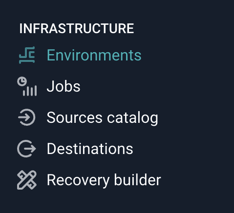
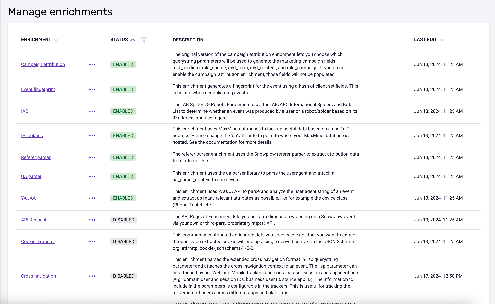
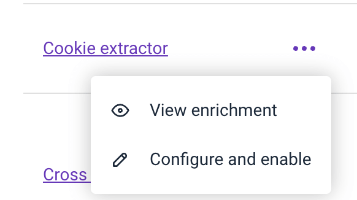
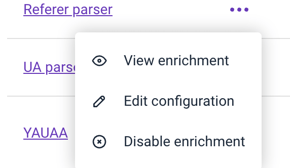
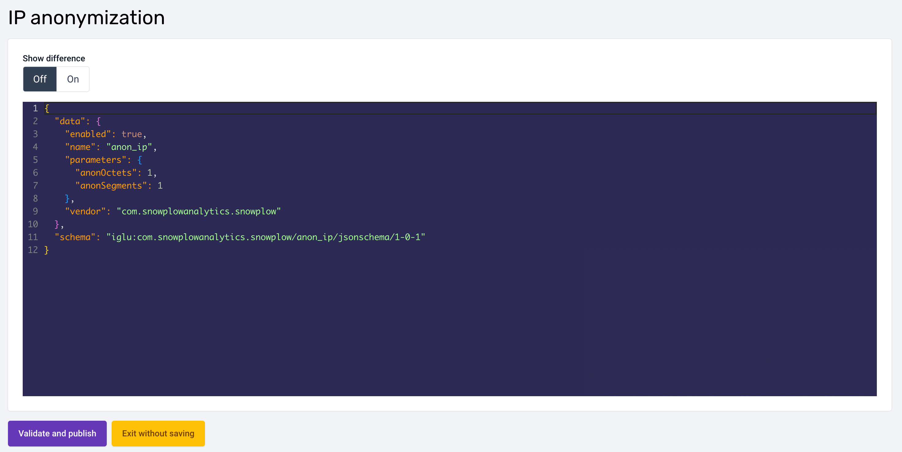

Enrichments in Snowplow allow you to add valuable context to your raw event data, making it more insightful and useful for analysis.

They are applied in real-time to events inside the Snowplow pipeline, and typically add more properties to each event, resulting in more columns in your events table.

When you install Snowplow via Quick Start, several enrichments are enabled by default. These enrichments automatically enhance your data without requiring additional configuration.

**Default Enrichments:**

- **IP Lookups**: Adds geographical data based on the IP address.
- **User-Agent Parsing**: Extracts browser, OS, and device information from user-agent strings.
- **Referer Parsing**: Analyzes referer URLs to determine the source of the traffic.
- **UA Parser**: Parses user-agent strings into structured data.
- **Page View ID**: Adds a unique identifier to each page view event

## Managing Enrichments via BDP

To start managing Enrichments in our hosted BDP platform, follow these steps:

1. Navigate to the environment you'd like to manage
2. Select *Enrichments* in the environment menu.



When you select navigate to the Enrichments screen you'll see a listing of all Enrichments and see their current status & last edited date for the environment.



3. Click on the three dots icon to see available options e.g. enable / edit.





4. To configure an enrichment, simply select "Configure and enable" if it's currently disabled, or choose "Edit configuration" if it's already set up. This will open a JSON editor where you can input your configuration.
    1. Each enrichment has a JSON schema against which it is validated. The enrichment JSONs follow a common pattern:

```json
{
    "schema": "iglu:((self-describing JSON schema for the enrichment))",

    "data": {
        "name": "enrichment name",
        "vendor": "enrichment vendor",
        "enabled": true / false,
        "parameters": {
            ((enrichment-specific settings))
        }
    }
}
```

For each enrichment, the JSON used to configure the enrichment has:

- A `name` field containing the name of the enrichment
- A `vendor` field containing the name of the company which created the enrichment
- An `enabled` field which can be set to `false` to ignore the enrichment
- A `parameters` field, containing the information needed to configure the enrichment

The `enabled` and `parameters` fields are the ones which you may wish to customize.For your convenience, you can enable the "Show difference" option to compare any previous configuration with your new one. Once you've completed the configuration, click "Validate and publish" to submit your changes. Our support team will then receive your request and proceed with updating the enrichment on our end.


