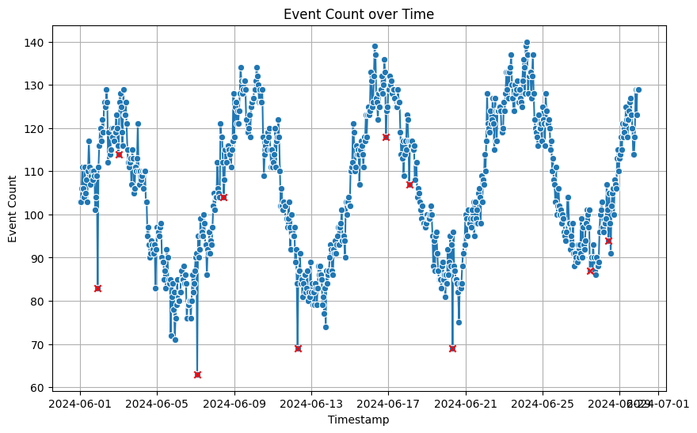

Welcome to the **Event Volume Anomaly Detection** solution accelerator.

This accelerator provides an introduction to detecting anomalies in Snowplow event volumes, specifically within **BigQuery** on **Google Cloud Platform (GCP)**. The focus is on identifying anomalies in **event volume data**, using data stored in BigQuery. This can help detect potential tracking issues or sudden increases in failed events by monitoring event volume trends.

This guide walks you through the steps required to:
- Load Snowplow event data into **BigQuery**
- Train an **ARIMA+** model for time series anomaly detection
- Identify statistically significant drops or spikes in event volumes
- Visualize anomalies using **matplotlib** and **seaborn**

## Requirements

To use this accelerator, you need:
- **Access to a GCP project** (including the project ID)
- **BigQuery permissions** (read, write, and query access)
- *A Snowplow pipeline is not required*, as sample data is provided.

This accelerator typically takes around **30 minutes** to complete. The notebook requires minimal computational resources with the provided sample dataset.

## Get started

This accelerator is available on **GitHub**:
- [GitHub repository](https://github.com/snowplow-industry-solutions/event-volume-anomaly-detection)

You can clone this repository and run it locally on your PC or import it into a [Google Colab notebook](https://colab.research.google.com/).

## Next steps

Once you've completed this accelerator, you can:
- Adapt the model to detect other anomalies in your own Snowplow event data
- Fine-tune the confidence threshold to reduce false positives
- Expand into detecting other types of anomalies such as missing properties or bot traffic

By leveraging Snowplow’s granular event data, you can proactively monitor data quality.

Ready to get started? [Jump into the notebook](https://github.com/snowplow-industry-solutions/event-volume-anomaly-detection/tree/main/notebooks) and start detecting anomalies!

