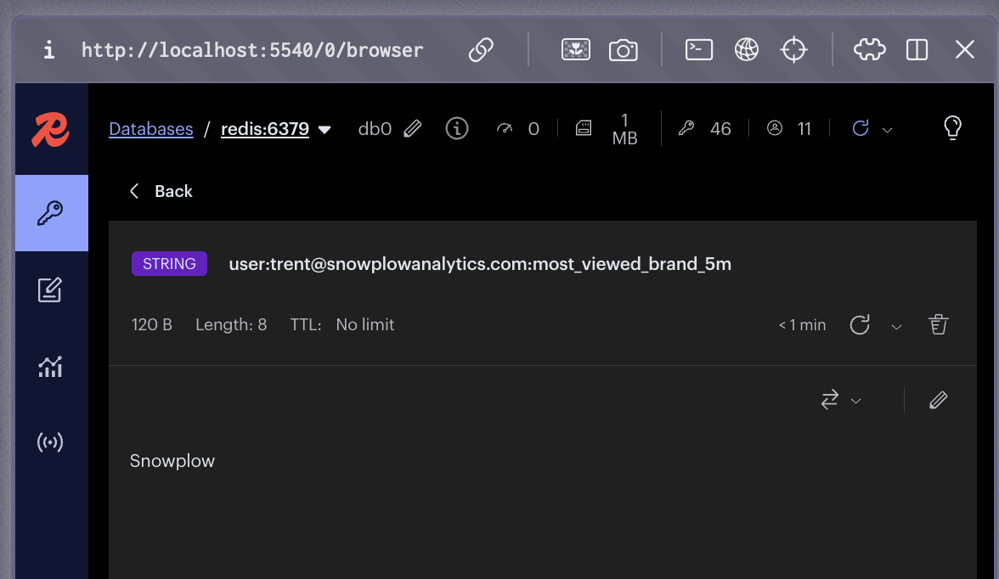

This page describes how to add an additional feature to the product window. The process would be similar for other parts of the system, such as cart or purchase features.

The package `com.evoura.snowplow.operator.product` contains all classes related to the product features. The features used by the product windows are:

1. `product_view_count`
2. `avg_viewed_price`
3. `return_view_count`
4. `price_range_viewed`

These are generated as metrics for Flink by the `ProductMetricsGeneratorRichFunction` class. To generate an additional feature, you will need to update several other classes first.

In this example, you will track a new feature called `most_viewed_brand`, based on the user's most viewed product brand.

## 1. Add a field to `ProductViewEvent`

The web application tracks data on product brand—it's a field within the Snowplow [ecommerce `product_view` event](/docs/sources/trackers/web-trackers/tracking-events/ecommerce/#product-view). A full example payload is available at `.example/product_view.json`, showing how the payload would look after processing through the Snowplow pipeline.

The `brand` field isn't currently present in the `ProductViewEvent` class.

Add `brand` as a `String` instance variable, after `timestamp`.

The updated class should look like this:

```java
package com.evoura.snowplow.operator.product;

import com.evoura.operator.TimestampedEvent;

public class ProductViewEvent implements TimestampedEvent {
  public String eventId;
  public String userId;
  public String productId;
  public double productPrice;
  public long timestamp;
  public String brand;

  public ProductViewEvent() {}

  public ProductViewEvent(
      String eventId, String userId, String productId, double productPrice, long timestamp, String brand) {
    this.eventId = eventId;
    this.userId = userId;
    this.productId = productId;
    this.productPrice = productPrice;
    this.timestamp = timestamp;
    this.brand = brand;
  }

  @Override
  public long getTimestamp() {
    return timestamp;
  }

  @Override
  public String toString() {
    return "ProductViewEvent{"
        + "eventId='"
        + eventId
        + '\''
        + ", userId='"
        + userId
        + '\''
        + ", productId='"
        + productId
        + '\''
        + ", productPrice="
        + productPrice
        + ", brand='"
        + brand
        + '\''
        + '}';
  }
}
```

## 2. Deserialize the information in `ProductViewEventMap`

Because you updated the `ProductViewEvent` constructor, you need to update the `ProductViewEventMap` class as well. The class `com.evoura.snowplow.operator.product.ProductViewEventMap` is responsible for mapping a `SnowplowEvent` into a `ProductViewEvent`.

On line 32, provide the `brand` argument as `productNode.path("brand").asText()`.

The updated method should look like this:

```java
@Override
public ProductViewEvent map(SnowplowEvent snowplowEvent) throws Exception {
  String eventId = snowplowEvent.getEventId();
  String userId = snowplowEvent.getUserId();

  JsonNode payloadNode = MAPPER.readTree(snowplowEvent.payload);
  JsonNode productNode = payloadNode.path("product");

  String productId = productNode.path("id").asText("");
  JsonNode priceNode = productNode.path("price");
  double productPrice = priceNode.isNumber() ? priceNode.asDouble() : 0.0;

  return new ProductViewEvent(
      eventId, userId, productId, productPrice, snowplowEvent.getTimestamp(), productNode.path("brand").asText());
}
```

## 3. Calculate the most viewed brand

You can now calculate which brand is the most viewed by the user. All the current features are already segmented by `user_id`, so the segmentation won't be part of this.

Look at the class `com.evoura.snowplow.operator.product.ProductFeatureRollingWindow`. The method `ProductFeatureRollingWindow.processWindow` receives `Iterable<ProductViewEvent> events` as the first argument.

This variable will contain all the `ProductViewEvent`s in the defined window. For products you can choose a 5 minute or a 1 hour window. Iterate through these items to calculate the most viewed brand by the user in this window.

It will look like something like this:

```java
String mostViewedBrand =
        uniqueEvents.values().stream()
            .collect(
                Collectors.groupingBy(
                    productViewEvent -> productViewEvent.brand, Collectors.counting()))
            .entrySet()
            .stream()
            .max(Map.Entry.comparingByValue())
            .map(Map.Entry::getKey)
            .orElse("");
```

## 4. Forward the `mostViewedBrand` downstream

The value of the feature needs to be collected so that it's available for Flink.

The class `com.evoura.snowplow.operator.product.ProductFeature` is responsible for forwarding all calculations that happened in `ProductFeatureRollingWindow.processWindow`.

Start by updating the class to store the new `mostViewedBrand` feature as a `String` variable.

```java
public class ProductFeature implements Serializable {
  public String userId;
  public int uniqueProductCount;
  public double averagePrice;
  public double minPrice;
  public double maxPrice;
  public String windowSize;
  public Map<String, Long> views;
  public String mostViewedBrand;

  public ProductFeature() {}

  public ProductFeature(
      String userId,
      int uniqueProductCount,
      double averagePrice,
      double minPrice,
      double maxPrice,
      String windowSize,
      Map<String, Long> views,
      String mostViewedBrand) {
    this.userId = userId;
    this.uniqueProductCount = uniqueProductCount;
    this.averagePrice = averagePrice;
    this.minPrice = minPrice;
    this.maxPrice = maxPrice;
    this.windowSize = windowSize;
    this.views = views;
    this.mostViewedBrand = mostViewedBrand;
  }

  @Override
  public String toString() {
    return String.format(
        "Window: %s, User: %s, Unique Products: %d, Avg Price: %.2f, Min Price: %.2f, Max Price: %.2f, Views: %s, Most Viewed Brand: %s",
        windowSize, userId, uniqueProductCount, averagePrice, minPrice, maxPrice, views, mostViewedBrand);
  }
  ...
}
```
This class contains a `TypeInfoFactory` class. A `TypeInfoFactory` is a way to tell Flink what's being forwarded to the next operator.

This is required because we decided to turn off Kryo deserialization on Flink. This trades some convenience for the long-term ability to perform rolling upgrades, rescale jobs, and keep historical state readable as your data model inevitably changes.

Kryo's "black-box" binary format doesn't carry any structural information, so even a small change to a field name, order, or data type breaks compatibility and can corrupt state when jobs are upgraded. Flink's own type serializers (POJO, Avro, Protobuf, etc.) embed explicit schema metadata and versioning hooks, allowing the runtime to evolve the schema safely and transparently migrate state across savepoints. We chose POJO for this project to avoid requiring any external schema registry.

Update the `ProductFeature` `TypeInfoFactory` to forward the `mostViewedBrand` feature.

The desired output will be:

```java
public class ProductFeature implements Serializable {
  ...

  public static class InfoFactory extends TypeInfoFactory<ProductFeature> {

    public static TypeInformation<ProductFeature> typeInfo() {
      InfoFactory factory = new InfoFactory();
      return factory.createTypeInfo(null, null);
    }

    @Override
    public TypeInformation<ProductFeature> createTypeInfo(
        Type t, Map<String, TypeInformation<?>> genericParameters) {
      Map<String, TypeInformation<?>> fields = new HashMap<>();

      fields.put("userId", Types.STRING);
      fields.put("uniqueProductCount", Types.INT);
      fields.put("averagePrice", Types.DOUBLE);
      fields.put("minPrice", Types.DOUBLE);
      fields.put("maxPrice", Types.DOUBLE);
      fields.put("windowSize", Types.STRING);
      fields.put("views", Types.MAP(Types.STRING, Types.LONG));
      fields.put("mostViewedBrand", Types.STRING);

      return Types.POJO(ProductFeature.class, fields);
    }
  }
}
```

Next, go back to `ProductFeatureRollingWindow.processWindow` and pass `mostViewedBrand` on at line 75.

```java
    out.collect(
        new ProductFeature(
            ctx.getCurrentKey(),
            uniqueViewsCount,
            avgUniquePrice,
            uniqueViewsCount == 0 ? 0.0 : priceStats.getMin(),
            uniqueViewsCount == 0 ? 0.0 : priceStats.getMax(),
            windowIdentifier,
            productViewCounts,
            mostViewedBrand));
```

## 5. Get the feature in Redis

The class `com.evoura.snowplow.operator.product.ProductMetricsGeneratorRichFunction` is responsible for converting the generated metrics into something the Redis operator understands. The method `ProductMetricsGeneratorRichFunction.processElement` has multiple feature collections.

Add your new `mostViewedBrand` feature after the existing blocks:

```java
out.collect(
        new MetricValue(
            String.format(
                "user:%s:most_viewed_brand_%s", productFeature.userId, productFeature.windowSize),
            String.valueOf(productFeature.mostViewedBrand)));
```

## 6. Re-run the pipeline

After these changes, re-run the script `./up.sh`. It will rebuild the docker image and restart the containers. You should be able to see in Redis the most viewed brand by the user.


