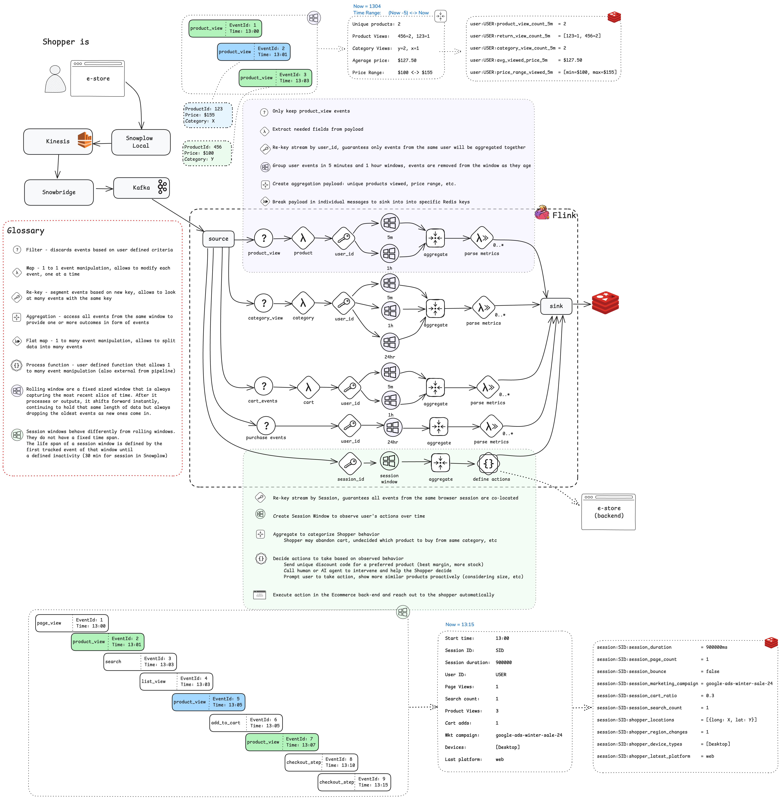
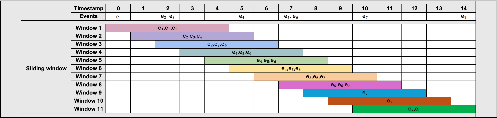
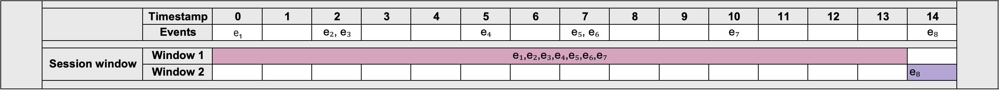

This section explains what is calculated, how each metric is updated, and where the values are stored.

- Metrics are calculated in-stream, so they’re always fresh
- Rolling windows offer an up-to-date view over the last N minutes or hours
- Session windows account for user inactivity, producing clean session data
- Redis keys are predictable, making metrics easy to use across services

## How features are calculated

Everything starts with the entry point class `com.evoura.snowplow.SnowplowAnalyticsPipeline`, which is responsible for:

- Creating a Kafka source (a Flink operator to read the data)
- Parsing the data into a known object (`com.evoura.snowplow.model.SnowplowEvent`)
- Branching the data for multiple windowed calculations
- Defining how each window processes the data
- Sinking the features into Redis

At a high level, the workflow is:
1. The Snowplow tracker sends raw events to the Snowplow pipeline, which processes them and forwards them to Flink
2. Flink parses events, assigns more timestamps, and sends each event down a dedicated branch
3. Each branch runs a windowed function that maintains just enough state to update the metric
4. The function emits a `MetricValue` object at a fixed cadence (30 seconds or 1 minute)
5. Flink writes the metric to Redis using a predictable key (`user:{id}:feature:{name}_{window}`)

## Window types

| Window type | Purpose                  | Size                    | Emit every    | Ends when            | Used in                           |
| ----------- | ------------------------ | ----------------------- | ------------- | -------------------- | --------------------------------- |
| Rolling     | Continuous, sliding view | 5 m, 1 h, 24 h          | 30 s or 1 min | Never; always shifts | Product, Category, Cart, Purchase |
| Session     | Group events per visit   | Gap-based (30 min idle) | 30 s          | No events for 30 min | Session metrics                   |

This architecture diagram shows more details about the windowing logic:



- All rolling windows use a custom `RollingWindowProcessFunction`
- The session view uses `SnowplowSessionWindow`

For example, aggregation on a rolling window of 5 seconds and a session window with a 3-second gap would look like:





More detail is available in [The case for a custom window in Flink: Expanding your streaming use-cases](https://pedromazala.substack.com/p/the-case-for-a-custom-window-in-flink?utm_source=snowplow&utm_medium=accelerator&utm_campaign=live-shopper) blog post.

## Per-feature logic

### Product views

- Event filter: `product_view`
- Key: `userId`
- Windows: 5 min, 1 hour
- Metrics: view count, average price, min-max price range
  _Emitted as_: `product_view_count_5m`, `avg_viewed_price_1h`, etc.

### Category engagement

- Event filter: `list_view`, `product_view`
- Key: `userId`
- Windows: 5 min, 1 hour, 24 hour
- Metrics: category view count, repeat views, top category in window

### Cart behavior

- Event filter: `add_to_cart`, `remove_from_cart`
- Key: `userId`
- Windows: 5 min, 1 hour
- Metrics: adds, removes, net cart value, cart change frequency

### Purchase history

- Event filter: checkout events (`add_to_cart`, `remove_from_cart`, `checkout_step`)
- Key: `userId`
- Window: 24 hour
- Metrics: order count, total spend, average order value

### Session analytics

- Event filter: all high-level engagement events
- Key: `sessionId`
- Window: session gap (30 min)
- Metrics: session duration, pages per session, bounce flag, cart-to-page ratio

## Redis key pattern

```
user:{user_id}:{feature}_{window}
```

Examples:
- `user:trent@snowplowanalytics.com:product_view_count_5m`
- `user:lucas@snowplowanalytics.com:session_duration`

Downstream apps such as dashboards, ML models, or chat bots read these keys directly.
