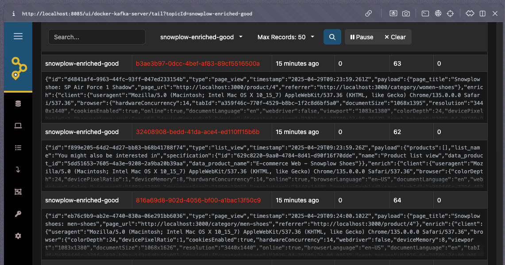
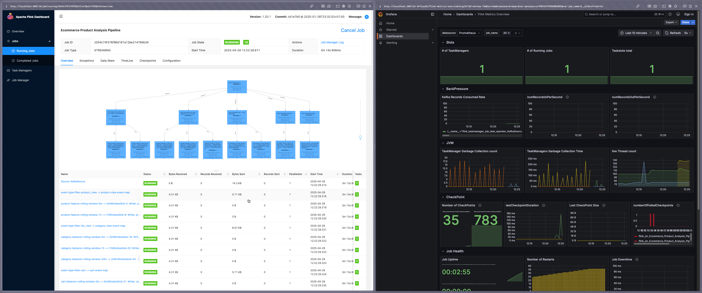
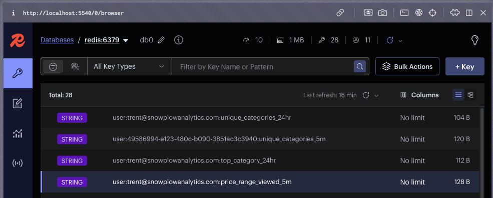

1. [Clone the repository](https://github.com/snowplow-industry-solutions/flink-live-shopper)
2. Run the startup script. This will:
    - Ensure `.env` files exist, copying from `.env.example` if needed
    - Update Git submodules
    - Start all the services defined in the Docker Compose files, in detached mode

   ```bash
   up.sh
   ```

3. Access the main interfaces:
   - **Web application ecommerce store**: `http://localhost:3000`
   - **AKHQ (Kafka UI)**: `http://localhost:8085`
   - **Redis Insights**: `http://localhost:5540`
   - **Flink dashboard**: `http://localhost:8081`
   - **Grafana**: `http://localhost:3001`
4. When finished, stop the containers
   ```bash
   docker compose down
   ```

## Dataflow steps

1. Client-side tracking:
   - The Next.js-based ecommerce store emits user interactions (e.g., `product_view`, `add_to_cart`) using the Snowplow JavaScript tracker

2. Ingestion pipeline:
   - Events are captured by the Collector and processed via Enrich
   - Snowbridge forwards enriched events into Kafka topics

   

3. Stream processing (Apache Flink):
   - Events are parsed, filtered, and routed into logical branches
   - Processing includes:
     - Product features: count views, average viewed price, price range
     - Cart behavior: add/remove counts, cart value, update frequency
     - Category engagement: category views, repeat views
     - Purchase history: aggregate purchases over rolling windows (e.g., 24 hours) to calculate total spend, order count
     - Session analytics: duration, bounce rate, marketing source

   

4. Feature store (Redis):
   - Metrics are written to Redis using deterministic keys (e.g., `user:{user_id}:{feature}_{window}`)
   - These metrics are available for real-time lookups by downstream systems

   

## Testing

To test the system, log in to the ecommerce store using one of the [mock users](https://github.com/snowplow-industry-solutions/ecommerce-nextjs-example-store/blob/main/src/mocks/users.ts).

Open a product listed on the homepage. You should see data flowing to the `enriched-good` topic via [AKHQ](http://localhost:8085). This is the same data ingested by Flink to derive metrics.

All calculated metrics will appear in [Redis Insights](http://localhost:5540).

If you don't see any data flowing, check that the ecommerce store is sending events correctly. Ad blockers can interfere with event tracking: turn them off for full functionality.

The data in Redis is now available to be consumed by any application, system, or process—for example, an AI agent can use this data to determine the next best action.
