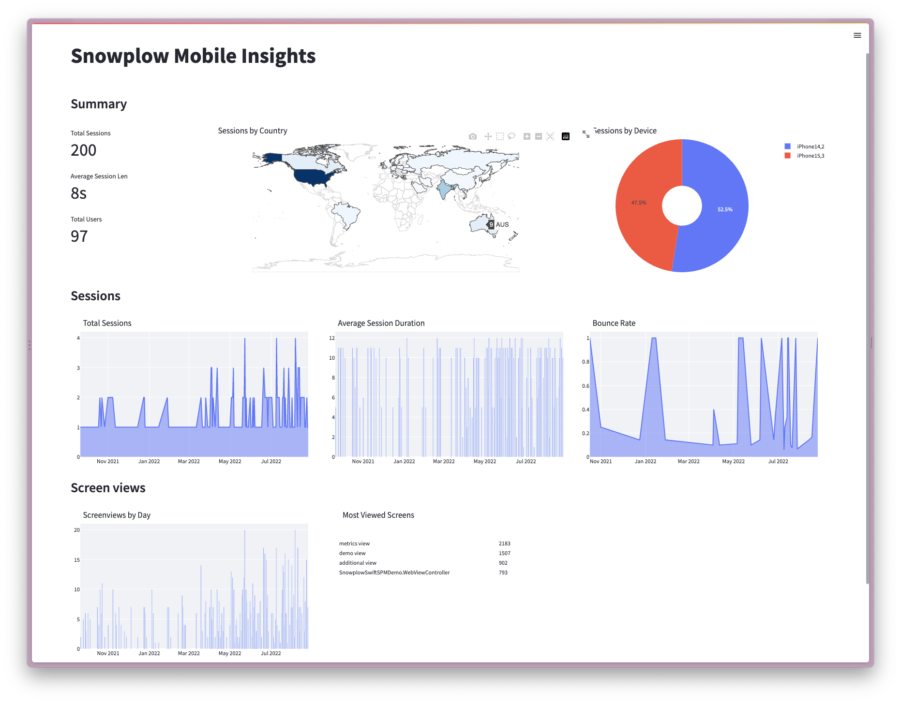

Welcome to the **build advanced analytics for hybrid apps** tutorial. Once finished, you will be able to build a deeper understanding of customer behavior on your mobile apps and use your data to influence business decisions.

In this tutorial you will learn to:

- Model and visualize Snowplow data using the [snowplow-mobile](https://hub.getdbt.com/snowplow/snowplow_mobile/latest/) dbt package and Streamlit using our sample data (no need to have a working pipeline)
- Set up Snowplow tracking in a hybrid mobile app to track events both from native iOS/Android/React Native code as well as embedded web views
- Apply what you have learned on your own pipeline to gain insights

Hybrid apps are mobile apps that in addition to a native interface, provide part of the UI through an embedded web view. Snowplow events are tracked from both the native code (e.g. written in Swift or Kotlin) as well as the web view (in JavaScript). Our goal is to have both events tracked from the native code as well as the web view share the same session and appear as tracked with the same tracker.

## Who this tutorial is for

- Data practitioners who would like to get familiar with Snowplow data
- Data practitioners who would like to set up tracking in a mobile hybrid app and learn how to use the Snowplow mobile data model to gain insight from their customers' behavioral data as quickly as possible

## What you will achieve

In approximately 2 working days (~12 working hours) you can achieve the following:

- **Upload data** - Upload a sample Snowplow events dataset to your warehouse
- **Model** - Configure and run the snowplow-mobile data model
- **Visualize** - Visualize the modeled data with Streamlit
- **Track** - Set up and deploy tracking to your hybrid mobile app
- **Next steps** - Gain value from your own pipeline data through modeling and visualization

## Prerequisites

**Modeling and Visualization**
- dbt CLI installed / dbt Cloud account available
- New dbt project created and configured
- Python 3 installed
- Snowflake, BigQuery or Databricks account and a user with access to create schemas and tables

**Tracking**
- Snowplow pipeline
- Hybrid mobile app to implement tracking on

:::note
Please note that **Snowflake, BigQuery and Databricks** will be used for illustration but the snowplow-mobile dbt package also supports **Postgres** and **Redshift**.
:::

## What you will build

**Mobile and Hybrid Apps Analytics Dashboard**

## System overview

The diagram below gives a complete overview of the system covered in this accelerator:

1. Events are tracked from app logic both inside the **Web view** as well as the **native app code**.
   - Native code events are tracked using the [Snowplow iOS](https://github.com/snowplow/snowplow-objc-tracker), [Android](https://github.com/snowplow/snowplow-android-tracker), or [React Native tracker](https://github.com/snowplow/snowplow-react-native-tracker).
   - Web view events are tracked using the [WebView tracker](https://github.com/snowplow-incubator/snowplow-webview-tracker) that passes them to be tracked by the Snowplow iOS or Android tracker.
2. Tracked events are loaded into the warehouse by the Snowplow BDP or Open Source Cloud.
3. The raw events are **modeled into higher level entities** such as screen views, sessions, or users using the [snowplow-mobile](https://docs.snowplowanalytics.com/docs/modeling-your-data/the-snowplow-mobile-data-model/dbt-mobile-data-model/) dbt package.
4. Finally, we **visualize** the modeled data using Streamlit.

This unified approach allows you to understand user behavior seamlessly across both native and web components of your hybrid app.
