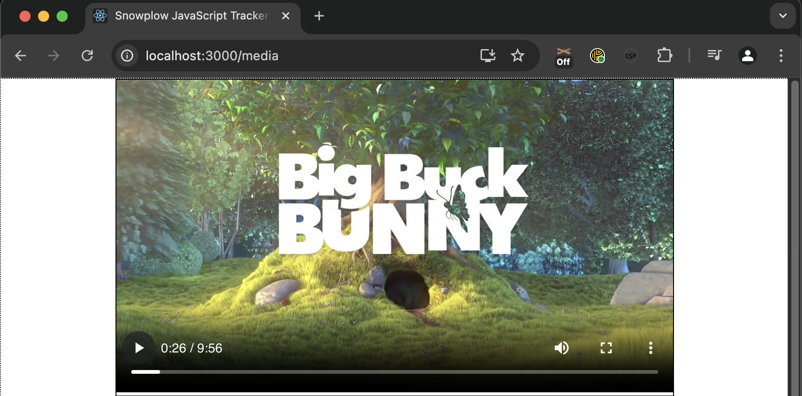
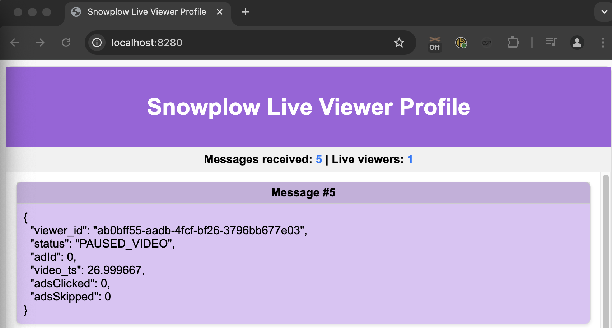

In this tutorial, we have explored the **live viewer profiles** solution accelerator for video streaming, gaining practical insights into building, deploying, and extending real-time, event-driven architectures using Snowplow and Kafka.

## Key Takeaways

### Understanding the Process
We successfully have built a real time system for processing event data including:
- **Web Tracking Application** for collecting media events.

- **Snowplow Collector and Snowbridge** for event processing and forwarding.
- **Live Viewer Backend** for managing real-time data with Kafka and DynamoDB.
- **Live Viewer Frontend** for visualizing real-time user activity on the web tracking application.

This architecture highlights how real-time insights can be achieved using event-driven systems in a streaming context.

### What We Achieved
We explored how to:
1. Use LocalStack to emulate AWS services for local development and testing.
2. Launch and interact with the system components, such as the Kafka UI and LocalStack UI.
3. View and verify the real-time event data from the browser using Snowplow's media tracking capabilities.
4. Deploy the solution in an AWS environment using Terraform.

### Practical Applications
This tutorial can be extended to utilize Snowplow event data for other real-time use cases, such as:
- Web Engagement analytics.
- Personalized recommendations.
- Ad performance tracking.

## Next Steps
- **Extend tracking:** Extend the solution to track more granular user interactions or track on a new platform such as mobile.
- **Extend dashboard:** Extend the Live Viewer to include information on the media being watched and the user.
- **Replace the state store:** Replace Amazon DynamoDB with an alternative to be cloud agnostic, e.g. Google Bigtable or MongoDB.

By completing this tutorial, you are equipped to harness the power of event-driven systems and Snowplow’s analytics framework to build dynamic, real-time solutions tailored to your streaming and analytics needs.
