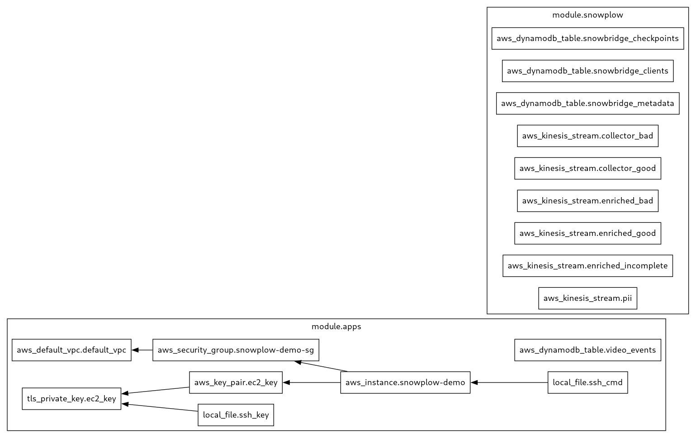

The following steps will deploy the solution accelerator to AWS using Terraform. This is an alternative to the Localstack method. There is no need to manually install [Terraform](https://www.terraform.io/). It is executed via [Docker](https://www.docker.com/) using the `terraform.sh` script.

## Step 0: Prerequisites

1. Open a terminal
2. Install **Docker** and **Docker Compose**
3. [Clone the project](https://github.com/snowplow-industry-solutions/kafka-live-viewer-profiles) and navigate to its directory
```bash
git clone https://github.com/snowplow-industry-solutions/kafka-live-viewer-profiles.git
```
4. Create a `.env` file based on `./docker/.env.example` and configure AWS variables.
```bash
ACCEPT_LICENSE="true"
AWS_REGION=eu-west-2
AWS_ACCESS_KEY_ID=xxxxxxxxxxxxxxxxxxxxx
AWS_SECRET_ACCESS_KEY=xxxxxxxxxxxxxxxxx
```

## Step 1: Initialize the project

```bash
$ ./terraform/terraform.sh init
```

## Step 2: Create the infrastructure

```bash
$ ./terraform/terraform.sh apply
```

## Step 3: Access the EC2 instance that runs the apps in AWS

```bash
$ ./terraform/apps/ssh.sh
```

Inside the EC2 instance, you can control the Docker images in a similar way to how you do locally:

```bash
$ cd snowplow-demo

$ ./stats.sh # <- show the statistics for the Docker containers
$ ./down.sh  # <- stop the Docker containers
$ ./up.sh    # <- start the Docker containers
```

## Step 4: Open access to the applications

Review the [LocalStack guide](/tutorials/kafka-live-viewer-profiles/quickstart-localstack) for the default configuration for each component. Open public access to the two front-end applications and the Snowplow Collector using a HTTP load balancer so that anyone can watch the video, submit events to the pipeline, and see information on concurrent users.

The applications listen for HTTP traffic on the following ports
- Web tracker front-end - 3000
- Live viewer front-end - 8280
- Snowplow Collector - 9090

## Next steps

- You can implement Snowplow media tracking on any [HTML5](/docs/sources/trackers/javascript-trackers/web-tracker/tracking-events/media/html5/) or [YouTube](/docs/sources/trackers/javascript-trackers/web-tracker/tracking-events/media/youtube/) media of your choice
- Look into the output from Kafka and extend the Live Viewer to include information on the media being watched and the user
- Replace Amazon DynamoDB with an alternative to be cloud agnostic, e.g. Google Bigtable or MongoDB
---

## Other commands

### Check versions

```bash
$ ./terraform/terraform.sh --version
```
Example response
```bash
Terraform v1.10.0
on linux_amd64
+ provider registry.terraform.io/hashicorp/aws v5.79.0
+ provider registry.terraform.io/hashicorp/local v2.5.2
+ provider registry.terraform.io/hashicorp/tls v4.0.6
```

### Check the Terraform plan

```bash
$ ./terraform/terraform.sh plan
```

### Generate a PNG image for the Terraform modules in this project

```bash
$ ./terraform/terraform.sh png
```

Current PNG image of the available modules:



### Destroy the infrastructure

```bash
$ ./terraform/terraform.sh destroy
```
