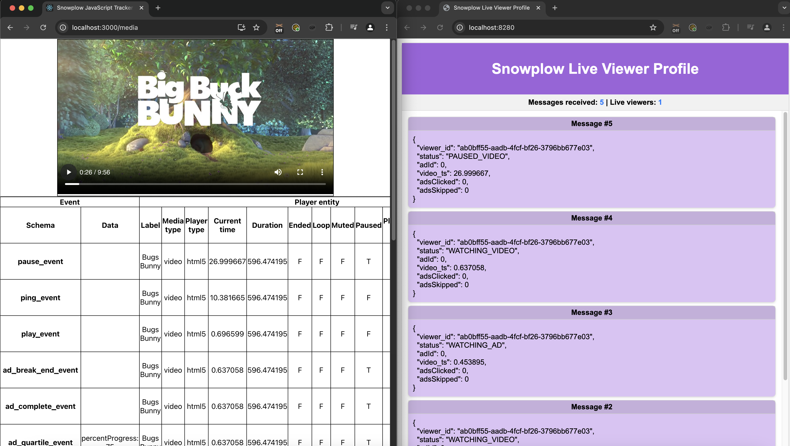

Welcome to the **live viewer profiles** solution accelerator for video streaming.

This accelerator demonstrates how to build a real-time use case leveraging **Snowplow event data** to create live viewer profiles for a video streaming site. By combining Snowplow's streaming pipeline with **Apache Kafka**, a **Java application** and **AWS DynamoDB**, the solution processes live streaming events to visualize user interactions with video content and advertisements.

On the left side of the image below, someone is watching a video. Their events are sent through a Snowplow pipeline to Kafka where they are consumed and processed by an application. The result of this processing is displayed in the right window. This shows the number of active users and their current state.

Through this hands-on guide, you'll learn how to build, deploy, and extend real-time, event-driven architectures using Snowplow and Kafka, enabling personalized recommendations, real-time insights, and dynamic analytics for streaming platforms. The framework is inspired by common challenges in video streaming, including tracking user behavior, ad engagement, and session activities, with the goal of maintaining up-to-date viewer profiles in DynamoDB.

This accelerator is open source and can serve as the foundation to build practical applications like real-time viewer insights, engagement analytics, ad performance tracking, and personalized recommendations. Whether you're optimizing ad placements or enhancing viewer satisfaction, this guide equips you to unlock the full potential of Snowplow event data.

Please start by reviewing how the application works in the next page on Localstack, even if you're planning to deploy with Terraform.

## Solution Accelerator code

The code for this infrastructure is available [here on GitHub](https://github.com/snowplow-industry-solutions/kafka-live-viewer-profiles).

## Architecture

The solution comprises several interconnected components:

- **Web tracking application**:
  - A React application with a video to watch
  - Snowplow's media tracking has been configured to send events (e.g., play, pause, ad skipped) to the [Snowplow Collector](/docs/fundamentals)
  - Code available in [tracker-frontend](https://github.com/snowplow-industry-solutions/kafka-live-viewer-profiles/tree/main/tracker-frontend) folder in GitHub

- **Snowplow Collector**:
  - Collects and forwards events via [Stream Enrich](/docs/fundamentals) and Kinesis to [Snowbridge](/docs/destinations/forwarding-events/snowbridge)

- **Snowplow Snowbridge**:
  - Publishes events to Kafka for the Live Viewer back-end to consume

- **Live Viewer back-end**:
  - A Java application which processes events from Kafka, stores the data in DynamoDB, and generates JSON state data for the Live Viewer front-end
  - Code available in [live-viewer-backend](https://github.com/snowplow-industry-solutions/kafka-live-viewer-profiles/tree/main/live-viewer-backend) folder in GitHub

- **Live Viewer front-end**:
  - A HTML website which displays the state of users currently watching the video
  - Code available in [live-viewer-frontend](https://github.com/snowplow-industry-solutions/kafka-live-viewer-profiles/tree/main/live-viewer-frontend) folder in GitHub

The following diagram maps out where each component sits in the end-to-end communication flow.

### Components and configuration

The following files in the [GitHub repository](https://github.com/snowplow-industry-solutions/kafka-live-viewer-profiles) can be used to configure the project's components:
- **Snowplow components**: `docker/compose.snowplow.yaml`
- **Kafka infrastructure**: `docker/compose.kafka.yaml`
- **Application components**: `docker/compose.apps.yaml`
- **LocalStack setup**: `docker/compose.localstack.yaml`
- **AWS setup**: Terraform scripts (located in the `docs/terraform` folder)

## Acknowledgements
Thank you to the Kafka experts [OSO](https://oso.sh/) for their support with building this accelerator.
