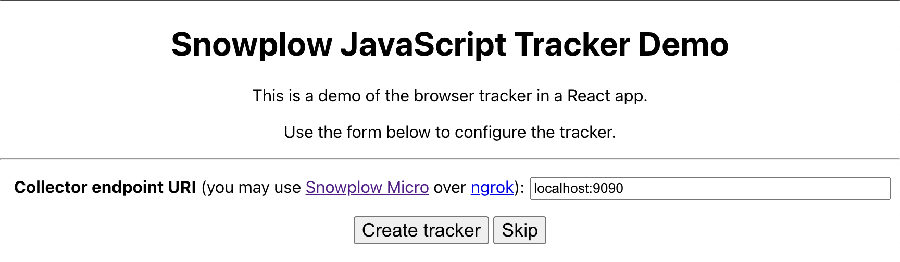
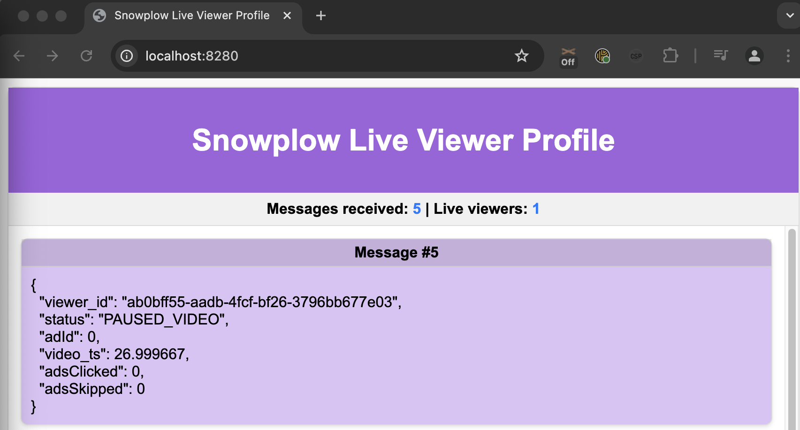

## Steps to Run the Application

### Step 0: Prerequisites

1. Open a terminal.
2. Install **Docker** and **Docker Compose**.
3. [Clone the project](https://github.com/snowplow-industry-solutions/kafka-live-viewer-profiles) and navigate to its directory.
```bash
git clone https://github.com/snowplow-industry-solutions/kafka-live-viewer-profiles.git
```
4. Create a `.env` file based on `.env.example`. You can leave the AWS variables as placeholders when using Localstack
```bash
ACCEPT_LICENSE="true"
AWS_REGION=eu-west-2
AWS_ACCESS_KEY_ID=xxxxxxxxxxxxxxxxxxxxx
AWS_SECRET_ACCESS_KEY=xxxxxxxxxxxxxxxxx
AWS_ENDPOINT_URL=http://localstack:4566
```

### Step 1: Start the Containers

Run the following command to download and run everything in Docker:

```bash
./docker/up.sh
```
Details on everything that is installed can be found in [architecture](/tutorials/kafka-live-viewer-profiles/introduction#architecture)

**Tips:**
- Use `Ctrl+C` to stop services but keep containers running.
- Pass service-specific options to `./docker/up.sh` (e.g., `./docker/up.sh kafka-services`).

### Step 2: Open the Web Tracking Frontend

Visit [http://localhost:3000](http://localhost:3000) to configure the Stream Collector endpoint and start tracking events. Enter the Collector URL: `localhost:9090` and click `Create tracker`.



On the next screen, click `Custom media tracking demo`. This will bring up a video and a screen that displays information on what events are sent from the browser to the pipeline. If you want to simulate multiple users watching the video at the same time, you can open this in separate browsers.


You must keep this window open with the video playing because everything here is running in real-time. You can use the [Snowplow Chrome Plugin](https://chromewebstore.google.com/detail/snowplow-inspector/maplkdomeamdlngconidoefjpogkmljm) to verify that the events are successfully sent from the web browser.


### Step 3: Open the Live Viewer Frontend

Open [http://localhost:8280](http://localhost:8280) in a separate window. This will display the active users and their current state (e.g. watching video, watching advertisement, paused).



Congratulations! You have successfully run the accelerator to stream web behavior through Snowplow and Kafka to a real-time dashboard.

## Next Steps
- You can implement Snowplow media tracking on any [HTML5](/docs/sources/trackers/web-trackers/tracking-events/media/html5/) or [YouTube](/docs/sources/trackers/web-trackers/tracking-events/media/youtube/) media of your choice
- Look into the output from Kafka and extend the Live Viewer to include information on the media being watched and the user.
- Use our supplied Terraform in the next section to run this on AWS and make it publicly available.

## Other Things You Can Do

### View Events in Kafka UI

Access [http://localhost:8080](http://localhost:8080) to review events within the Kafka UI.

### Manage Containers with LazyDocker

Run the following command to manage containers visually:

```bash
sudo ./docker/lazy.sh
```

### Inspect Infrastructure with LocalStack UI

Visit the [LocalStack UI](https://app.localstack.cloud/) to inspect infrastructure components such as Kinesis and DynamoDB. Please note that a LocalStack account is required to view this.

## Cleaning Up

### Stop the containers

Shut down all running containers:

```bash
./docker/down.sh
```

### Clean Up and Delete

To remove all containers and images, use:

```bash
./docker/clean.sh
```

**Warning**: This command will delete all generated data.
