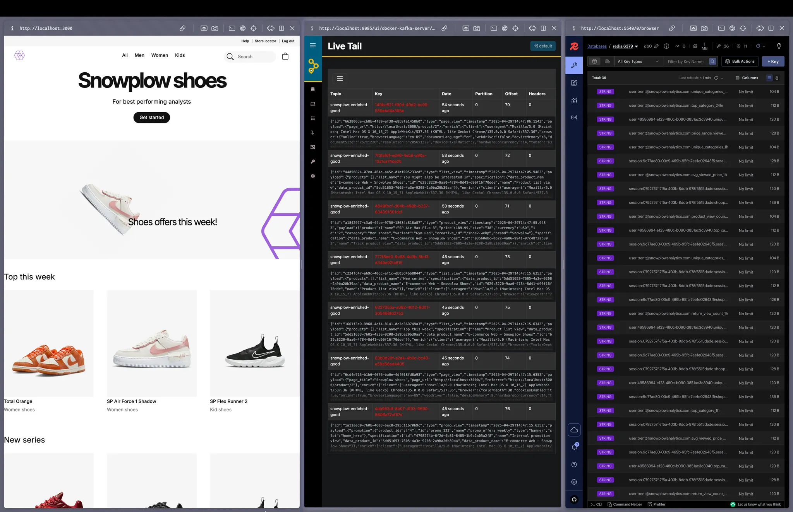

Welcome to the **Snowplow Live Shopper** solution accelerator for ecommerce.

This accelerator demonstrates how to leverage Snowplow's behavioral data to monitor and act on shopper behavior while they're still navigating your site.

Traditional analytics stacks focus on deriving insights after the fact—business intelligence dashboards that show what happened. Real-time monitoring enables proactive actions such as initiating a live chat, or sending a unique discount code based on surges in shopper activity.

In this accelerator, you'll learn how to calculate key metrics, in near real time, that can power other systems.

After you set up the project, you can explore the system via three tools:
- [**Snowplow ecommerce store**](https://github.com/snowplow-industry-solutions/ecommerce-nextjs-example-store) (left panel in below image)
- [**AKHQ**](https://akhq.io/), a Kafka visualization tool (center panel)
- [**Redis Insights**](https://redis.io/insight/), a Redis visualization tool (right panel)

All interactions on the store flow through [Snowplow Local](https://github.com/snowplow-incubator/snowplow-local) and are streamed into Kafka, where they are processed using Flink.

The computed metrics can also feed longer-term dashboards, enhancing the quality and reusability of your data.

## Prerequisites

This accelerator is fully Dockerized. The only prerequisite is Docker 28+.

## Solution accelerator code

The code for this accelerator [is available on GitHub](https://github.com/snowplow-industry-solutions/flink-live-shopper).

## Architectural overview

You can find the architectural overview in [this Excalidraw scene](https://link.excalidraw.com/l/E5gTPZc8rA/8vfgGl2Soqx).

Benefits of this architecture:
- Sub-second freshness: metrics are computed in the stream, not via nightly batch jobs, so they're actionable in-session
- Single source of truth: the same logic powers dashboards and in-session nudges
- Composable and portable: the entire system runs in Docker, and can be adapted to cloud-managed Kafka/Flink/Redis with minimal changes

The key subsystems are described below.

### Event capture and ingestion with Snowplow

- E-store front-end and Snowplow JavaScript tracker: user activity is captured as Snowplow ecommerce events
- Snowplow Local to Kafka: the Snowplow pipeline validates the events, enriches them with device and geolocation data, then forwards them into Kafka

### Real-time stream processing in Flink

- Source: a single Flink job reads from the `enriched-good` topic
- Branching by event type: the stream is split into four logical lanes (product, category, cart, purchase)
- There are two options for keying and windowing:
  - Rolling windows (5 min, 1 h, 24 h): keyed by `user_id` for always-fresh "last-N-minutes" stats
  - Session windows: keyed by `session_id`, grouping events into sessions that end after 30 minutes of inactivity
- Aggregations: each lane computes its own features (e.g., view counts, average price, cart value, session duration)
- Metric parsers: convert aggregated values into one or more metrics, for example, a unique product count may feed both product view metrics and average viewed price metrics

### Feature store and action loop

- Sink to Redis: Flink writes each metric to Redis using deterministic keys like `user:{id}:{feature}_{window}` or `session:{sid}:{metric}`, making Redis a low-latency feature store
- Backend consumers: the e-store back-end (or any downstream app like ML models or dashboards) can retrieve metrics in microseconds to:
  - Trigger live-chat prompts when high-value carts stall
  - Send discounts based on price sensitivity
  - Feed both real-time dashboards and long-term analytics using consistent definitions
