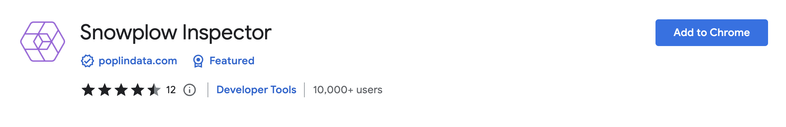
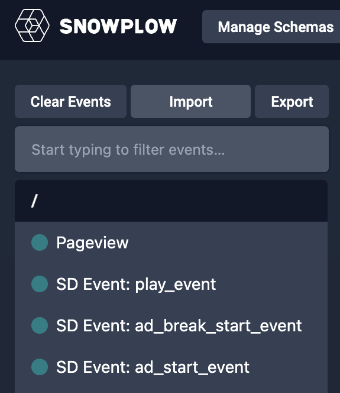
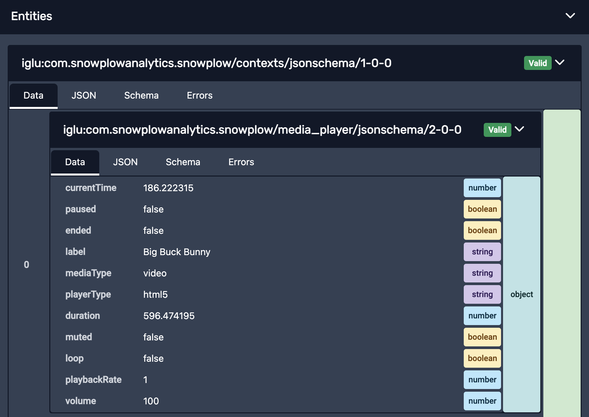
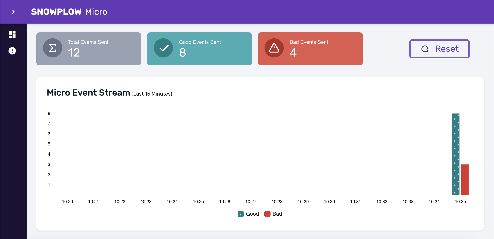
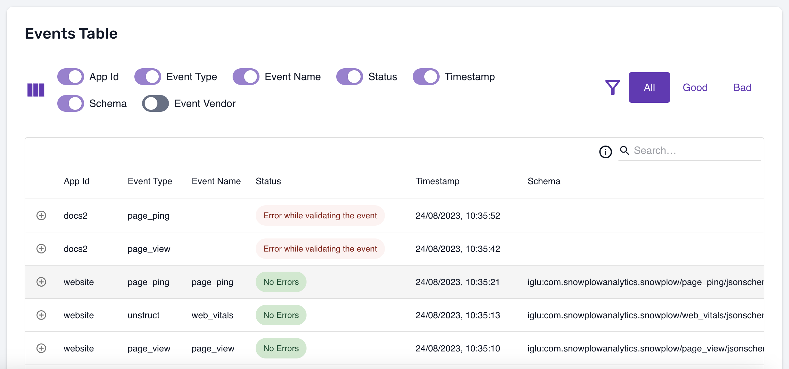

This section covers how to test your media tracking implementation to ensure events are being captured correctly.

## Testing on web using the Snowplow Chrome Extension

The Snowplow Chrome Extension can be used to ensure the event was emitted correctly but the browser extension does not check that the event was processed correctly.

### Installation

Install the [Snowplow Chrome Extension](https://chrome.google.com/webstore/detail/snowplow-inspector/maplkdomeamdlngconidoefjpogkmljm?hl=en). You may need to restart your browser.



### Check your data

Open up devtools (F12) and navigate to the Snowplow extension. In a regular setup you should probably see a list of page view and media player events start to form as you interact with your site.



Click on an event to get a breakdown of the data being captured.



## Testing using Snowplow Micro

We will be using [Snowplow Micro](https://docs.snowplow.io/docs/understanding-your-pipeline/what-is-snowplow-micro/) as a small replacement of a Snowplow pipeline for local testing. Snowplow Micro is a local web server that lets you inspect tracked events.

### Start Micro using Docker

You will need to have Docker installed. See the [instructions here](https://docs.docker.com/get-docker/) in case you don't have it installed yet.

The following command can be used to run Micro using Docker:

```bash
docker run -p 9090:9090 snowplow/snowplow-micro:2.0.0
```

### Install and start ngrok

Additionally, you will need the Micro server to be accessible to your mobile devices or emulator VMs. The easiest way to achieve this is through the [ngrok proxy](https://ngrok.com/) that creates a publicly accessible URL for your local server. You can install ngrok on macOS using the following command ([see here](https://ngrok.com/download) for installation options on other platforms):

```bash
brew install ngrok/ngrok/ngrok
```

You will need to [sign up](https://dashboard.ngrok.com/signup) on the ngrok website and get an authtoken that you can then add to your ngrok installation using:

```bash
ngrok config add-authtoken <token>
```

Finally, you can start ngrok as follows:

```bash
ngrok http 9090
```

This will start the proxy and show you the "Forwarding" URL at which your Micro will be accessible (it has the format `https://XXXX-XX-XX-XXX-XX.ngrok.io`)

### Configure the endpoint in your app

Enter the forwarding URL in the `createTracker` call in your app. Build and run your app in an iOS simulator, Android emulator, or an actual device and use the app so that a number of events are tracked.

### Check your data

Navigate to [http://localhost:9090/micro/ui](http://localhost:9090/micro/ui) on your computer to see the number of tracked events. You should see a chart showing the number of events that passed validation (good) and failed validation (bad) over time.



Under the chart, you will see a table with the tracked events that you can inspect.


