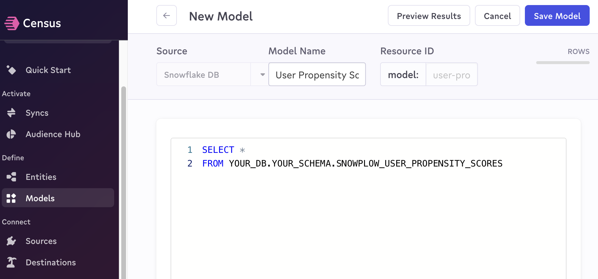
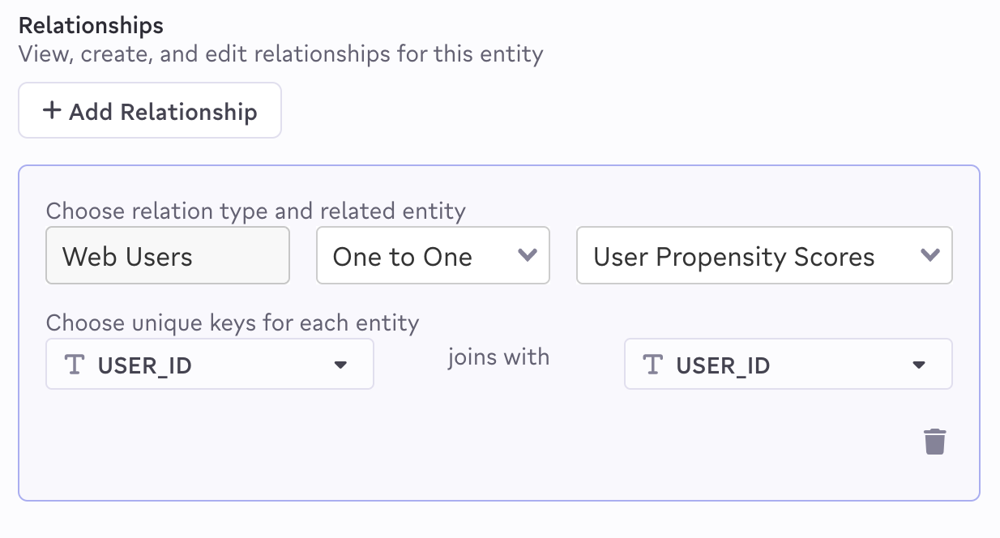
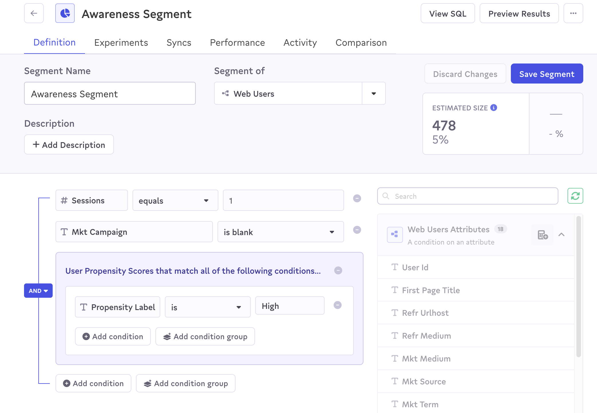

With Census connected to your data warehouse, you can now build audiences based on your ML propensity scores and Snowplow behavioral data.

## Create your models

First you need to create a [model](https://docs.getcensus.com/basics/data-models-and-entities/models) based on your out-of-the-box Snowplow modeled `snowplow_web_users` table or any custom user tables you have built.

Create another model for the user propensity scores table you created in the previous chapter, `snowplow_user_propensity_scores`.

## Create Census Entities

You'll need to create [Entities](https://docs.getcensus.com/basics/data-models-and-entities/entities) for the audiences to be built off. Base these Entities off the models you created in the previous step. Finally add a 1:1 relationship between the two, joining on `user_id`.

## Build your audience

Now you can build an audience using columns from your newly created Entities. In this example we're targeting users in the awareness stage based on the following criteria:

- First time on website
- Did not arrive from a marketing campaign
- **High** propensity score

:::note
Marketing to high propensity to convert users (using your ML model output created in the previous predictive ML models section) will lead to higher conversion for less advertising spend!
:::

