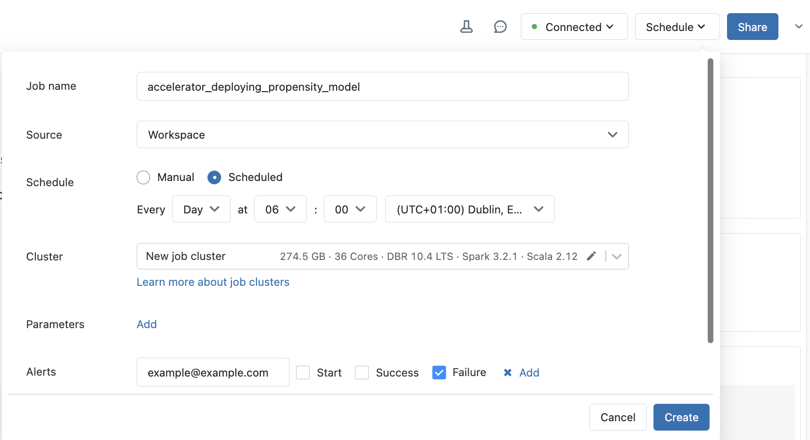
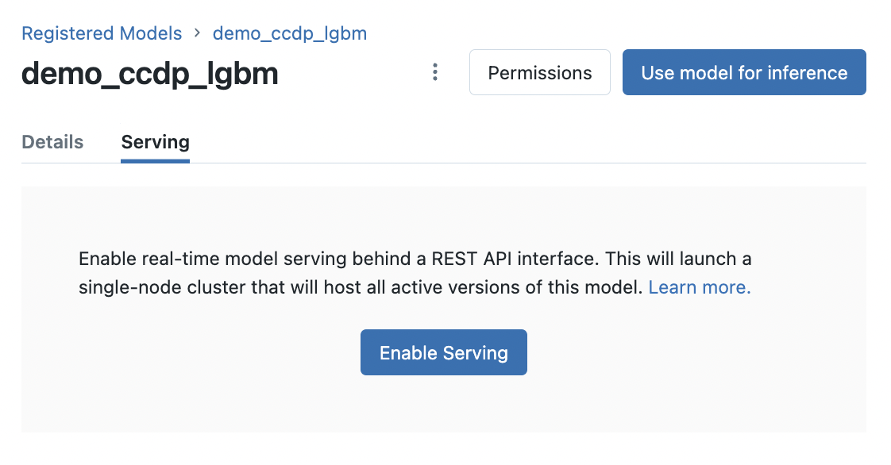
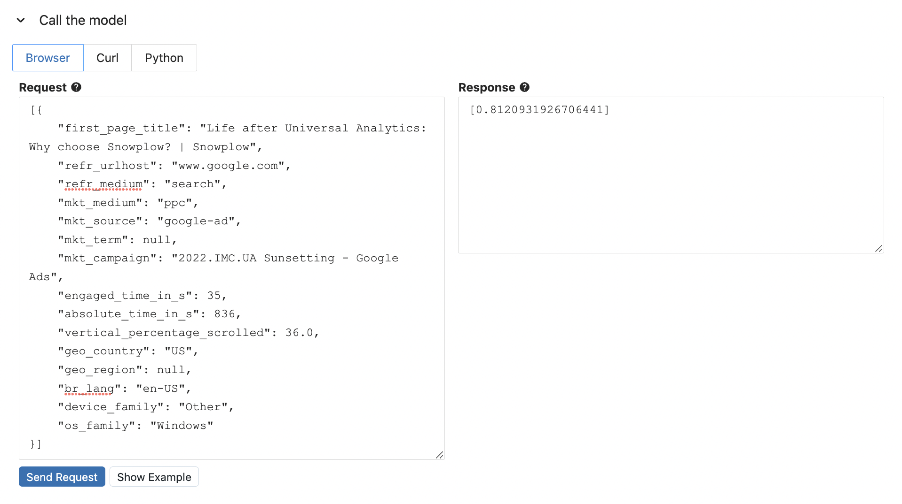

In this accelerator you have learned how to log, register, load and use a machine learning model in your data warehouse. The final step is putting these models into production.

## Databricks deployment options

You can deploy your model in several ways:

### Option 1: Databricks notebook scheduling

The example notebook shown earlier in this accelerator showed how you could load and use your models. This notebook can be triggered to run on a schedule by either creating a [workflow job](https://docs.databricks.com/workflows/jobs/jobs.html) or setting up a schedule from within the notebook itself.



### Option 2: Delta Live Tables

If you are using a DLT pipeline, add the steps to load and use your model into your pipeline notebook. See [Delta Live Tables introduction](https://docs.databricks.com/workflows/delta-live-tables/index.html) for more information.

### Option 3: MLflow model serving REST API

The following steps illustrate how to issue requests using a REST API to get predictions from your deployed model using [MLflow model serving](https://docs.databricks.com/mlflow/model-serving.html).

1. Navigate to your model in the Databricks model registry and click **Enable Serving** for your model.



2. Send a request from the UI to validate model serving. Click on **Show Example** to populate the request content with the model example that was logged with your model.



3. Click on the **Python** tab under *Call the model* and copy the python code snippet. This function enables you to use the model outside of Databricks.

:::note
As a security best practice, when authenticating with automated tools, systems, scripts, and apps, Databricks recommends you use access tokens belonging to service principals instead of workspace users. For more information, see [Manage service principles](https://docs.databricks.com/administration-guide/users-groups/service-principals.html).
:::

```python
# replace with code snippet from the model serving page
import os
import requests
import numpy as np
import pandas as pd
import json

def create_tf_serving_json(data):
  return {'inputs': {name: data[name].tolist() for name in data.keys()} if isinstance(data, dict) else data.tolist()}

def score_model(dataset):
  url = 'https://<DATABRICKS_URL>/model/demo_ccdp_lgbm/Production/invocations'
  headers = {'Authorization': f'Bearer {os.environ.get("DATABRICKS_TOKEN")}', 'Content-Type': 'application/json'}
  ds_dict = dataset.to_dict(orient='split') if isinstance(dataset, pd.DataFrame) else create_tf_serving_json(dataset)
  data_json = json.dumps(ds_dict, allow_nan=True)
  response = requests.request(method='POST', headers=headers, url=url, data=data_json)
  if response.status_code != 200:
    raise Exception(f'Request failed with status {response.status_code}, {response.text}')
  return response.json()
```

## Snowflake deployment options

### Snowflake Tasks

The example notebooks shown earlier in this accelerator showed how you could save the model training as a Snowflake Stored Procedure and using a Snowflake UDF to call your model for predictions. You can create [Snowflake Tasks](https://docs.snowflake.com/en/user-guide/tasks-intro) to:

Schedule model training:

```sql
CREATE TASK train_model_monthly
  WAREHOUSE = MY_WH
  SCHEDULE = '1 MONTH'
AS
CALL TRAIN_PROPENSITY_TO_CONVERT_MODEL();
```

Schedule predictions:

```sql
CREATE TASK daily_predictions
  WAREHOUSE = MY_WH
  SCHEDULE = '1 DAY'
AS
CREATE OR REPLACE TABLE USER_PROPENSITY_SCORES AS (
  SELECT
    USER_ID,
    PREDICT_PROPENSITY_TO_CONVERT(FIRST_PAGE_TITLE, REFR_URLHOST, REFR_MEDIUM, MKT_MEDIUM, MKT_SOURCE, MKT_TERM, MKT_CAMPAIGN, ENGAGED_TIME_IN_S, ABSOLUTE_TIME_IN_S, VERTICAL_PERCENTAGE_SCROLLED, GEO_COUNTRY, GEO_REGION, BR_LANG, DEVICE_FAMILY, OS_FAMILY) AS PROPENSITY_TO_CONVERT
  FROM FIRST_TOUCH_USER_FEATURES
);
```

These automated approaches ensure your propensity scores are always up to date, enabling your marketing teams to target the most promising prospects with minimal manual intervention.
