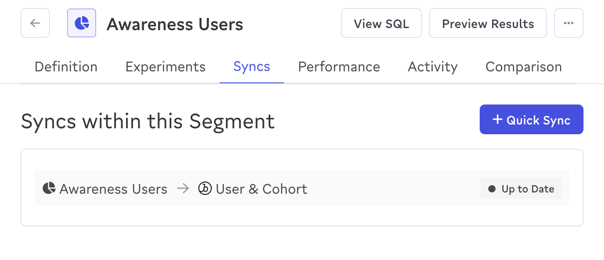
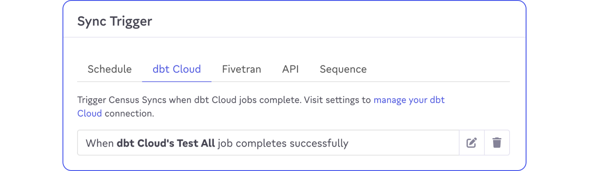

After building your audience, you need to sync it to your marketing destinations and ensure it stays up to date with your latest data.

## Step 1: Sync your audiences to your destinations

After setting up your required [destinations](https://docs.getcensus.com/destinations/overview) in Census you can sync up your new audiences.

## Step 2: Schedule your audience syncs

It's important that your audiences connected to these third party tools are always up to date and in sync with your Snowplow web data in the data warehouse.

One way you can ensure this is by using the [dbt Cloud sync trigger](https://docs.getcensus.com/basics/core-concept/triggering-syncs#dbt-cloud) to trigger syncs after the dbt Snowplow web model job finishes and the derived tables are updated.

This automated approach ensures that your marketing campaigns are always targeting users based on the most recent behavioral data and ML predictions, maximizing the effectiveness of your advertising spend.
