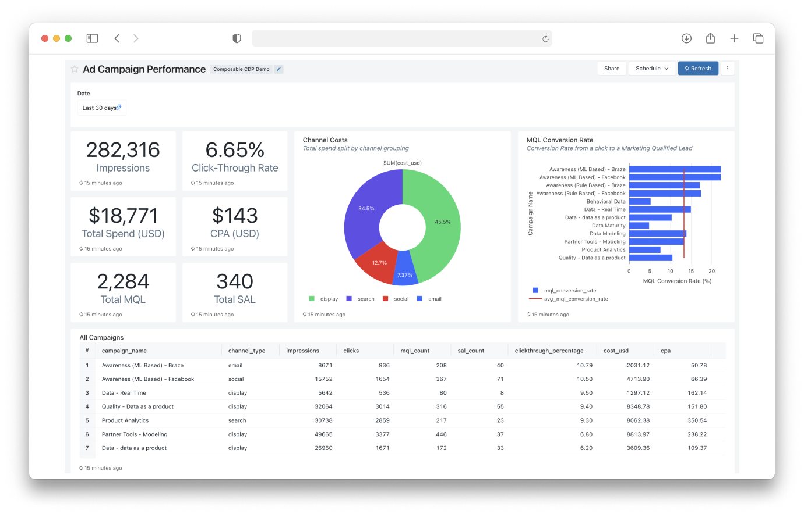
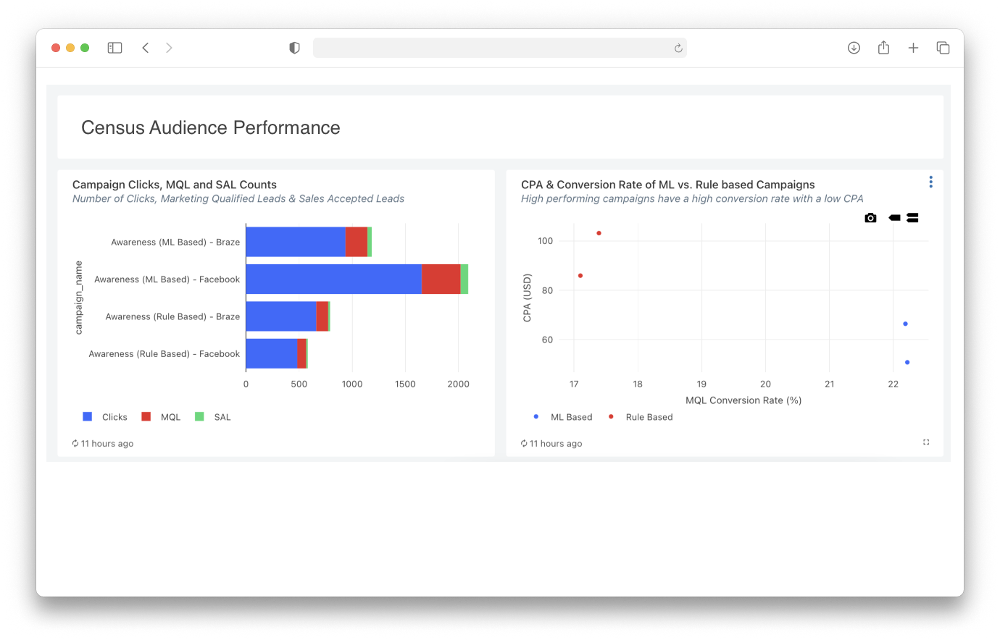

At this stage you will have at least one campaign up and running synced from a Census audience. Now you can build reporting to measure the effectiveness of your ML-driven targeting.

## Step 1: Attribution in Snowplow

Snowplow allows you to gain full control of your attribution.

Out of the box, the Snowplow JavaScript tracker captures both the page URL and the referrer URL. The [campaign attribution enrichment](https://docs.snowplow.io/docs/enriching-your-data/available-enrichments/campaign-attribution-enrichment/) can then parse out any marketing parameters that are present in the page URL, as well as click IDs from Google or other search engines. By default, it looks for the `utm_` fields, but other marketing parameters can be specified as well. The [referrer parser enrichment](https://docs.snowplow.io/docs/enriching-your-data/available-enrichments/referrer-parser-enrichment/) will also classify the referrer. Together, these two enrichments populate the following fields in atomic.events:

| Marketing fields | Referrer fields |
| ---------------- | --------------- |
| mkt_medium       | refr_medium     |
| mkt_source       | refr_source     |
| mkt_term         | refr_term       |
| mkt_content      |                 |
| mkt_campaign     |                 |
| mkt_network      |                 |
| mkt_clickid      |                 |

By default, Snowplow's dbt web package models attribution on a first touch basis. So in the sessions table, the marketing and referrer information of the first page view in that session is saved.

## Step 2: Ingest campaign data

Ingest your ad campaign data from your marketing tools into your data warehouse using ETL tools like [Fivetran](https://www.fivetran.com/). If you use multiple advertising sources, you now have a single source of truth and can easily query across all of them.

## Step 3: Visualize your performance

Being able to monitor and compare all your campaigns in one place is vital for your marketing teams to uncover true ROI. Join your ingested campaign data with your Snowplow tracked attribution to build reporting in your BI tool.

## Step 4: Drill into Census activated campaigns

Drill deeper into the performance of your Census activated campaigns. Below is an example of campaigns activated by two Census audiences, *Awareness (ML Based)* and *Awareness (Rule Based)*, that have been running side by side. You can see the campaigns using ML outputs (targeting high propensity visitors) are achieving a greater ROI.

This comparison demonstrates the concrete business value of your ML model - by targeting users with higher propensity scores, you can achieve better conversion rates and lower cost per acquisition across your marketing campaigns.
