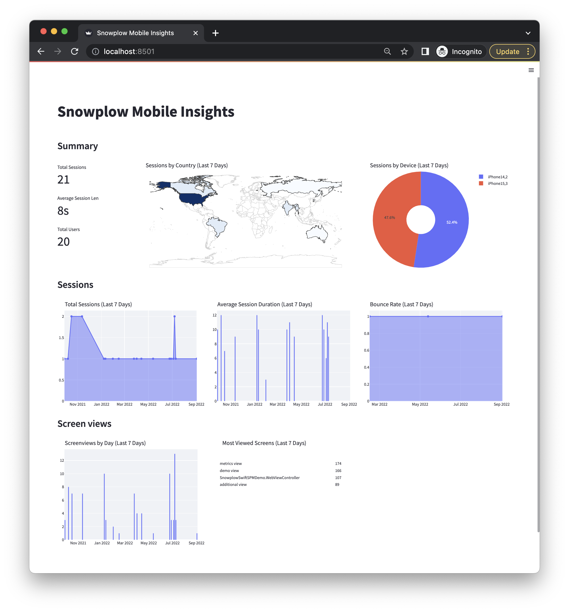
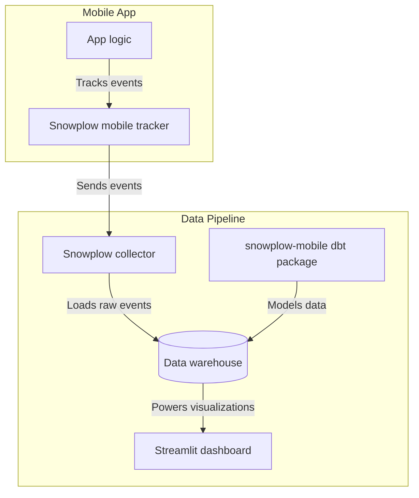

Welcome to the **mobile analytics with Snowplow** tutorial.

This tutorial shows you how to build a complete mobile analytics solution using Snowplow. You'll learn to track user behavior in mobile apps, model the data for analysis, and create visualizations to understand customer patterns.

The tutorial focuses on practical implementation for data practitioners who want to:
- Understand how Snowplow mobile data works through hands-on modeling
- Set up tracking in iOS, Android, React Native, or Flutter apps  
- Transform raw event data into actionable insights using dbt and Streamlit

You'll work through the complete analytics pipeline from data collection to visualization, using sample data so you can start immediately without needing an existing Snowplow pipeline.

### Who this tutorial is for

This tutorial is designed for data practitioners and engineers who want to implement mobile analytics. You should have basic familiarity with SQL and be comfortable working with data warehouses and command-line tools.

### What you'll build

By the end of this tutorial, you'll have:
- Uploaded and modeled sample mobile event data
- Created a Streamlit dashboard showing user behavior metrics
- Implemented tracking in a mobile app
- Generated and validated test events

The final result is an interactive dashboard that reveals insights about user sessions, screen engagement, and behavioral patterns.

### Architecture

The tutorial covers this complete system:

1. **Mobile app tracking** - Events tracked from app logic using Snowplow mobile trackers
2. **Event collection** - Raw events loaded into your warehouse via Snowplow pipeline  
3. **Data modeling** - Events transformed into sessions, users, and screen views using the snowplow-mobile dbt package
4. **Visualization** - Modeled data displayed in interactive Streamlit dashboard

### Prerequisites

**For data modeling and visualization:**
- [dbt CLI](https://docs.getdbt.com/docs/core/installation) installed or [dbt Cloud](https://docs.getdbt.com/docs/cloud/about-cloud-setup) account
- New dbt [project](https://docs.getdbt.com/docs/build/projects) created and configured
- Python 3 installed
- Data warehouse account (Snowflake, BigQuery, or Databricks) with permissions to create schemas and tables

**For mobile tracking:**
- Snowplow pipeline (for production use)
- Mobile app to implement tracking (iOS, Android, React Native, or Flutter)

The tutorial uses Snowflake, BigQuery, and Databricks for examples, but the snowplow-mobile dbt package also supports Postgres and Redshift.
