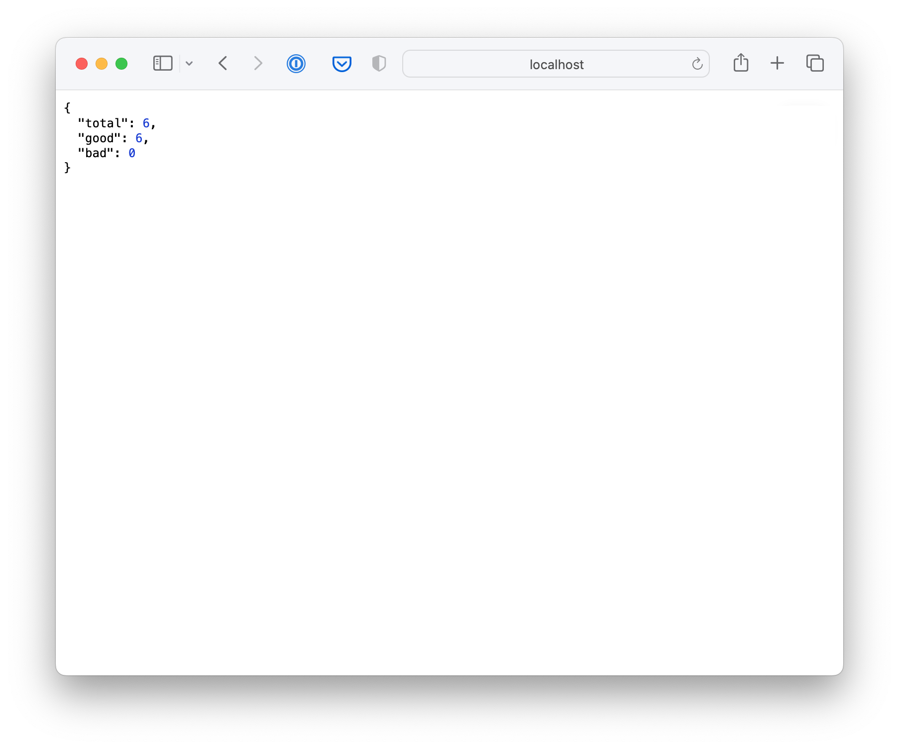
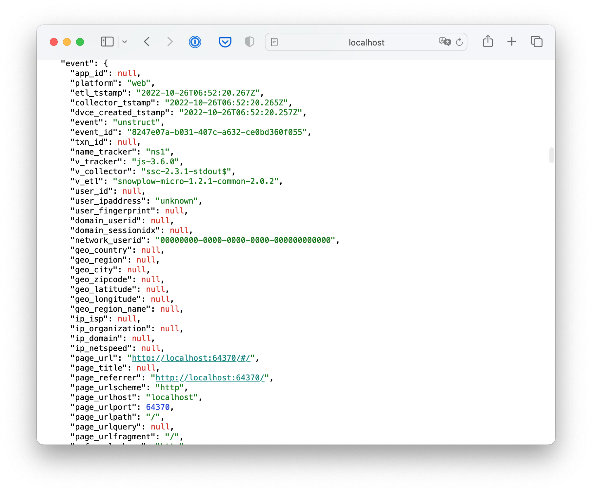

Before connecting your tracking to a production Snowplow pipeline, you'll test your implementation locally using Snowplow Micro. Micro is a lightweight version of Snowplow that runs locally and provides immediate feedback on your tracked events.

This testing step ensures your events are structured correctly and validates your tracking implementation before deploying to production.

## Step 1: Start Snowplow Micro

Snowplow Micro runs as a Docker container. You'll need Docker installed on your machine - see the [Docker installation guide](https://docs.docker.com/get-docker/) if you don't have it yet.

Start Micro using this command:

```bash
docker run -p 9090:9090 snowplow/snowplow-micro:1.3.3
```

This starts Micro on port 9090 and makes it accessible at `http://localhost:9090`.

## Step 2: Set up ngrok for mobile access

Your mobile device or emulator needs to access the Micro server. The easiest way is to use ngrok, which creates a public URL for your local server.

### Install ngrok

Install ngrok on macOS:

```bash
brew install ngrok/ngrok/ngrok
```

For other platforms, see the [ngrok download page](https://ngrok.com/download).

### Configure ngrok

Sign up at [ngrok.com](https://dashboard.ngrok.com/signup) to get an authtoken, then configure it:

```bash
ngrok config add-authtoken YOUR_TOKEN_HERE
```

### Start ngrok

Create a public tunnel to your Micro server:

```bash
ngrok http 9090
```

Ngrok will display a "Forwarding" URL like `https://abcd-12-34-567-89.ngrok.io` - this is your public endpoint.

## Step 3: Configure your app endpoint

Update the endpoint URL in your tracker configuration to use the ngrok URL. Replace the placeholder `{{URL for Collector}}` in your tracker setup with your ngrok forwarding URL.

For example:

### iOS
```swift
let networkConfig = NetworkConfiguration(endpoint: "https://abcd-12-34-567-89.ngrok.io")
```

### Android
```java
NetworkConfiguration networkConfig = new NetworkConfiguration("https://abcd-12-34-567-89.ngrok.io");
```

### React Native
```typescript
const tracker = createTracker(
    'mobile-tracker',
    {
        endpoint: 'https://abcd-12-34-567-89.ngrok.io',
    },
    // ... other configuration
);
```

### Flutter
```dart
SnowplowTracker tracker = await Snowplow.createTracker(
    namespace: 'mobile-tracker',
    endpoint: 'https://abcd-12-34-567-89.ngrok.io',
    // ... other configuration
);
```

## Step 4: Test your tracking

Build and run your app on a device or emulator. Use the app to trigger various events:

- Navigate between screens
- Trigger any custom events you've implemented
- Put the app in background and foreground (if lifecycle tracking is enabled)
- Perform typical user actions in your app

The tracker will send these events to Micro through the ngrok tunnel.

## Step 5: Validate your events

Micro provides several endpoints to inspect your tracked events:

### Check event counts

Visit `http://localhost:9090/micro/all` to see a summary of tracked events:

```json
{
  "total": 15,
  "good": 13,
  "bad": 2
}
```



- **Total**: All events received
- **Good**: Events that passed schema validation
- **Bad**: Events that failed validation

### Inspect good events

View successful events at `http://localhost:9090/micro/good`:



This shows the complete event payload including:
- Event timestamps and IDs
- Event type and schema
- Context entities (session, platform, etc.)
- Custom event data

### Debug validation errors

If you have bad events, check `http://localhost:9090/micro/bad` to see validation errors. This helps identify issues with:
- Invalid schema references
- Missing required fields
- Incorrect data types
- Malformed JSON

## What to look for

When validating your events, check that:

1. **Events are arriving**: The total count increases as you use the app
2. **Validation passes**: Most events should be "good" rather than "bad"
3. **Automatic tracking works**: Screen views and lifecycle events appear automatically
4. **Custom events are correct**: Your custom events have the expected schema and data
5. **Context is included**: Platform, session, and other context entities are attached

## Common issues

### No events appearing
- Check your ngrok URL is correct in the app
- Verify the app is building and running without errors
- Ensure Micro and ngrok are both running

### Bad events
- Verify schema URLs are correct and accessible
- Check that required fields are included
- Validate JSON structure matches your schema

### Missing context
- Ensure auto-tracking features are enabled in tracker configuration
- Check that context entities are properly configured

## Reset Micro

To clear all events and start fresh, restart the Micro Docker container:

```bash
# Stop current container
docker stop $(docker ps -q --filter ancestor=snowplow/snowplow-micro:1.3.3)

# Start fresh instance
docker run -p 9090:9090 snowplow/snowplow-micro:1.3.3
```

With your tracking validated through Micro, you can confidently connect your app to a production Snowplow pipeline. The events you're seeing in Micro are exactly what will be collected and processed by your full Snowplow infrastructure.
