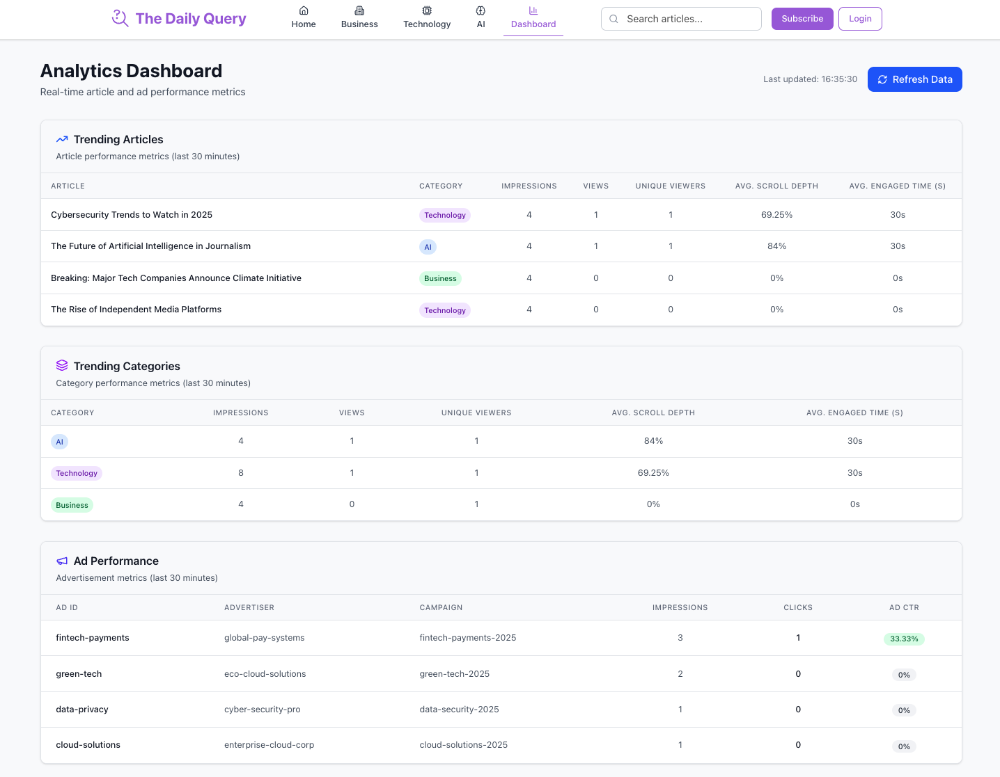

In this tutorial, you've explored the real-time editorial analytics solution accelerator for gaining practical experience building, deploying, and extending real-time, event-driven architectures using Snowplow and ClickHouse.

You have successfully built a real-time system for processing event data including:
- **Web tracking application** for collecting article interaction and ad performance events
- **Snowplow Micro and Snowbridge** for event processing and forwarding
- **ClickHouse** for processing and storing real-time event-level data
- **Editorial Analytics Dashboard front-end** for visualizing real-time content engagement behavior on the web tracking application

This architecture highlights how real-time insights can be achieved using event-driven systems in a streaming context.

## What you achieved

You explored how to:
1. Use Snowplow Micro to emulate a full Snowplow pipeline for local development and testing
2. Launch and interact with the system components, such as the ClickHouse UI and Micro UI
3. View and verify the real-time event data from the browser using Snowplow's granular content tracking capabilities

This tutorial can be extended to use Snowplow event data for other real-time use cases, such as:
- Web engagement analytics
- Personalized content recommendations
- Ad performance tracking
- Search and content re-ranking

## Next steps

The following extensions are a good starting point for building on this accelerator:

- **Extend tracking:** extend the solution to track more granular user interactions or track on a new platform such as mobile
- **Personalize content recommendations:** extend the solution to change the Featured Article on the homepage based on the most-viewed article from the last 30 minutes
- **Exclude content:** extend the solution to exclude any content already viewed by the current user
- **Real-time content scoring:** extend the solution to compute a real-time score for each article, based on the latest engagement

By completing this tutorial, you're equipped to build event-driven systems that deliver real-time analytics tailored to your streaming needs.
